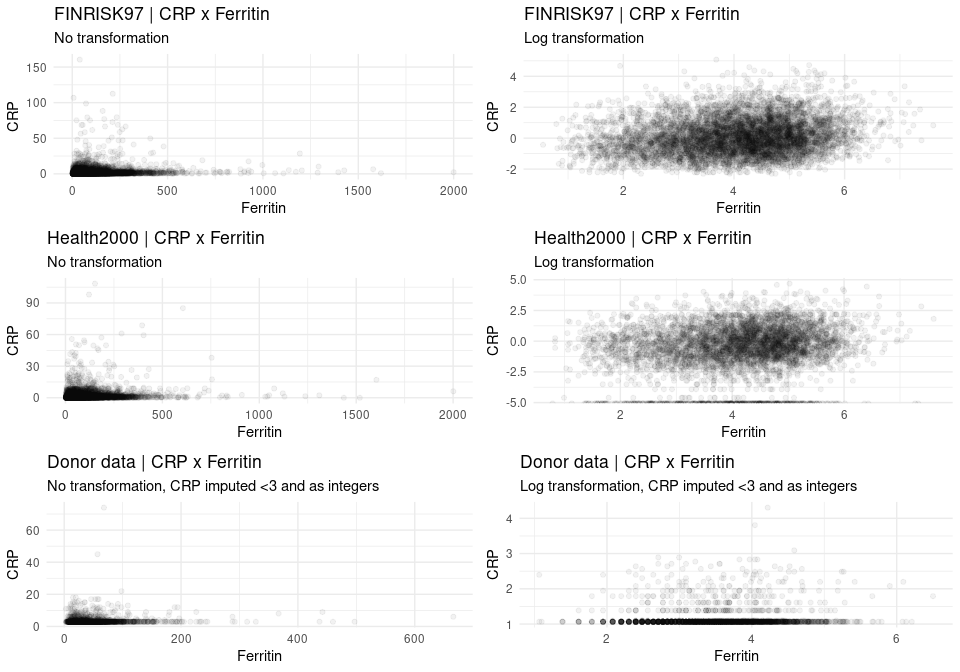
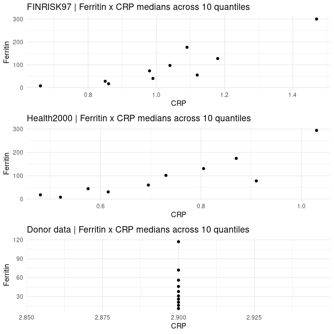
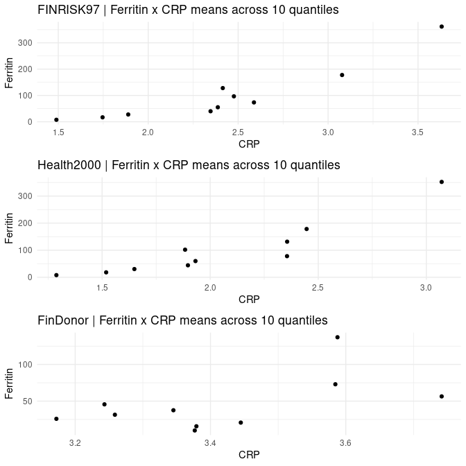
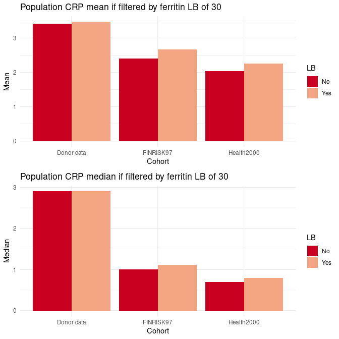
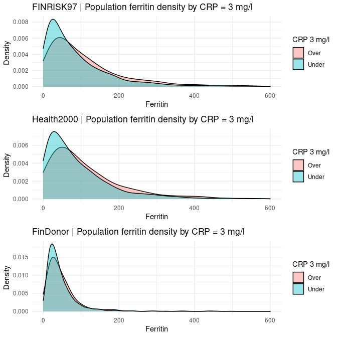
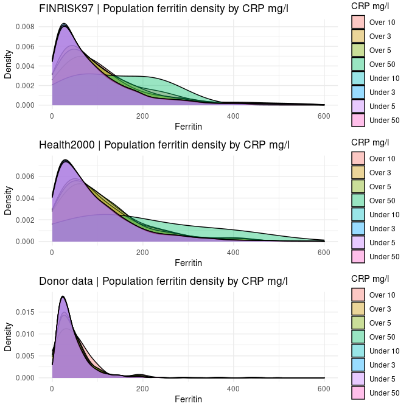
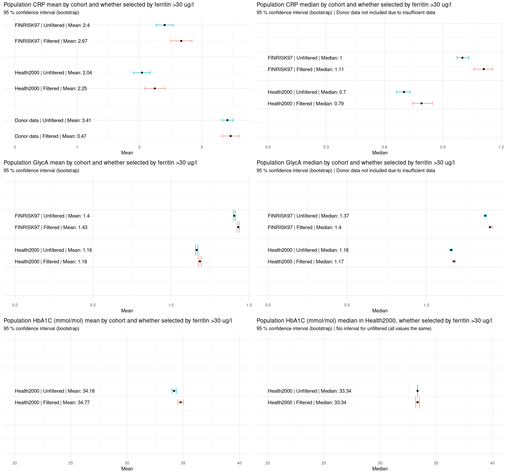
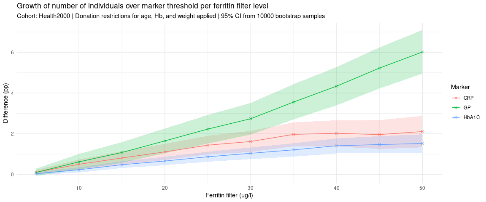
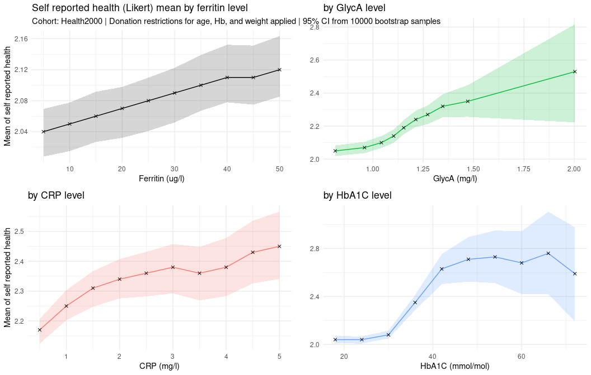
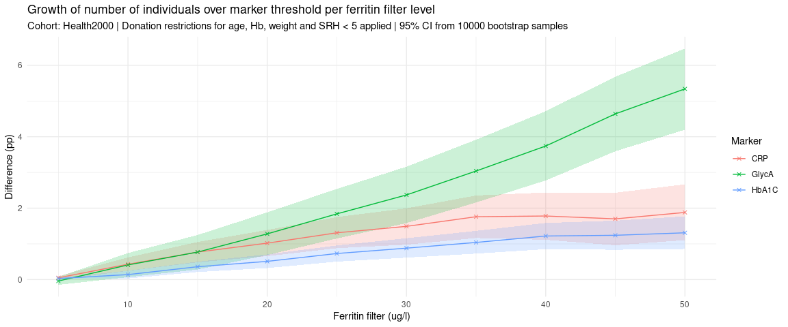

We have one cohort of blood donors, FinDonor, and two general population
cohorts, FinRisk97 and Health2000. The FinDonor cohort does not include
the variables of interest, so we’ll use data from individual donations
(by donors), which is cross-referenceable to the FinDonor set.

# Warmup | Getting to know the data

The data we have presented as CRP x Ferritin plots. The left hand side
presents data as is, the right hand side presents the data after log
transform. The positive correlation between CRP and Ferritin is much
more obvious when we log transform the data. The Health2000 data has
many values set as 0.00 (missing data?), so these values are probably
creating the points at -5 (log(0) = -Inf). The FinDonor data requires
some attention also: the CRP measurements have not been taken using a
high sensitivity method, as we were not interested in “non-elevated”
CRP. So, every CRP value under 3 is missing, and here they have been
imputed as “2.9”. Additionally, the resolution extends only to integers,
which creates visible stratification/intervals after the log
transformation of the data. The FinDonor is the only data set where the
positive correlation is thus not immediately visible.

Still working with the entire cohorts (no subgroup analysis yet). We
sort the data (each cohort separately) by the ferritin measurements and
take 10 quantiles from each sorted cohort. If we then take the ferritin
and CRP medians from each of the quantiles, we can plot them to examine
the relationship in ordinal “categories”. This is raw data without
transformations. NaNs are stripped.

The positive correlation between ferritin and CRP is obvious in the
FINRISK97 and Health2000 cohorts, but as the medians never cross 3, the
FinDonor cohort shows nothing.

Analysis of means reveals that the FinDonor CRP x Ferritin behaves
similarly.

What happens to CRP when we start filtering donors based on ferritin
levels? Let’s say that we want to set the LB of donor ferritin to 30
ug/l. To see the effect, we want to compare the CRP medians/means of
population filtered and not filtered by the ferritin LB.

Using ferritin LB of 30 ug/l, the share of potential donors in
inflammatory risk (e.g. vascular or heart disease, indicated by CRP
&gt;= 3 mg/l) increases from 18.52% to 20.72% in the FINRISK1997 cohort
and from 16.22% to 17.84% in the Health2000 cohort. Within the existing
donor population (indicated by the FinDonor cohort) the share goes from
14.85% to 15.85%.

Thinking in reverse, what is the maximum ferritin threshold we could set
without increasing the share of donors under inflammation risk?

These density plots indicate that dodging CRP 3 mg/l might not be
possible based on ferritin value alone. Do these distributions ever
separate?

# Actionable analysis

## Ferritin x CRP & GlycA & HbA1*C*

The plot below shows what happens to common inflammation marker means
and medians within the population when we start requiring a certain
ferritin threshold for donors. Filter value for ferritin is set to a
*lower bound* of 30 ug/l for these analyses. The CRP variable is
available in every cohort, but the GP is only found from FINRISK97 and
Health200. Finally, the glycated hemoglobin (HbA1C) is only available in
the Health2000 cohort.

## Self reported health

This plot shows how the mean of self reported health reacts to
increasing marker values.

1.  Ferritin: \[5, 50\] in increments of 5. (So that we have the cutoff
    of 30 in the “middle”.)
2.  CRP: \[0.5, 5\] in increments of 0.5. (So that we have cutoff of 3
    in the “middle”.)
3.  GlycA: 10 quantiles. (So that we have the population mean in the
    “middle”.)
4.  HbA1*C*: \[18, 72\] in increments of 6. (So that we have
    the cutoff of 42 in the “middle”.)

The mean of self reported health clearly increases (so: SR health
worsens) with ferritin. The others offer a couple of dipping points
(very interesting) as we go further up with the markers.

Let’s assume that people who report their health as “bad” (5) don’t come
to donate. Does it affect our ratio analysis?

    ferrLBs <- c(5, 10, 15, 20, 25, 30, 35, 40, 45, 50)
    if (!file.exists(paste0("~/CRP_enrichment/data/healthy_ferritin_threshold_boot", boot_n, ".rds"))){ # run bootstrap only if needed
        start <- Sys.time()
        # CRP
        CRP_diffs <- c()
        CRP_lower <- c()
        CRP_upper <- c()
        for (i in 1:length(ferrLBs)) {
            boot_obj <- boot(h2000_healthier, statistic = get_ratio_boot, R = boot_n, var1 = FERRITIINI, var2 = CRP, var1_trld = ferrLBs[i], var2_trld = 3)
            ci_obj <- boot.ci(boot_obj, type = "norm")
            CRP_diffs[i] <- boot_obj$t0
            CRP_lower[i] <- ci_obj$normal[2]
            CRP_upper[i] <- ci_obj$normal[3]
        }
        # GlycA
        GP_diffs <- c()
        GP_lower <- c()
        GP_upper <- c()
        GP_median <- median(h2000_healthier$GP, na.rm = T)
        for (i in 1:length(ferrLBs)) {
            boot_obj <- boot(h2000_filtered, statistic = get_ratio_boot, R = boot_n, var1 = FERRITIINI, var2 = GP, var1_trld = ferrLBs[i], var2_trld = GP_median)
            ci_obj <- boot.ci(boot_obj, type = "norm")
            GP_diffs[i] <- boot_obj$t0
            GP_lower[i] <- ci_obj$normal[2]
            GP_upper[i] <- ci_obj$normal[3]
        }
        # HbA_1C
        hba_diffs <- c()
        hba_lower <- c()
        hba_upper <- c()
        h2000_m <- h2000_healthier %>%
            mutate(hba = B_GHb_A1C * 10.93 - 23.50)
        for (i in 1:length(ferrLBs)) {
            boot_obj <- boot(h2000_m, statistic = get_ratio_boot, R = boot_n, var1 = FERRITIINI, var2 = hba, var1_trld = ferrLBs[i], var2_trld = 42)
            ci_obj <- boot.ci(boot_obj, type = "norm")
            hba_diffs[i] <- boot_obj$t0
            hba_lower[i] <- ci_obj$normal[2]
            hba_upper[i] <- ci_obj$normal[3]
        }
        
        boot_diff_df <- data.frame(LB = rep(ferrLBs, 3), diffs = c(CRP_diffs, GP_diffs, hba_diffs), 
                                   lower = c(CRP_lower, GP_lower, hba_lower), upper = c(CRP_upper, GP_upper, hba_upper),
                                    group = c(rep("CRP", 10), rep("GlycA", 10), rep("HbA1C", 10)))
        
        # save to file so we don't have to do this every time
        saveRDS(boot_diff_df, paste0("~/CRP_enrichment/data/healthy_ferritin_threshold_boot", boot_n, ".rds"))
        
        end <- Sys.time()
        print(end - start)
    } else {
        boot_diff_df <- readRDS(paste0("~/CRP_enrichment/data/healthy_ferritin_threshold_boot", boot_n, ".rds"))
    }

It does seem to lower the level of GlycA by ~0.7 pp, CRP by ~0.2 pp, and
HbA1*C* by 0.1 pp.
