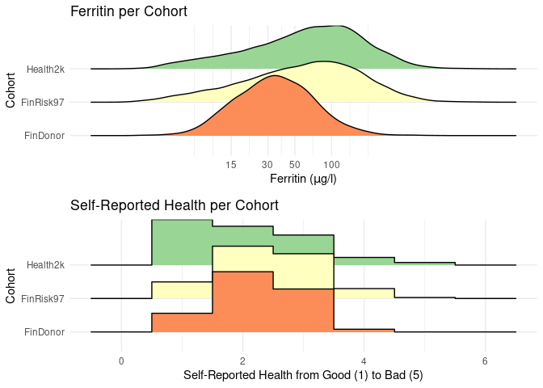
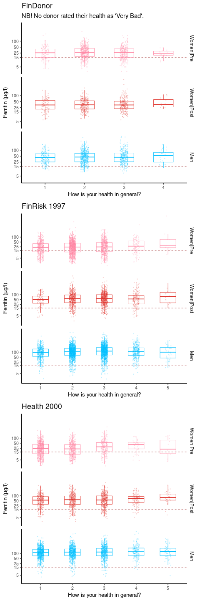
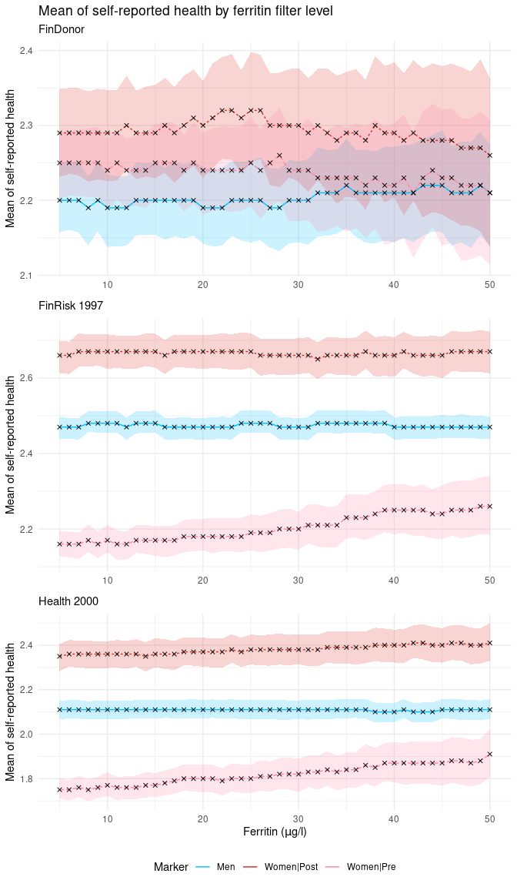
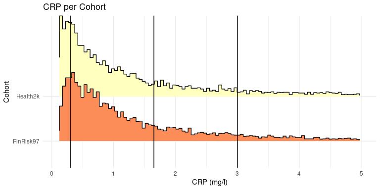
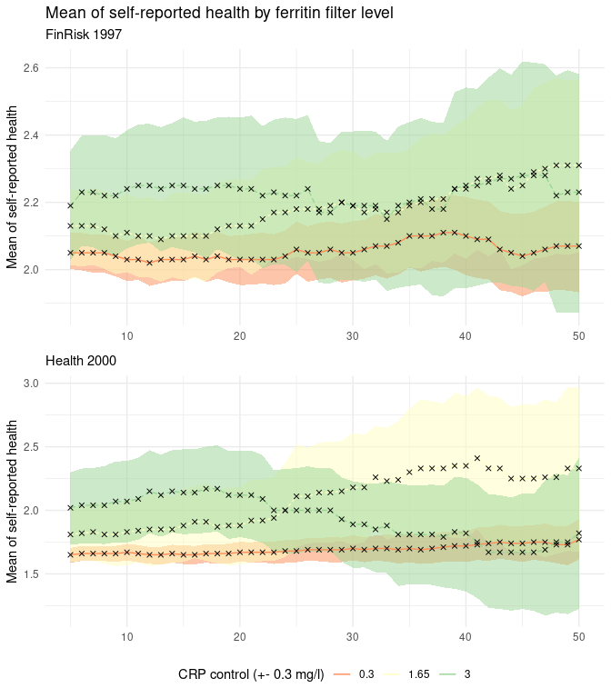
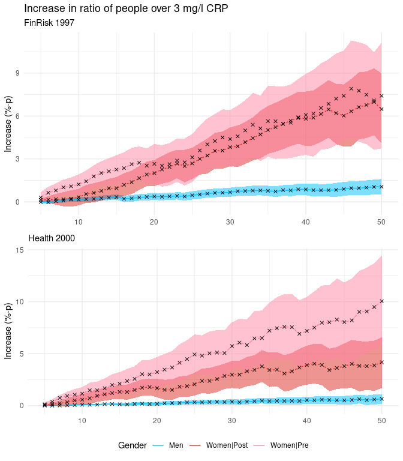
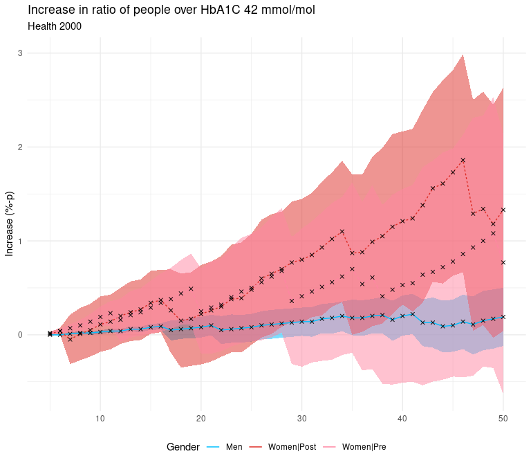

### Cohort Check

Let’s first check what kind of measurements these cohorts offer for
these two variables. We do this, because we want to know if the
variables differ significantly between cohorts. If they do, we need to
study them separately.

It would seem reasonable to study these cohorts separately. The FinDonor
cohort differs from Health2k and FinRisk97 significantly in terms of
ferritin measurements, and the Health2k differs significantly from the
others with respect to self-reported health.

### Boxplots

To study how and if ferritin measurements correlate with self-reported
health, we first explore some box plots. We wish to do this for each
cohort, and within them, to the following groups: men, menstruating
women, non-menstruating women. This is because menstruation causes
regular loss of ferritin from the bloodstream.

### Line plots

To examine correlation via a line plot, we’ll take the mean of
self-reported health for subpopulations limited by different ferritin
values and draw a line through them. We’ll want to do this again
separately for each cohort and cohort subgroup. Also, we’ll bootstrap
our estimates so we get confidence intervals. For exploration purposes
we’ll use a fairly low number of bootstrap samples (such as 100), but
for publication purposes we should aim somewhere around 10k samples.

### Control for CRP

Next we’ll see what happens to this relationship, if we control for CRP,
a common inflammatory marker. This time, we’ll focus on cohorts and
groups where any effect was measured, namely the non-menstruating women
in the FinRisk97 and Health200 cohorts.

First we’ll check how the CRP distributes between these two cohorts, to
help us select control points.

The FinRisk 1997 and Health 2000 cohorts have largerly similar CRP
distributions. We will not use the FinDonor set here at all, because it
has no sensible observations under 3 mg/l, and those above are measured
in integers. Eyeballing nice control points, we could probably choose 3
equidistant points between the 3 mg/l and the common high point of the
histograms, 0.3 mg/l.

