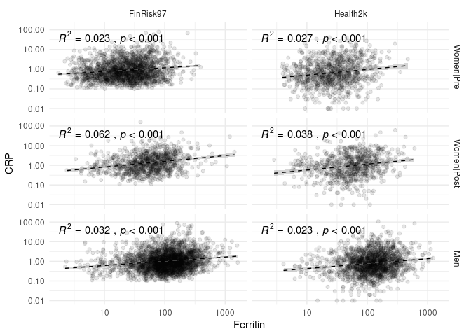
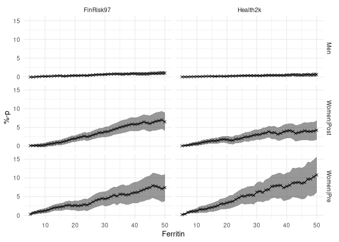

    # Load data on individual donations
    load("./data/r02.fd.bd.all.rdata") # outputs an object called "output" into the environment
    donations <- output

    # We only want to look at first donation event values from each donor
    donors <- donations %>%
        group_by(donor) %>%
        filter(date == min(date)) %>%
        ungroup()

    # Load FinDonor demographic data
    load("./data/r02ds.donorData.rdata") # outputs an object called "output" into the environment
    findonor <- output

    # Combine the FinDonor datasets
    FinDonor <- left_join(donors, findonor, by = "donor")

    # Load THL data
    # Sofie: thldalta.rdata contains all five THL cohorts, extract FINRISK97 and Health2000 from the others
    load("./data/thldata.rdata")
    FinRisk97 <- thldata$fr1997
    Health2k <- thldata$h2000

    # Remove leftovers
    rm(output)
    rm(thldata)

    ## Rename useful stuff
    # Ferritin, Self-Reported Health
    FinDonor <- rename(FinDonor, SRH = QR17, Menstruation = QR79, Age_float = Age, Age = age)
    FinRisk97 <- rename(FinRisk97, Ferritin = FERRITIN, SRH = Q40, Gender = SUKUP, Menstruation = K129, Age = IKA)
    Health2k <- rename(Health2k, Ferritin = FERRITIINI, SRH = BA01, Gender = SP2, Menstruation = BD03, Age = IKA2, Menopause = MENOP)

    # Make "useful stuff" conform with each other
    FinDonor <- FinDonor %>% 
        mutate(SRH = case_when(SRH == "Excellent" ~ 1,
                               SRH == "Very_good" ~ 2,
                               SRH == "Good" ~ 3,
                               SRH == "Satisfactory" ~ 4,
                               SRH == "Poor" ~ 5),
               Group = case_when(Gender == "Men" ~ "Men",
                                 Gender == "Women" & (Menstruation == "regular_period" | Menstruation == "irregular_period") ~ "Women|Pre",
                                 Gender == "Women" & Menstruation == "no_period" ~ "Women|Post",
                                 TRUE ~ "NA")) # Equates to "else"

    FinRisk97 <- FinRisk97 %>%
        mutate(Gender = case_when(Gender == 1 ~ "Men",
                                  Gender == 2 ~ "Women",
                                  TRUE ~ "NA"),
               Group = case_when(Gender == "Men" ~ "Men",
                                 Gender == "Women" & (Menstruation == 1 | Menstruation == 2) ~ "Women|Pre",
                                 Gender == "Women" & Menstruation == 3 ~ "Women|Post",
                                 TRUE ~ "NA"))

    Health2k <- Health2k %>%
        mutate(Gender = case_when(Gender == 1 ~ "Men",
                                  Gender == 2 ~ "Women",
                                  TRUE ~ "NA"),
               Group = case_when(Gender == "Men" ~ "Men",
                                 Gender == "Women" & (Menstruation == 1 | Menstruation == 2) ~ "Women|Pre",
                                 Gender == "Women" & (Menstruation == 3 | Age >= 55) ~ "Women|Post",
                                 TRUE ~ "NA"))

    # Donation eligibility
    # These are both "approximates" in a sense, we don't have all the necessary variables to
    # filter thoroughly, and we'll be able to do more filtering on Health2000 than FinRisk97
    donor_eligible_h2k <- Health2k %>%
        filter(BMII_PAINO.x >= 50 & BMII_PAINO.x <= 200) %>% # Filter away people <50kg and >200kg
        filter(Age >= 18 & Age <= 66) %>% # Filter away too young and too old
        filter((B_Hb >= 125 & Gender == "Women") | (B_Hb >= 135 & Gender == "Men")) %>% # Filter by hemoglobin
        filter(BA08 == 0) %>% # filter out people with heart attacks
        filter(BA09 == 0) %>% # filter out people with angina
        filter(BA10 == 0) %>% # cardiac insufficiency / heart failure
        filter(!(BA26 == 1 & ATC_A10A == 1)) %>% # filter out people who are diabetic AND use insulin
        filter(SRH < 4) %>% # filter out "Bad" or "Very bad" SRH
        rename(GlycA = GP) %>% # rename for ease of use
        mutate(HbA1C = B_GHb_A1C * 10.93 - 23.50)

    donor_eligible_fr <- FinRisk97 %>%
        filter(PAINO >= 50 & PAINO <= 200) %>% # Filter away people <50kg and >200kg
        filter(Age >= 18 & Age <= 66) %>% # Filter away too young and too old
        #filter((HGB >= 125 & Gender == 2) | (HGB >= 135 & Gender == 1)) %>% # DON'T filter by hemoglobin, < 500 values in data
        filter(Q15A != 2) %>% # STEMI, NSTEMI
        filter(Q16A != 2) %>% # Stroke
        # filter(Q38 != 2 & Q38 != 4) %>%  # Insulin treatment (2: just insulin, 4: insulin and a tablet)
        filter(Q17B != 2) %>% # cardiac insufficiency
        filter(Q17C != 2) %>% # angina pectoris
        filter(SRH < 4) %>% # filter out "Bad" or "Very bad" SRH
        rename(GlycA = GP) # rename for ease of use

    # Create useful mastersets
    fer_srh <- bind_rows(FinRisk97 = donor_eligible_fr[, c("Ferritin", "SRH", "Group")], 
                         Health2k = donor_eligible_h2k[, c("Ferritin", "SRH", "Group")], .id = "Cohort") %>% 
        mutate(Group = ordered(Group, levels = c("Women|Pre", "Women|Post", "Men")),
               Cohort = ordered(Cohort, levels = c("FinRisk97", "Health2k")),
               SRH = ordered(SRH, levels = 1:5)) %>%
        filter(Group != "NA") %>%
        drop_na()

    fer_srh_crp <- bind_rows(FinRisk97 = donor_eligible_fr[, c("Ferritin", "SRH", "Group", "CRP")], 
                             Health2k = donor_eligible_h2k[, c("Ferritin", "SRH", "Group", "CRP")], .id = "Cohort") %>% 
        mutate(Group = ordered(Group, levels = c("Women|Pre", "Women|Post", "Men")),
               Cohort = ordered(Cohort, levels = c("FinRisk97", "Health2k")),
               SRH = ordered(SRH, levels = 1:5)) %>%
        filter(Group != "NA") %>%
        filter(CRP >= 0.01) %>%
        #mutate(CRP = ifelse(CRP < 0.2, 0.1, CRP)) %>%
        drop_na()

    addmargins(table(fer_srh_crp$Group, fer_srh_crp$Cohort))

    ##             
    ##              FinRisk97 Health2k  Sum
    ##   Women|Pre       1915      943 2858
    ##   Women|Post       884      661 1545
    ##   Men             2603     1710 4313
    ##   Sum             5402     3314 8716

    options(scipen = 10000)
    ggplot(data = fer_srh_crp, aes(x = Ferritin, y = CRP)) + 
        geom_point(alpha = 0.1) +
        scale_x_log10() +
        scale_y_log10() +
        theme_minimal() + 
        geom_smooth(method = "lm", color = "black", linetype = "dashed", size = 0.5) +
        facet_grid(rows = vars(Group), cols = vars(Cohort))

    ferritin_values <- seq(5, 50, 1)
    iterations <- length(ferritin_values)
    CRP_trld <- 3

    if (!file.exists(paste0("./data/PUBL_finrisk_ratio_CRP", boot_n, ".rds"))) { # run bootstrap only if needed
        
        ## Preallocate
        # Men
        means_men <- 1:iterations
        upper_men <- 1:iterations
        lower_men <- 1:iterations
        # Women|Pre
        means_women_pre <- 1:iterations
        upper_women_pre <- 1:iterations
        lower_women_pre <- 1:iterations
        # Women|Post
        means_women_post <- 1:iterations
        upper_women_post <- 1:iterations
        lower_women_post <- 1:iterations
        
        for (i in 1:iterations) {
            
            #############
            #### FinRisk97
            #############
            
            ## Compute
            # Men
            boot_obj_men <- boot(fer_srh_crp %>% filter(Group == "Men" & Cohort == "FinRisk97"), statistic = get_ratio_boot, R = boot_n, 
                                 var1 = Ferritin, var2 = CRP, var1_trld = ferritin_values[i], var2_trld = CRP_trld)
            ci_obj_men <- boot.ci(boot_obj_men, type = "norm")
            # Women|Pre
            boot_obj_women_pre <- boot(fer_srh_crp %>% filter(Group == "Women|Pre" & Cohort == "FinRisk97"), statistic = get_ratio_boot, R = boot_n, 
                                       var1 = Ferritin, var2 = CRP, var1_trld = ferritin_values[i], var2_trld = CRP_trld)
            ci_obj_women_pre <- boot.ci(boot_obj_women_pre, type = "norm")
            # Women|Post
            boot_obj_women_post <- boot(fer_srh_crp %>% filter(Group == "Women|Post" & Cohort == "FinRisk97"), statistic = get_ratio_boot, R = boot_n, 
                                        var1 = Ferritin, var2 = CRP, var1_trld = ferritin_values[i],var2_trld = CRP_trld)
            ci_obj_women_post <- boot.ci(boot_obj_women_post, type = "norm")
            
            ## Store
            # Men
            means_men[i] <- boot_obj_men$t0
            upper_men[i] <- ci_obj_men$normal[3]
            lower_men[i] <- ci_obj_men$normal[2]
            # Women|Pre
            means_women_pre[i] <- boot_obj_women_pre$t0
            upper_women_pre[i] <- ci_obj_women_pre$normal[3]
            lower_women_pre[i] <- ci_obj_women_pre$normal[2]
            # Women|Post
            means_women_post[i] <- boot_obj_women_post$t0
            upper_women_post[i] <- ci_obj_women_post$normal[3]
            lower_women_post[i] <- ci_obj_women_post$normal[2]
            
            # Combine
            means_finrisk <- data.frame(Ferritin = rep(ferritin_values, 3),
                                         means = c(means_men, means_women_pre, means_women_post),
                                         upper = c(upper_men, upper_women_pre, upper_women_post),
                                         lower = c(lower_men, lower_women_pre, lower_women_post),
                                         Gender = c(rep("Men", iterations), rep("Women|Pre", iterations), rep("Women|Post", iterations)))
        
        }
        
        # Save
        saveRDS(means_finrisk, paste0("./data/PUBL_finrisk_ratio_CRP", boot_n, ".rds"))
    } else {means_finrisk <- readRDS(paste0("./data/PUBL_finrisk_ratio_CRP", boot_n, ".rds"))}

    if (!file.exists(paste0("./data/PUBL_health2k_ratio_CRP", boot_n, ".rds"))) { # run bootstrap only if needed
        ## Preallocate
        # Men
        means_men <- 1:iterations
        upper_men <- 1:iterations
        lower_men <- 1:iterations
        # Women|Pre
        means_women_pre <- 1:iterations
        upper_women_pre <- 1:iterations
        lower_women_pre <- 1:iterations
        # Women|Post
        means_women_post <- 1:iterations
        upper_women_post <- 1:iterations
        lower_women_post <- 1:iterations

        for (i in 1:iterations) {
        
        #############
        #### Health2000
        #############
        
        ## Compute
        # Men
        boot_obj_men <- boot(fer_srh_crp %>% filter(Group == "Men" & Cohort == "Health2k"), statistic = get_ratio_boot, R = boot_n, 
                             var1 = Ferritin, var2 = CRP, var1_trld = ferritin_values[i], var2_trld = CRP_trld)
        ci_obj_men <- boot.ci(boot_obj_men, type = "norm")
        # Women|Pre
        boot_obj_women_pre <- boot(fer_srh_crp %>% filter(Group == "Women|Pre" & Cohort == "Health2k"), statistic = get_ratio_boot, R = boot_n, 
                                   var1 = Ferritin, var2 = CRP, var1_trld = ferritin_values[i], var2_trld = CRP_trld)
        ci_obj_women_pre <- boot.ci(boot_obj_women_pre, type = "norm")
        # Women|Post
        boot_obj_women_post <- boot(fer_srh_crp %>% filter(Group == "Women|Post" & Cohort == "Health2k"), statistic = get_ratio_boot, R = boot_n, 
                                    var1 = Ferritin, var2 = CRP, var1_trld = ferritin_values[i], var2_trld = CRP_trld)
        ci_obj_women_post <- boot.ci(boot_obj_women_post, type = "norm")
        
        ## Store
        # Men
        means_men[i] <- boot_obj_men$t0
        upper_men[i] <- ci_obj_men$normal[3]
        lower_men[i] <- ci_obj_men$normal[2]
        # Women|Pre
        means_women_pre[i] <- boot_obj_women_pre$t0
        upper_women_pre[i] <- ci_obj_women_pre$normal[3]
        lower_women_pre[i] <- ci_obj_women_pre$normal[2]
        # Women|Post
        means_women_post[i] <- boot_obj_women_post$t0
        upper_women_post[i] <- ci_obj_women_post$normal[3]
        lower_women_post[i] <- ci_obj_women_post$normal[2]
        
        # Combine
        means_health2k <- data.frame(Ferritin = rep(ferritin_values, 3),
                                     means = c(means_men, means_women_pre, means_women_post),
                                     upper = c(upper_men, upper_women_pre, upper_women_post),
                                     lower = c(lower_men, lower_women_pre, lower_women_post),
                                     Gender = c(rep("Men", iterations), rep("Women|Pre", iterations), rep("Women|Post", iterations)))    
        
        
        }
        
        # Save
        saveRDS(means_health2k, paste0("./data/PUBL_health2k_ratio_CRP", boot_n, ".rds"))
    } else {means_health2k <- readRDS(paste0("./data/PUBL_health2k_ratio_CRP", boot_n, ".rds"))}

    means_all <- rbind(means_finrisk, means_health2k)
    means_all$Cohort <- c(rep("FinRisk97", 138), rep("Health2k", 138))

    ggplot(data = means_all, aes(x = Ferritin, y = means)) +
        geom_ribbon(aes(ymin = lower, ymax = upper), alpha = .5) +
        geom_line() +
        geom_point(shape = 4) +
        theme_minimal() +
        facet_grid(rows = vars(Gender), cols = vars(Cohort)) +
        labs(y = "%-p")

