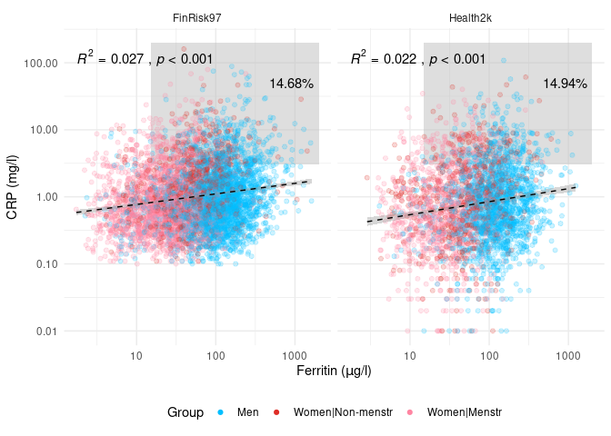
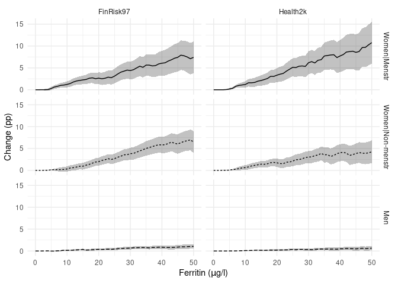
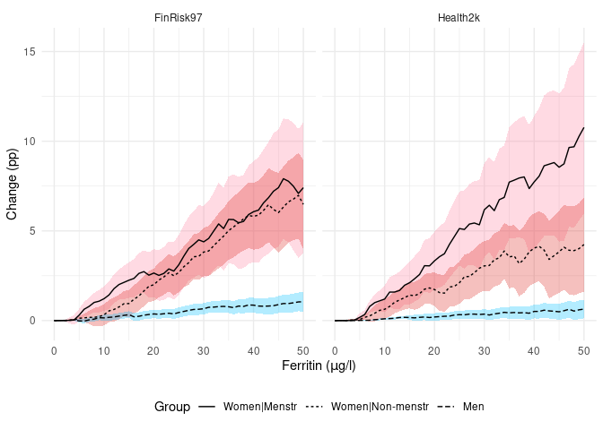
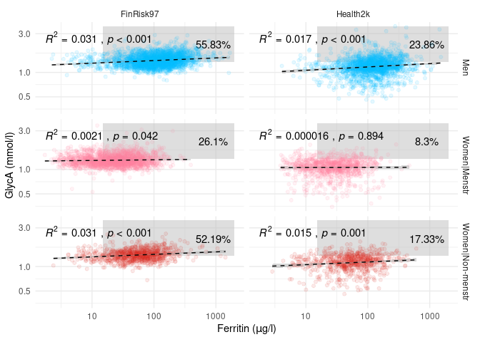
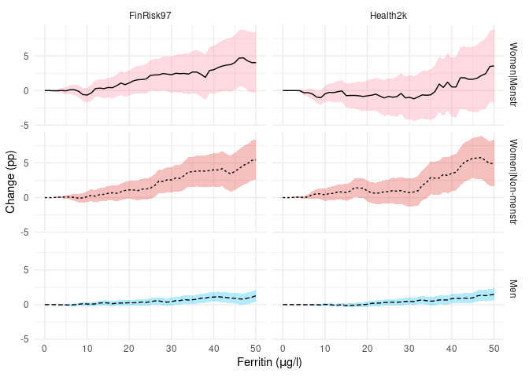
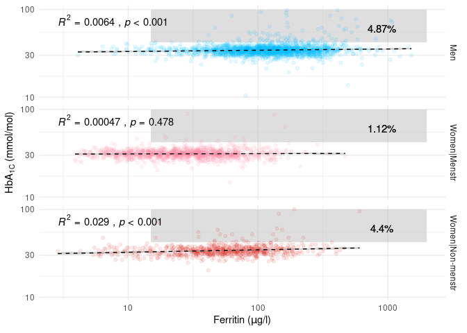
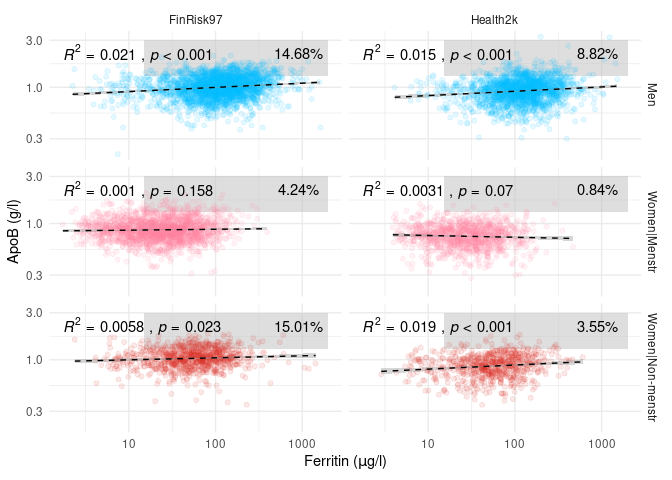
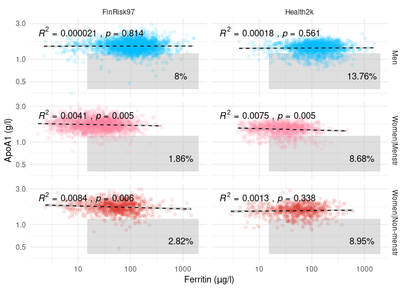

    # Load data on individual donations
    load("./data/r02.fd.bd.all.rdata") # outputs an object called "output" into the environment
    donations <- output

    # We only want to look at first donation event values from each donor
    donors <- donations %>%
        group_by(donor) %>%
        filter(date == min(date)) %>%
        ungroup()

    # Load FinDonor demographic data
    load("./data/r02ds.donorData.rdata") # outputs an object called "output" into the environment
    findonor <- output

    # Combine the FinDonor datasets
    FinDonor <- left_join(donors, findonor, by = "donor")

    # Load THL data
    # Sofie: thldalta.rdata contains all five THL cohorts, extract FINRISK97 and Health2000 from the others
    load("./data/thldata.rdata")
    FinRisk97 <- thldata$fr1997
    Health2k <- thldata$h2000

    # Remove leftovers
    rm(output)
    rm(thldata)

    ## Rename useful stuff
    # Ferritin, Self-Reported Health
    FinDonor <- rename(FinDonor, SRH = QR17, Menstruation = QR79, Age_float = Age, Age = age)
    FinRisk97 <- rename(FinRisk97, Ferritin = FERRITIN, SRH = Q40, Gender = SUKUP, Menstruation = K129, Age = IKA)
    Health2k <- rename(Health2k, Ferritin = FERRITIINI, SRH = BA01, Gender = SP2, Menstruation = BD03, Age = IKA2, Menopause = MENOP, APOB = NMR_APOB, APOA1 = NMR_APOA1)

    # Make "useful stuff" conform with each other
    FinDonor <- FinDonor %>% 
        mutate(SRH = case_when(SRH == "Excellent" ~ 1,
                               SRH == "Very_good" ~ 2,
                               SRH == "Good" ~ 3,
                               SRH == "Satisfactory" ~ 4,
                               SRH == "Poor" ~ 5),
               Group = case_when(Gender == "Men" ~ "Men",
                                 Gender == "Women" & (Menstruation == "regular_period" | Menstruation == "irregular_period") ~ "Women|Pre",
                                 Gender == "Women" & Menstruation == "no_period" ~ "Women|Post",
                                 TRUE ~ "NA")) # Equates to "else"

    FinRisk97 <- FinRisk97 %>%
        mutate(Gender = case_when(Gender == 1 ~ "Men",
                                  Gender == 2 ~ "Women",
                                  TRUE ~ "NA"),
               Group = case_when(Gender == "Men" ~ "Men",
                                 Gender == "Women" & (Menstruation == 1 | Menstruation == 2) ~ "Women|Pre",
                                 Gender == "Women" & Menstruation == 3 ~ "Women|Post",
                                 TRUE ~ "NA"))

    Health2k <- Health2k %>%
        mutate(Gender = case_when(Gender == 1 ~ "Men",
                                  Gender == 2 ~ "Women",
                                  TRUE ~ "NA"),
               Group = case_when(Gender == "Men" ~ "Men",
                                 Gender == "Women" & (Menstruation == 1 | Menstruation == 2) ~ "Women|Pre",
                                 Gender == "Women" & (Menstruation == 3 | Age >= 55) ~ "Women|Post",
                                 TRUE ~ "NA"))

    # Donation eligibility
    # These are both "approximates" in a sense, we don't have all the necessary variables to
    # filter thoroughly, and we'll be able to do more filtering on Health2000 than FinRisk97
    donor_eligible_h2k <- Health2k %>%
        filter(BMII_PAINO.x >= 50 & BMII_PAINO.x <= 200) %>% # Filter away people <50kg and >200kg
        filter(Age >= 18 & Age <= 66) %>% # Filter away too young and too old
        filter((B_Hb >= 125 & Gender == "Women") | (B_Hb >= 135 & Gender == "Men")) %>% # Filter by hemoglobin
        filter(BA08 == 0) %>% # filter out people with heart attacks
        filter(BA09 == 0) %>% # filter out people with angina
        filter(BA10 == 0) %>% # cardiac insufficiency / heart failure
        filter(!(BA26 == 1 & ATC_A10A == 1)) %>% # filter out people who are diabetic AND use insulin
        filter(SRH < 4) %>% # filter out "Bad" or "Very bad" SRH
        rename(GlycA = GP) %>% # rename for ease of use
        mutate(HbA1C = B_GHb_A1C * 10.93 - 23.50)

    donor_eligible_fr <- FinRisk97 %>%
        filter(PAINO >= 50 & PAINO <= 200) %>% # Filter away people <50kg and >200kg
        filter(Age >= 18 & Age <= 66) %>% # Filter away too young and too old
        #filter((HGB >= 125 & Gender == 2) | (HGB >= 135 & Gender == 1)) %>% # DON'T filter by hemoglobin, < 500 values in data
        filter(Q15A != 2) %>% # STEMI, NSTEMI
        filter(Q16A != 2) %>% # Stroke
        # filter(Q38 != 2 & Q38 != 4) %>%  # Insulin treatment (2: just insulin, 4: insulin and a tablet)
        filter(Q17B != 2) %>% # cardiac insufficiency
        filter(Q17C != 2) %>% # angina pectoris
        filter(SRH < 4) %>% # filter out "Bad" or "Very bad" SRH
        rename(GlycA = GP) # rename for ease of use

    # Create useful mastersets
    # fer_srh <- bind_rows(FinRisk97 = donor_eligible_fr[, c("Ferritin", "SRH", "Group")], 
    #                      Health2k = donor_eligible_h2k[, c("Ferritin", "SRH", "Group")], .id = "Cohort") %>% 
    #     mutate(Group = ordered(Group, levels = c("Women|Pre", "Women|Post", "Men")),
    #            Cohort = ordered(Cohort, levels = c("FinRisk97", "Health2k")),
    #            SRH = ordered(SRH, levels = 1:5)) %>%
    #     filter(Group != "NA") %>%
    #     drop_na()

    fer_crp <- bind_rows(FinRisk97 = donor_eligible_fr[, c("Ferritin", "Group", "CRP")], 
                             Health2k = donor_eligible_h2k[, c("Ferritin", "Group", "CRP")], .id = "Cohort") %>% 
        mutate(Group = ordered(Group, levels = c("Women|Pre", "Women|Post", "Men")),
               Cohort = ordered(Cohort, levels = c("FinRisk97", "Health2k"))) %>%
        filter(Group != "NA") %>%
        filter(CRP >= 0.01) %>%
        drop_na()

    table1 <- as.data.frame(table(fer_crp$Group, fer_crp$Cohort))
    table1$CRP <- c(paste0(round(summary(fer_crp$CRP[fer_crp$Group == "Women|Pre" & fer_crp$Cohort == "FinRisk97"])[3], 2), " | (", round(summary(fer_crp$CRP[fer_crp$Group == "Women|Pre" & fer_crp$Cohort == "FinRisk97"])[2], 2), ", ", round(summary(fer_crp$CRP[fer_crp$Group == "Women|Pre" & fer_crp$Cohort == "FinRisk97"])[5], 2), ")"),
                      paste0(round(summary(fer_crp$CRP[fer_crp$Group == "Women|Post" & fer_crp$Cohort == "FinRisk97"])[3], 2), " | (", round(summary(fer_crp$CRP[fer_crp$Group == "Women|Post" & fer_crp$Cohort == "FinRisk97"])[2], 2), ", ", round(summary(fer_crp$CRP[fer_crp$Group == "Women|Post" & fer_crp$Cohort == "FinRisk97"])[5], 2), ")"),
                      paste0(round(summary(fer_crp$CRP[fer_crp$Group == "Men" & fer_crp$Cohort == "FinRisk97"])[3], 2), " | (", round(summary(fer_crp$CRP[fer_crp$Group == "Men" & fer_crp$Cohort == "FinRisk97"])[2], 2), ", ", round(summary(fer_crp$CRP[fer_crp$Group == "Men" & fer_crp$Cohort == "FinRisk97"])[5], 2), ")"),
                      paste0(round(summary(fer_crp$CRP[fer_crp$Group == "Women|Pre" & fer_crp$Cohort == "Health2k"])[3], 2), " | (", round(summary(fer_crp$CRP[fer_crp$Group == "Women|Pre" & fer_crp$Cohort == "Health2k"])[2], 2), ", ", round(summary(fer_crp$CRP[fer_crp$Group == "Women|Pre" & fer_crp$Cohort == "Health2k"])[5], 2), ")"),
                      paste0(round(summary(fer_crp$CRP[fer_crp$Group == "Women|Post" & fer_crp$Cohort == "Health2k"])[3], 2), " | (", round(summary(fer_crp$CRP[fer_crp$Group == "Women|Post" & fer_crp$Cohort == "Health2k"])[2], 2), ", ", round(summary(fer_crp$CRP[fer_crp$Group == "Women|Post" & fer_crp$Cohort == "Health2k"])[5], 2), ")"),
                      paste0(round(summary(fer_crp$CRP[fer_crp$Group == "Men" & fer_crp$Cohort == "Health2k"])[3], 2), " | (", round(summary(fer_crp$CRP[fer_crp$Group == "Men" & fer_crp$Cohort == "Health2k"])[2], 2), ", ", round(summary(fer_crp$CRP[fer_crp$Group == "Men" & fer_crp$Cohort == "Health2k"])[5], 2), ")"))
    table1$FER <- c(paste0(round(summary(fer_crp$Ferritin[fer_crp$Group == "Women|Pre" & fer_crp$Cohort == "FinRisk97"])[3], 2), " | (", round(summary(fer_crp$Ferritin[fer_crp$Group == "Women|Pre" & fer_crp$Cohort == "FinRisk97"])[2], 2), ", ", round(summary(fer_crp$Ferritin[fer_crp$Group == "Women|Pre" & fer_crp$Cohort == "FinRisk97"])[5], 2), ")"),
                      paste0(round(summary(fer_crp$Ferritin[fer_crp$Group == "Women|Post" & fer_crp$Cohort == "FinRisk97"])[3], 2), " | (", round(summary(fer_crp$Ferritin[fer_crp$Group == "Women|Post" & fer_crp$Cohort == "FinRisk97"])[2], 2), ", ", round(summary(fer_crp$Ferritin[fer_crp$Group == "Women|Post" & fer_crp$Cohort == "FinRisk97"])[5], 2), ")"),
                      paste0(round(summary(fer_crp$Ferritin[fer_crp$Group == "Men" & fer_crp$Cohort == "FinRisk97"])[3], 2), " | (", round(summary(fer_crp$Ferritin[fer_crp$Group == "Men" & fer_crp$Cohort == "FinRisk97"])[2], 2), ", ", round(summary(fer_crp$Ferritin[fer_crp$Group == "Men" & fer_crp$Cohort == "FinRisk97"])[5], 2), ")"),
                      paste0(round(summary(fer_crp$Ferritin[fer_crp$Group == "Women|Pre" & fer_crp$Cohort == "Health2k"])[3], 2), " | (", round(summary(fer_crp$Ferritin[fer_crp$Group == "Women|Pre" & fer_crp$Cohort == "Health2k"])[2], 2), ", ", round(summary(fer_crp$Ferritin[fer_crp$Group == "Women|Pre" & fer_crp$Cohort == "Health2k"])[5], 2), ")"),
                      paste0(round(summary(fer_crp$Ferritin[fer_crp$Group == "Women|Post" & fer_crp$Cohort == "Health2k"])[3], 2), " | (", round(summary(fer_crp$Ferritin[fer_crp$Group == "Women|Post" & fer_crp$Cohort == "Health2k"])[2], 2), ", ", round(summary(fer_crp$Ferritin[fer_crp$Group == "Women|Post" & fer_crp$Cohort == "Health2k"])[5], 2), ")"),
                      paste0(round(summary(fer_crp$Ferritin[fer_crp$Group == "Men" & fer_crp$Cohort == "Health2k"])[3], 2), " | (", round(summary(fer_crp$Ferritin[fer_crp$Group == "Men" & fer_crp$Cohort == "Health2k"])[2], 2), ", ", round(summary(fer_crp$Ferritin[fer_crp$Group == "Men" & fer_crp$Cohort == "Health2k"])[5], 2), ")"))
    table1

    ##         Var1      Var2 Freq                 CRP                      FER
    ## 1  Women|Pre FinRisk97 1915  0.77 | (0.4, 1.87)   24.02 | (12.39, 42.53)
    ## 2 Women|Post FinRisk97  884 1.27 | (0.62, 2.65)   55.79 | (31.06, 93.72)
    ## 3        Men FinRisk97 2603 0.89 | (0.46, 1.88) 112.06 | (66.46, 182.07)
    ## 4  Women|Pre  Health2k  943 0.62 | (0.27, 1.81)        28 | (15.2, 48.6)
    ## 5 Women|Post  Health2k  661  1.02 | (0.38, 2.4)      55.9 | (32.7, 95.5)
    ## 6        Men  Health2k 1710 0.77 | (0.35, 1.75)   124.7 | (76.67, 193.9)

    options(scipen = 10000)
    ggplot(data = fer_crp, aes(x = Ferritin, y = CRP)) + 
        geom_point(alpha = 0.1) +
        scale_x_log10() +
        scale_y_log10() +
        theme_minimal() + 
        geom_smooth(method = "lm", formula = y ~ x, color = "black", linetype = "dashed", size = 0.5) +
        stat_cor(aes(label = paste(..rr.label.., ..p.label.., sep = "~`,`~")), p.accuracy = 0.001) +
        facet_grid(rows = vars(Group), cols = vars(Cohort))

    options(scipen = 10000)
    ggplot(data = fer_crp, aes(x = Ferritin, y = CRP)) + 
        geom_point(aes(color = Group), alpha = 0.1) +
        scale_x_log10() +
        scale_y_log10() +
        scale_color_manual(values = c( "#00BFFF",  "#de2d26", "#ff85a2" ),
                           limits = c( "Men",  "Women|Post", "Women|Pre" )) +
        scale_fill_manual(values = c( "#00BFFF",  "#de2d26", "#ff85a2" ),
                          limits = c( "Men",  "Women|Post", "Women|Pre" )) +
        theme_minimal() + 
        geom_smooth(method = "lm", color = "black", linetype = "dashed", size = 0.5) +
        stat_cor(aes(label = paste(..rr.label.., ..p.label.., sep = "~`,`~")), p.accuracy = 0.001) +
        facet_grid(rows = vars(Group), cols = vars(Cohort)) +
        theme(legend.position = "none")

    options(scipen = 10000)
    ggplot(data = fer_crp, aes(x = Ferritin, y = CRP)) + 
        geom_point(aes(color = Group), alpha = 0.2) +
        scale_x_log10() +
        scale_y_log10() +
        scale_color_manual(values = c( "#00BFFF",  "#de2d26", "#ff85a2" ),
                           limits = c( "Men",  "Women|Post", "Women|Pre" )) +
        scale_fill_manual(values = c( "#00BFFF",  "#de2d26", "#ff85a2" ),
                          limits = c( "Men",  "Women|Post", "Women|Pre" )) +
        theme_minimal() + 
        geom_smooth(method = "lm", color = "black", linetype = "dashed", size = 0.5) +
        stat_cor(aes(label = paste(..rr.label.., ..p.label.., sep = "~`,`~")), p.accuracy = 0.001) +
        facet_grid(cols = vars(Cohort)) +
        theme(legend.position = "bottom") + guides(colour = guide_legend(override.aes = list(alpha = 1)))

    ferritin_values <- seq(5, 50, 1)
    iterations <- length(ferritin_values)
    CRP_trld <- 3

    if (!file.exists(paste0("./data/PUBL_finrisk_ratio_CRP", boot_n, ".rds"))) { # run bootstrap only if needed
        
        ## Preallocate
        # Men
        means_men <- 1:iterations
        upper_men <- 1:iterations
        lower_men <- 1:iterations
        # Women|Pre
        means_women_pre <- 1:iterations
        upper_women_pre <- 1:iterations
        lower_women_pre <- 1:iterations
        # Women|Post
        means_women_post <- 1:iterations
        upper_women_post <- 1:iterations
        lower_women_post <- 1:iterations
        
        for (i in 1:iterations) {
            
            #############
            #### FinRisk97
            #############
            
            ## Compute
            # Men
            boot_obj_men <- boot(fer_crp %>% filter(Group == "Men" & Cohort == "FinRisk97"), statistic = get_ratio_boot, R = boot_n, 
                                 var1 = Ferritin, var2 = CRP, var1_trld = ferritin_values[i], var2_trld = CRP_trld, var2_over = T)
            ci_obj_men <- boot.ci(boot_obj_men, type = "norm")
            # Women|Pre
            boot_obj_women_pre <- boot(fer_crp %>% filter(Group == "Women|Pre" & Cohort == "FinRisk97"), statistic = get_ratio_boot, R = boot_n, 
                                       var1 = Ferritin, var2 = CRP, var1_trld = ferritin_values[i], var2_trld = CRP_trld, var2_over = T)
            ci_obj_women_pre <- boot.ci(boot_obj_women_pre, type = "norm")
            # Women|Post
            boot_obj_women_post <- boot(fer_crp %>% filter(Group == "Women|Post" & Cohort == "FinRisk97"), statistic = get_ratio_boot, R = boot_n, 
                                        var1 = Ferritin, var2 = CRP, var1_trld = ferritin_values[i],var2_trld = CRP_trld, var2_over = T)
            ci_obj_women_post <- boot.ci(boot_obj_women_post, type = "norm")
            
            ## Store
            # Men
            means_men[i] <- boot_obj_men$t0
            upper_men[i] <- ci_obj_men$normal[3]
            lower_men[i] <- ci_obj_men$normal[2]
            # Women|Pre
            means_women_pre[i] <- boot_obj_women_pre$t0
            upper_women_pre[i] <- ci_obj_women_pre$normal[3]
            lower_women_pre[i] <- ci_obj_women_pre$normal[2]
            # Women|Post
            means_women_post[i] <- boot_obj_women_post$t0
            upper_women_post[i] <- ci_obj_women_post$normal[3]
            lower_women_post[i] <- ci_obj_women_post$normal[2]
            
            # Combine
            means_finrisk <- data.frame(Ferritin = rep(ferritin_values, 3),
                                         means = c(means_men, means_women_pre, means_women_post),
                                         upper = c(upper_men, upper_women_pre, upper_women_post),
                                         lower = c(lower_men, lower_women_pre, lower_women_post),
                                         Gender = c(rep("Men", iterations), rep("Women|Pre", iterations), rep("Women|Post", iterations)))
        
        }
        
        # Save
        saveRDS(means_finrisk, paste0("./data/PUBL_finrisk_ratio_CRP", boot_n, ".rds"))
    } else {means_finrisk <- readRDS(paste0("./data/PUBL_finrisk_ratio_CRP", boot_n, ".rds"))}

    if (!file.exists(paste0("./data/PUBL_health2k_ratio_CRP", boot_n, ".rds"))) { # run bootstrap only if needed
        ## Preallocate
        # Men
        means_men <- 1:iterations
        upper_men <- 1:iterations
        lower_men <- 1:iterations
        # Women|Pre
        means_women_pre <- 1:iterations
        upper_women_pre <- 1:iterations
        lower_women_pre <- 1:iterations
        # Women|Post
        means_women_post <- 1:iterations
        upper_women_post <- 1:iterations
        lower_women_post <- 1:iterations

        for (i in 1:iterations) {
        
        #############
        #### Health2000
        #############
        
        ## Compute
        # Men
        boot_obj_men <- boot(fer_crp %>% filter(Group == "Men" & Cohort == "Health2k"), statistic = get_ratio_boot, R = boot_n, 
                             var1 = Ferritin, var2 = CRP, var1_trld = ferritin_values[i], var2_trld = CRP_trld, var2_over = T)
        ci_obj_men <- boot.ci(boot_obj_men, type = "norm")
        # Women|Pre
        boot_obj_women_pre <- boot(fer_crp %>% filter(Group == "Women|Pre" & Cohort == "Health2k"), statistic = get_ratio_boot, R = boot_n, 
                                   var1 = Ferritin, var2 = CRP, var1_trld = ferritin_values[i], var2_trld = CRP_trld, var2_over = T)
        ci_obj_women_pre <- boot.ci(boot_obj_women_pre, type = "norm")
        # Women|Post
        boot_obj_women_post <- boot(fer_crp %>% filter(Group == "Women|Post" & Cohort == "Health2k"), statistic = get_ratio_boot, R = boot_n, 
                                    var1 = Ferritin, var2 = CRP, var1_trld = ferritin_values[i], var2_trld = CRP_trld, var2_over = T)
        ci_obj_women_post <- boot.ci(boot_obj_women_post, type = "norm")
        
        ## Store
        # Men
        means_men[i] <- boot_obj_men$t0
        upper_men[i] <- ci_obj_men$normal[3]
        lower_men[i] <- ci_obj_men$normal[2]
        # Women|Pre
        means_women_pre[i] <- boot_obj_women_pre$t0
        upper_women_pre[i] <- ci_obj_women_pre$normal[3]
        lower_women_pre[i] <- ci_obj_women_pre$normal[2]
        # Women|Post
        means_women_post[i] <- boot_obj_women_post$t0
        upper_women_post[i] <- ci_obj_women_post$normal[3]
        lower_women_post[i] <- ci_obj_women_post$normal[2]
        
        # Combine
        means_health2k <- data.frame(Ferritin = rep(ferritin_values, 3),
                                     means = c(means_men, means_women_pre, means_women_post),
                                     upper = c(upper_men, upper_women_pre, upper_women_post),
                                     lower = c(lower_men, lower_women_pre, lower_women_post),
                                     Gender = c(rep("Men", iterations), rep("Women|Pre", iterations), rep("Women|Post", iterations)))    
        
        
        }
        
        # Save
        saveRDS(means_health2k, paste0("./data/PUBL_health2k_ratio_CRP", boot_n, ".rds"))
    } else {means_health2k <- readRDS(paste0("./data/PUBL_health2k_ratio_CRP", boot_n, ".rds"))}

    means_all <- rbind(means_finrisk, means_health2k)
    means_all$Cohort <- c(rep("FinRisk97", 138), rep("Health2k", 138))
    means_all$Group <- factor(means_all$Gender, levels = c("Women|Pre", "Women|Post", "Men"))

    ggplot(data = means_all, aes(x = Ferritin, y = means)) +
        geom_ribbon(aes(ymin = lower, ymax = upper), alpha = .3) +
        geom_line(aes(linetype = Group)) +
        theme_minimal() +
        facet_grid(rows = vars(Group), cols = vars(Cohort)) +
        labs(y = "%p") + guides(linetype = "none")

    # FINRISK
    # Menstruating Women
    frwomenpre5 <- means_all %>% filter(Cohort == "FinRisk97" & Group == "Women|Pre" & Ferritin == 5)
    frwomenpre15 <- means_all %>% filter(Cohort == "FinRisk97" & Group == "Women|Pre" & Ferritin == 15)
    frwomenpre30 <- means_all %>% filter(Cohort == "FinRisk97" & Group == "Women|Pre" & Ferritin == 30)
    frwomenpre50 <- means_all %>% filter(Cohort == "FinRisk97" & Group == "Women|Pre" & Ferritin == 50)

    # Non-menstruating Women
    frwomenpost5 <- means_all %>% filter(Cohort == "FinRisk97" & Group == "Women|Post" & Ferritin == 5)
    frwomenpost15 <- means_all %>% filter(Cohort == "FinRisk97" & Group == "Women|Post" & Ferritin == 15)
    frwomenpost30 <- means_all %>% filter(Cohort == "FinRisk97" & Group == "Women|Post" & Ferritin == 30)
    frwomenpost50 <- means_all %>% filter(Cohort == "FinRisk97" & Group == "Women|Post" & Ferritin == 50)

    # Men
    frmen5 <- means_all %>% filter(Cohort == "FinRisk97" & Group == "Men" & Ferritin == 5)
    frmen15 <- means_all %>% filter(Cohort == "FinRisk97" & Group == "Men" & Ferritin == 15)
    frmen30 <- means_all %>% filter(Cohort == "FinRisk97" & Group == "Men" & Ferritin == 30)
    frmen50 <- means_all %>% filter(Cohort == "FinRisk97" & Group == "Men" & Ferritin == 50)

    # H2K
    # Menstruating Women
    h2kwomenpre5 <- means_all %>% filter(Cohort == "Health2k" & Group == "Women|Pre" & Ferritin == 5)
    h2kwomenpre15 <- means_all %>% filter(Cohort == "Health2k" & Group == "Women|Pre" & Ferritin == 15)
    h2kwomenpre30 <- means_all %>% filter(Cohort == "Health2k" & Group == "Women|Pre" & Ferritin == 30)
    h2kwomenpre50 <- means_all %>% filter(Cohort == "Health2k" & Group == "Women|Pre" & Ferritin == 50)

    # Non-menstruating Women
    h2kwomenpost5 <- means_all %>% filter(Cohort == "Health2k" & Group == "Women|Post" & Ferritin == 5)
    h2kwomenpost15 <- means_all %>% filter(Cohort == "Health2k" & Group == "Women|Post" & Ferritin == 15)
    h2kwomenpost30 <- means_all %>% filter(Cohort == "Health2k" & Group == "Women|Post" & Ferritin == 30)
    h2kwomenpost50 <- means_all %>% filter(Cohort == "Health2k" & Group == "Women|Post" & Ferritin == 50)

    # Men
    h2kmen5 <- means_all %>% filter(Cohort == "Health2k" & Group == "Men" & Ferritin == 5)
    h2kmen15 <- means_all %>% filter(Cohort == "Health2k" & Group == "Men" & Ferritin == 15)
    h2kmen30 <- means_all %>% filter(Cohort == "Health2k" & Group == "Men" & Ferritin == 30)
    h2kmen50 <- means_all %>% filter(Cohort == "Health2k" & Group == "Men" & Ferritin == 50)

    ggplot(data = means_all, aes(x = Ferritin, y = means)) +
        geom_ribbon(aes(ymin = lower, ymax = upper, fill = Group), alpha = .3) +
        geom_line(aes(linetype = Group)) +
        #geom_point(aes(color = Group)) +
        scale_color_manual(values = c( "#00BFFF",  "#de2d26", "#ff85a2" ),
                           limits = c( "Men",  "Women|Post", "Women|Pre" )) +
        scale_fill_manual(values = c( "#00BFFF",  "#de2d26", "#ff85a2" ),
                          limits = c( "Men",  "Women|Post", "Women|Pre" )) +
        theme_minimal() +
        facet_grid(rows = vars(Group), cols = vars(Cohort)) +
        labs(y = "%p") +
        theme(legend.position = "none")

    ggplot(data = means_all, aes(x = Ferritin, y = means, group = Group)) +
        geom_ribbon(aes(ymin = lower, ymax = upper, fill = Group), alpha = .3) +
        geom_line(aes(linetype = Group)) +
        #geom_point(aes(color = Group, shape = Group)) +
        scale_color_manual(values = c( "#00BFFF",  "#de2d26", "#ff85a2" ),
                           limits = c( "Men",  "Women|Post", "Women|Pre" )) +
        scale_fill_manual(values = c( "#00BFFF",  "#de2d26", "#ff85a2" ),
                          limits = c( "Men",  "Women|Post", "Women|Pre" )) +
        theme_minimal() +
        facet_grid(cols = vars(Cohort)) +
        labs(y = "%p") + 
        guides(fill = "none") +
        theme(legend.position = "bottom")

    # mastersets for the Supplement
    # GlycA
    fer_glyca <- bind_rows(FinRisk97 = donor_eligible_fr[, c("Ferritin", "Group", "GlycA")], 
                           Health2k = donor_eligible_h2k[, c("Ferritin", "Group", "GlycA")], .id = "Cohort") %>% 
        mutate(Group = ordered(Group, levels = c("Women|Pre", "Women|Post", "Men")),
               Cohort = ordered(Cohort, levels = c("FinRisk97", "Health2k"))) %>%
        filter(Group != "NA") %>%
        drop_na()
    # HbA1C
    fer_hba1c <- bind_rows(Health2k = donor_eligible_h2k[, c("Ferritin", "Group", "HbA1C")], .id = "Cohort") %>% 
        mutate(Group = ordered(Group, levels = c("Women|Pre", "Women|Post", "Men")),
               Cohort = ordered(Cohort, levels = c("Health2k"))) %>%
        filter(Group != "NA") %>%
        drop_na()

    # APOB
    fer_apob <- bind_rows(FinRisk97 = donor_eligible_fr[, c("Ferritin", "Group", "APOB")], 
                           Health2k = donor_eligible_h2k[, c("Ferritin", "Group", "APOB")], .id = "Cohort") %>% 
        mutate(Group = ordered(Group, levels = c("Women|Pre", "Women|Post", "Men")),
               Cohort = ordered(Cohort, levels = c("FinRisk97", "Health2k"))) %>%
        filter(Group != "NA") %>%
        drop_na()
    # APOA1
    fer_apoa1 <- bind_rows(FinRisk97 = donor_eligible_fr[, c("Ferritin", "Group", "APOA1")], 
                           Health2k = donor_eligible_h2k[, c("Ferritin", "Group", "APOA1")], .id = "Cohort") %>% 
        mutate(Group = ordered(Group, levels = c("Women|Pre", "Women|Post", "Men")),
               Cohort = ordered(Cohort, levels = c("FinRisk97", "Health2k"))) %>%
        filter(Group != "NA") %>%
        drop_na()

    suptable1 <- as.data.frame(table(fer_glyca$Group, fer_glyca$Cohort))

    suptable1$GlycA <- c(paste0(round(summary(fer_glyca$GlycA[fer_glyca$Group == "Women|Pre" & fer_glyca$Cohort == "FinRisk97"])[3], 2), " | (", round(summary(fer_glyca$GlycA[fer_glyca$Group == "Women|Pre" & fer_glyca$Cohort == "FinRisk97"])[2], 2), ", ", round(summary(fer_glyca$GlycA[fer_glyca$Group == "Women|Pre" & fer_glyca$Cohort == "FinRisk97"])[5], 2), ")"),
                      paste0(round(summary(fer_glyca$GlycA[fer_glyca$Group == "Women|Post" & fer_glyca$Cohort == "FinRisk97"])[3], 2), " | (", round(summary(fer_glyca$GlycA[fer_glyca$Group == "Women|Post" & fer_glyca$Cohort == "FinRisk97"])[2], 2), ", ", round(summary(fer_glyca$GlycA[fer_glyca$Group == "Women|Post" & fer_glyca$Cohort == "FinRisk97"])[5], 2), ")"),
                      paste0(round(summary(fer_glyca$GlycA[fer_glyca$Group == "Men" & fer_glyca$Cohort == "FinRisk97"])[3], 2), " | (", round(summary(fer_glyca$GlycA[fer_glyca$Group == "Men" & fer_glyca$Cohort == "FinRisk97"])[2], 2), ", ", round(summary(fer_glyca$GlycA[fer_glyca$Group == "Men" & fer_glyca$Cohort == "FinRisk97"])[5], 2), ")"),
                      paste0(round(summary(fer_glyca$GlycA[fer_glyca$Group == "Women|Pre" & fer_glyca$Cohort == "Health2k"])[3], 2), " | (", round(summary(fer_glyca$GlycA[fer_glyca$Group == "Women|Pre" & fer_glyca$Cohort == "Health2k"])[2], 2), ", ", round(summary(fer_glyca$GlycA[fer_glyca$Group == "Women|Pre" & fer_glyca$Cohort == "Health2k"])[5], 2), ")"),
                      paste0(round(summary(fer_glyca$GlycA[fer_glyca$Group == "Women|Post" & fer_glyca$Cohort == "Health2k"])[3], 2), " | (", round(summary(fer_glyca$GlycA[fer_glyca$Group == "Women|Post" & fer_glyca$Cohort == "Health2k"])[2], 2), ", ", round(summary(fer_glyca$GlycA[fer_glyca$Group == "Women|Post" & fer_glyca$Cohort == "Health2k"])[5], 2), ")"),
                      paste0(round(summary(fer_glyca$GlycA[fer_glyca$Group == "Men" & fer_glyca$Cohort == "Health2k"])[3], 2), " | (", round(summary(fer_glyca$GlycA[fer_glyca$Group == "Men" & fer_glyca$Cohort == "Health2k"])[2], 2), ", ", round(summary(fer_glyca$GlycA[fer_glyca$Group == "Men" & fer_glyca$Cohort == "Health2k"])[5], 2), ")"))

    suptable1$FER <- c(paste0(round(summary(fer_glyca$Ferritin[fer_glyca$Group == "Women|Pre" & fer_glyca$Cohort == "FinRisk97"])[3], 2), " | (", round(summary(fer_glyca$Ferritin[fer_glyca$Group == "Women|Pre" & fer_glyca$Cohort == "FinRisk97"])[2], 2), ", ", round(summary(fer_glyca$Ferritin[fer_glyca$Group == "Women|Pre" & fer_glyca$Cohort == "FinRisk97"])[5], 2), ")"),
                      paste0(round(summary(fer_glyca$Ferritin[fer_glyca$Group == "Women|Post" & fer_glyca$Cohort == "FinRisk97"])[3], 2), " | (", round(summary(fer_glyca$Ferritin[fer_glyca$Group == "Women|Post" & fer_glyca$Cohort == "FinRisk97"])[2], 2), ", ", round(summary(fer_glyca$Ferritin[fer_glyca$Group == "Women|Post" & fer_glyca$Cohort == "FinRisk97"])[5], 2), ")"),
                      paste0(round(summary(fer_glyca$Ferritin[fer_glyca$Group == "Men" & fer_glyca$Cohort == "FinRisk97"])[3], 2), " | (", round(summary(fer_glyca$Ferritin[fer_glyca$Group == "Men" & fer_glyca$Cohort == "FinRisk97"])[2], 2), ", ", round(summary(fer_glyca$Ferritin[fer_glyca$Group == "Men" & fer_glyca$Cohort == "FinRisk97"])[5], 2), ")"),
                      paste0(round(summary(fer_glyca$Ferritin[fer_glyca$Group == "Women|Pre" & fer_glyca$Cohort == "Health2k"])[3], 2), " | (", round(summary(fer_glyca$Ferritin[fer_glyca$Group == "Women|Pre" & fer_glyca$Cohort == "Health2k"])[2], 2), ", ", round(summary(fer_glyca$Ferritin[fer_glyca$Group == "Women|Pre" & fer_glyca$Cohort == "Health2k"])[5], 2), ")"),
                      paste0(round(summary(fer_glyca$Ferritin[fer_glyca$Group == "Women|Post" & fer_glyca$Cohort == "Health2k"])[3], 2), " | (", round(summary(fer_glyca$Ferritin[fer_glyca$Group == "Women|Post" & fer_glyca$Cohort == "Health2k"])[2], 2), ", ", round(summary(fer_glyca$Ferritin[fer_glyca$Group == "Women|Post" & fer_glyca$Cohort == "Health2k"])[5], 2), ")"),
                      paste0(round(summary(fer_glyca$Ferritin[fer_glyca$Group == "Men" & fer_glyca$Cohort == "Health2k"])[3], 2), " | (", round(summary(fer_glyca$Ferritin[fer_glyca$Group == "Men" & fer_glyca$Cohort == "Health2k"])[2], 2), ", ", round(summary(fer_glyca$Ferritin[fer_glyca$Group == "Men" & fer_glyca$Cohort == "Health2k"])[5], 2), ")"))

    suptable2 <- as.data.frame(table(fer_hba1c$Group))
    suptable2$HbA1C <- c(paste0(round(summary(fer_hba1c$HbA1C[fer_hba1c$Group == "Women|Pre" & fer_hba1c$Cohort == "Health2k"])[3], 2), " | (", round(summary(fer_hba1c$HbA1C[fer_hba1c$Group == "Women|Pre" & fer_hba1c$Cohort == "Health2k"])[2], 2), ", ", round(summary(fer_hba1c$HbA1C[fer_hba1c$Group == "Women|Pre" & fer_hba1c$Cohort == "Health2k"])[5], 2), ")"),
                      paste0(round(summary(fer_hba1c$HbA1C[fer_hba1c$Group == "Women|Post" & fer_hba1c$Cohort == "Health2k"])[3], 2), " | (", round(summary(fer_hba1c$HbA1C[fer_hba1c$Group == "Women|Post" & fer_hba1c$Cohort == "Health2k"])[2], 2), ", ", round(summary(fer_hba1c$HbA1C[fer_hba1c$Group == "Women|Post" & fer_hba1c$Cohort == "Health2k"])[5], 2), ")"),
                      paste0(round(summary(fer_hba1c$HbA1C[fer_hba1c$Group == "Men" & fer_hba1c$Cohort == "Health2k"])[3], 2), " | (", round(summary(fer_hba1c$HbA1C[fer_hba1c$Group == "Men" & fer_hba1c$Cohort == "Health2k"])[2], 2), ", ", round(summary(fer_hba1c$HbA1C[fer_hba1c$Group == "Men" & fer_hba1c$Cohort == "Health2k"])[5], 2), ")"))

    suptable2$FER <-  c(paste0(round(summary(fer_hba1c$Ferritin[fer_hba1c$Group == "Women|Pre" & fer_hba1c$Cohort == "Health2k"])[3], 2), " | (", round(summary(fer_hba1c$Ferritin[fer_hba1c$Group == "Women|Pre" & fer_hba1c$Cohort == "Health2k"])[2], 2), ", ", round(summary(fer_hba1c$Ferritin[fer_hba1c$Group == "Women|Pre" & fer_hba1c$Cohort == "Health2k"])[5], 2), ")"),
                      paste0(round(summary(fer_hba1c$Ferritin[fer_hba1c$Group == "Women|Post" & fer_hba1c$Cohort == "Health2k"])[3], 2), " | (", round(summary(fer_hba1c$Ferritin[fer_hba1c$Group == "Women|Post" & fer_hba1c$Cohort == "Health2k"])[2], 2), ", ", round(summary(fer_hba1c$Ferritin[fer_hba1c$Group == "Women|Post" & fer_hba1c$Cohort == "Health2k"])[5], 2), ")"),
                      paste0(round(summary(fer_hba1c$Ferritin[fer_hba1c$Group == "Men" & fer_hba1c$Cohort == "Health2k"])[3], 2), " | (", round(summary(fer_hba1c$Ferritin[fer_hba1c$Group == "Men" & fer_hba1c$Cohort == "Health2k"])[2], 2), ", ", round(summary(fer_hba1c$Ferritin[fer_hba1c$Group == "Men" & fer_hba1c$Cohort == "Health2k"])[5], 2), ")"))

    suptable1

    ##         Var1      Var2 Freq               GlycA                     FER
    ## 1  Women|Pre FinRisk97 1977 1.28 | (1.17, 1.42)    23.9 | (12.3, 42.52)
    ## 2 Women|Post FinRisk97  891 1.38 | (1.25, 1.52)   55.78 | (31.2, 93.21)
    ## 3        Men FinRisk97 2640 1.38 | (1.25, 1.55)  112.1 | (66.53, 183.4)
    ## 4  Women|Pre  Health2k 1072  1.1 | (0.96, 1.23)  27.64 | (14.78, 48.25)
    ## 5 Women|Post  Health2k  704     1.15 | (1, 1.3)      55.6 | (32, 95.25)
    ## 6        Men  Health2k 1903 1.19 | (1.05, 1.35) 121.8 | (75.72, 189.34)

    suptable2

    ##         Var1 Freq                  HbA1C                    FER
    ## 1  Women|Pre 1074 31.15 | (28.96, 33.34) 27.62 | (14.72, 48.19)
    ## 2 Women|Post  705 33.34 | (31.15, 36.61)      55.6 | (32, 95.4)
    ## 3        Men 1910 34.43 | (32.24, 35.52) 121.8 | (75.8, 189.42)

    # TODO: suptable3
    # TODO: suptable4

    options(scipen = 10000)
    ggplot(data = fer_glyca, aes(x = Ferritin, y = GlycA)) + 
        geom_point(aes(color = Group), alpha = 0.1) +
        scale_x_log10() +
        scale_y_log10() +
        scale_color_manual(values = c( "#00BFFF",  "#de2d26", "#ff85a2" ),
                           limits = c( "Men",  "Women|Post", "Women|Pre" )) +
        scale_fill_manual(values = c( "#00BFFF",  "#de2d26", "#ff85a2" ),
                          limits = c( "Men",  "Women|Post", "Women|Pre" )) +
        theme_minimal() + 
        geom_smooth(method = "lm", color = "black", linetype = "dashed", size = 0.5) +
        stat_cor(aes(label = paste(..rr.label.., ..p.label.., sep = "~`,`~")), p.accuracy = 0.001) +
        facet_grid(rows = vars(Group), cols = vars(Cohort)) +
        theme(legend.position = "none")

    ferritin_values <- seq(5, 50, 1)
    iterations <- length(ferritin_values)

    if (!file.exists(paste0("./data/PUBL_finrisk_ratio_glyca", boot_n, ".rds"))) { # run bootstrap only if needed
        
        GlycA_trld <- median(fer_glyca[fer_glyca$Cohort == "FinRisk97", "GlycA"][[1]], na.rm = T)
        
        ## Preallocate
        # Men
        means_men <- 1:iterations
        upper_men <- 1:iterations
        lower_men <- 1:iterations
        # Women|Pre
        means_women_pre <- 1:iterations
        upper_women_pre <- 1:iterations
        lower_women_pre <- 1:iterations
        # Women|Post
        means_women_post <- 1:iterations
        upper_women_post <- 1:iterations
        lower_women_post <- 1:iterations
        
        for (i in 1:iterations) {
            
            #############
            #### FinRisk97
            #############
            
            ## Compute
            # Men
            boot_obj_men <- boot(fer_glyca %>% filter(Group == "Men" & Cohort == "FinRisk97"), statistic = get_ratio_boot, R = boot_n, 
                                 var1 = Ferritin, var2 = GlycA, var1_trld = ferritin_values[i], var2_trld = GlycA_trld, var2_over = T)
            ci_obj_men <- boot.ci(boot_obj_men, type = "norm")
            # Women|Pre
            boot_obj_women_pre <- boot(fer_glyca %>% filter(Group == "Women|Pre" & Cohort == "FinRisk97"), statistic = get_ratio_boot, R = boot_n, 
                                       var1 = Ferritin, var2 = GlycA, var1_trld = ferritin_values[i], var2_trld = GlycA_trld, var2_over = T)
            ci_obj_women_pre <- boot.ci(boot_obj_women_pre, type = "norm")
            # Women|Post
            boot_obj_women_post <- boot(fer_glyca %>% filter(Group == "Women|Post" & Cohort == "FinRisk97"), statistic = get_ratio_boot, R = boot_n, 
                                        var1 = Ferritin, var2 = GlycA, var1_trld = ferritin_values[i], var2_trld = GlycA_trld, var2_over = T)
            ci_obj_women_post <- boot.ci(boot_obj_women_post, type = "norm")
            
            ## Store
            # Men
            means_men[i] <- boot_obj_men$t0
            upper_men[i] <- ci_obj_men$normal[3]
            lower_men[i] <- ci_obj_men$normal[2]
            # Women|Pre
            means_women_pre[i] <- boot_obj_women_pre$t0
            upper_women_pre[i] <- ci_obj_women_pre$normal[3]
            lower_women_pre[i] <- ci_obj_women_pre$normal[2]
            # Women|Post
            means_women_post[i] <- boot_obj_women_post$t0
            upper_women_post[i] <- ci_obj_women_post$normal[3]
            lower_women_post[i] <- ci_obj_women_post$normal[2]
            
            # Combine
            means_finrisk <- data.frame(Ferritin = rep(ferritin_values, 3),
                                         means = c(means_men, means_women_pre, means_women_post),
                                         upper = c(upper_men, upper_women_pre, upper_women_post),
                                         lower = c(lower_men, lower_women_pre, lower_women_post),
                                         Gender = c(rep("Men", iterations), rep("Women|Pre", iterations), rep("Women|Post", iterations)))
        
        }
        
        # Save
        saveRDS(means_finrisk, paste0("./data/PUBL_finrisk_ratio_glyca", boot_n, ".rds"))
    } else {means_finrisk <- readRDS(paste0("./data/PUBL_finrisk_ratio_glyca", boot_n, ".rds"))}

    if (!file.exists(paste0("./data/PUBL_health2k_ratio_glyca", boot_n, ".rds"))) { # run bootstrap only if needed
        
        GlycA_trld <- median(fer_glyca[fer_glyca$Cohort == "Health2k", "GlycA"][[1]], na.rm = T)
        
        ## Preallocate
        # Men
        means_men <- 1:iterations
        upper_men <- 1:iterations
        lower_men <- 1:iterations
        # Women|Pre
        means_women_pre <- 1:iterations
        upper_women_pre <- 1:iterations
        lower_women_pre <- 1:iterations
        # Women|Post
        means_women_post <- 1:iterations
        upper_women_post <- 1:iterations
        lower_women_post <- 1:iterations

        for (i in 1:iterations) {
        
        #############
        #### Health2000
        #############
        
        ## Compute
        # Men
        boot_obj_men <- boot(fer_glyca %>% filter(Group == "Men" & Cohort == "Health2k"), statistic = get_ratio_boot, R = boot_n, 
                             var1 = Ferritin, var2 = GlycA, var1_trld = ferritin_values[i], var2_trld = GlycA_trld, var2_over = T)
        ci_obj_men <- boot.ci(boot_obj_men, type = "norm")
        # Women|Pre
        boot_obj_women_pre <- boot(fer_glyca %>% filter(Group == "Women|Pre" & Cohort == "Health2k"), statistic = get_ratio_boot, R = boot_n, 
                                   var1 = Ferritin, var2 = GlycA, var1_trld = ferritin_values[i], var2_trld = GlycA_trld, var2_over = T)
        ci_obj_women_pre <- boot.ci(boot_obj_women_pre, type = "norm")
        # Women|Post
        boot_obj_women_post <- boot(fer_glyca %>% filter(Group == "Women|Post" & Cohort == "Health2k"), statistic = get_ratio_boot, R = boot_n, 
                                    var1 = Ferritin, var2 = GlycA, var1_trld = ferritin_values[i], var2_trld = GlycA_trld, var2_over = T)
        ci_obj_women_post <- boot.ci(boot_obj_women_post, type = "norm")
        
        ## Store
        # Men
        means_men[i] <- boot_obj_men$t0
        upper_men[i] <- ci_obj_men$normal[3]
        lower_men[i] <- ci_obj_men$normal[2]
        # Women|Pre
        means_women_pre[i] <- boot_obj_women_pre$t0
        upper_women_pre[i] <- ci_obj_women_pre$normal[3]
        lower_women_pre[i] <- ci_obj_women_pre$normal[2]
        # Women|Post
        means_women_post[i] <- boot_obj_women_post$t0
        upper_women_post[i] <- ci_obj_women_post$normal[3]
        lower_women_post[i] <- ci_obj_women_post$normal[2]
        
        # Combine
        means_health2k <- data.frame(Ferritin = rep(ferritin_values, 3),
                                     means = c(means_men, means_women_pre, means_women_post),
                                     upper = c(upper_men, upper_women_pre, upper_women_post),
                                     lower = c(lower_men, lower_women_pre, lower_women_post),
                                     Gender = c(rep("Men", iterations), rep("Women|Pre", iterations), rep("Women|Post", iterations)))    
        
        
        }
        
        # Save
        saveRDS(means_health2k, paste0("./data/PUBL_health2k_ratio_glyca", boot_n, ".rds"))
    } else {means_health2k <- readRDS(paste0("./data/PUBL_health2k_ratio_glyca", boot_n, ".rds"))}

    means_all <- rbind(means_finrisk, means_health2k)
    means_all$Cohort <- c(rep("FinRisk97", 138), rep("Health2k", 138))
    means_all$Group <- factor(means_all$Gender, levels = c("Women|Pre", "Women|Post", "Men"))

    ggplot(data = means_all, aes(x = Ferritin, y = means)) +
        geom_ribbon(aes(ymin = lower, ymax = upper, fill = Group), alpha = .3) +
        geom_line(aes(linetype = Group)) +
        scale_color_manual(values = c( "#00BFFF",  "#de2d26", "#ff85a2" ),
                           limits = c( "Men",  "Women|Post", "Women|Pre" )) +
        scale_fill_manual(values = c( "#00BFFF",  "#de2d26", "#ff85a2" ),
                          limits = c( "Men",  "Women|Post", "Women|Pre" )) +
        theme_minimal() +
        facet_grid(rows = vars(Group), cols = vars(Cohort)) +
        labs(y = "%p") + theme(legend.position = "none")

    options(scipen = 10000)
    ggplot(data = fer_hba1c, aes(x = Ferritin, y = HbA1C)) + 
        geom_point(aes(color = Group), alpha = 0.1) +
        scale_x_log10() +
        scale_y_log10() +
        scale_color_manual(values = c( "#00BFFF",  "#de2d26", "#ff85a2" ),
                           limits = c( "Men",  "Women|Post", "Women|Pre" )) +
        scale_fill_manual(values = c( "#00BFFF",  "#de2d26", "#ff85a2" ),
                          limits = c( "Men",  "Women|Post", "Women|Pre" )) +
        theme_minimal() + 
        geom_smooth(method = "lm", color = "black", linetype = "dashed", size = 0.5) +
        stat_cor(aes(label = paste(..rr.label.., ..p.label.., sep = "~`,`~")), p.accuracy = 0.001) +
        facet_grid(rows = vars(Group)) +
        theme(legend.position = "none") +
        labs(y = expression(HbA[1*C]))

    ferritin_values <- seq(5, 50, 1)
    iterations <- length(ferritin_values)
    HbA1C_trld <- 42

    if (!file.exists(paste0("./data/PUBL_health2k_ratio_hba1c", boot_n, ".rds"))) { # run bootstrap only if needed
        
        ## Preallocate
        # Men
        means_men <- 1:iterations
        upper_men <- 1:iterations
        lower_men <- 1:iterations
        # Women|Pre
        means_women_pre <- 1:iterations
        upper_women_pre <- 1:iterations
        lower_women_pre <- 1:iterations
        # Women|Post
        means_women_post <- 1:iterations
        upper_women_post <- 1:iterations
        lower_women_post <- 1:iterations

        for (i in 1:iterations) {
        
        #############
        #### Health2000
        #############
        
        ## Compute
        # Men
        boot_obj_men <- boot(fer_hba1c %>% filter(Group == "Men" & Cohort == "Health2k"), statistic = get_ratio_boot, R = boot_n, 
                             var1 = Ferritin, var2 = HbA1C, var1_trld = ferritin_values[i], var2_trld = HbA1C_trld, var2_over = T)
        ci_obj_men <- boot.ci(boot_obj_men, type = "norm")
        # Women|Pre
        boot_obj_women_pre <- boot(fer_hba1c %>% filter(Group == "Women|Pre" & Cohort == "Health2k"), statistic = get_ratio_boot, R = boot_n, 
                                   var1 = Ferritin, var2 = HbA1C, var1_trld = ferritin_values[i], var2_trld = HbA1C_trld, var2_over = T)
        ci_obj_women_pre <- boot.ci(boot_obj_women_pre, type = "norm")
        # Women|Post
        boot_obj_women_post <- boot(fer_hba1c %>% filter(Group == "Women|Post" & Cohort == "Health2k"), statistic = get_ratio_boot, R = boot_n, 
                                    var1 = Ferritin, var2 = HbA1C, var1_trld = ferritin_values[i], var2_trld = HbA1C_trld, var2_over = T)
        ci_obj_women_post <- boot.ci(boot_obj_women_post, type = "norm")
        
        ## Store
        # Men
        means_men[i] <- boot_obj_men$t0
        upper_men[i] <- ci_obj_men$normal[3]
        lower_men[i] <- ci_obj_men$normal[2]
        # Women|Pre
        means_women_pre[i] <- boot_obj_women_pre$t0
        upper_women_pre[i] <- ci_obj_women_pre$normal[3]
        lower_women_pre[i] <- ci_obj_women_pre$normal[2]
        # Women|Post
        means_women_post[i] <- boot_obj_women_post$t0
        upper_women_post[i] <- ci_obj_women_post$normal[3]
        lower_women_post[i] <- ci_obj_women_post$normal[2]
        
        # Combine
        means_health2k <- data.frame(Ferritin = rep(ferritin_values, 3),
                                     means = c(means_men, means_women_pre, means_women_post),
                                     upper = c(upper_men, upper_women_pre, upper_women_post),
                                     lower = c(lower_men, lower_women_pre, lower_women_post),
                                     Gender = c(rep("Men", iterations), rep("Women|Pre", iterations), rep("Women|Post", iterations)))    
        
        
        }
        
        # Save
        saveRDS(means_health2k, paste0("./data/PUBL_health2k_ratio_hba1c", boot_n, ".rds"))
    } else {means_health2k <- readRDS(paste0("./data/PUBL_health2k_ratio_hba1c", boot_n, ".rds"))}

    means_all <- means_health2k
    means_all$Cohort <- c(rep("Health2k", 138))
    means_all$Group <- factor(means_all$Gender, levels = c("Women|Pre", "Women|Post", "Men"))

    ggplot(data = means_all, aes(x = Ferritin, y = means)) +
        geom_ribbon(aes(ymin = lower, ymax = upper, fill = Group), alpha = .3) +
        geom_line(aes(linetype = Group)) +
        scale_color_manual(values = c( "#00BFFF",  "#de2d26", "#ff85a2" ),
                           limits = c( "Men",  "Women|Post", "Women|Pre" )) +
        scale_fill_manual(values = c( "#00BFFF",  "#de2d26", "#ff85a2" ),
                          limits = c( "Men",  "Women|Post", "Women|Pre" )) +
        theme_minimal() +
        facet_grid(rows = vars(Group)) +
        labs(y = "%p") + theme(legend.position = "none")

    options(scipen = 10000)
    ggplot(data = fer_apob, aes(x = Ferritin, y = APOB)) + 
        geom_point(aes(color = Group), alpha = 0.1) +
        scale_x_log10() +
        scale_y_log10() +
        scale_color_manual(values = c( "#00BFFF",  "#de2d26", "#ff85a2" ),
                           limits = c( "Men",  "Women|Post", "Women|Pre" )) +
        scale_fill_manual(values = c( "#00BFFF",  "#de2d26", "#ff85a2" ),
                          limits = c( "Men",  "Women|Post", "Women|Pre" )) +
        theme_minimal() + 
        geom_smooth(method = "lm", color = "black", linetype = "dashed", size = 0.5) +
        stat_cor(aes(label = paste(..rr.label.., ..p.label.., sep = "~`,`~")), p.accuracy = 0.001) +
        facet_grid(rows = vars(Group), cols = vars(Cohort)) +
        theme(legend.position = "none")

    options(scipen = 10000)
    ggplot(data = fer_apoa1, aes(x = Ferritin, y = APOA1)) + 
        geom_point(aes(color = Group), alpha = 0.1) +
        scale_x_log10() +
        scale_y_log10() +
        scale_color_manual(values = c( "#00BFFF",  "#de2d26", "#ff85a2" ),
                           limits = c( "Men",  "Women|Post", "Women|Pre" )) +
        scale_fill_manual(values = c( "#00BFFF",  "#de2d26", "#ff85a2" ),
                          limits = c( "Men",  "Women|Post", "Women|Pre" )) +
        theme_minimal() + 
        geom_smooth(method = "lm", color = "black", linetype = "dashed", size = 0.5) +
        stat_cor(aes(label = paste(..rr.label.., ..p.label.., sep = "~`,`~")), p.accuracy = 0.001) +
        facet_grid(rows = vars(Group), cols = vars(Cohort)) +
        theme(legend.position = "none")

    ferritin_values <- seq(5, 50, 1)
    iterations <- length(ferritin_values)
    APOB_trld_men <- 1.5 # for males [0.6, 1.5]
    APOB_trld_women <- 1.3 # for females [0.6, 1.3]

    if (!file.exists(paste0("./data/PUBL_finrisk_ratio_APOB", boot_n, ".rds"))) { # run bootstrap only if needed
        
        ## Preallocate
        # Men
        means_men <- 1:iterations
        upper_men <- 1:iterations
        lower_men <- 1:iterations
        # Women|Pre
        means_women_pre <- 1:iterations
        upper_women_pre <- 1:iterations
        lower_women_pre <- 1:iterations
        # Women|Post
        means_women_post <- 1:iterations
        upper_women_post <- 1:iterations
        lower_women_post <- 1:iterations
        
        for (i in 1:iterations) {
            
            #############
            #### FinRisk97
            #############
            
            ## Compute
            # Men
            boot_obj_men <- boot(fer_apob %>% filter(Group == "Men" & Cohort == "FinRisk97"), statistic = get_ratio_boot, R = boot_n, 
                                 var1 = Ferritin, var2 = APOB, var1_trld = ferritin_values[i], var2_trld = APOB_trld_men, var2_over = T)
            ci_obj_men <- boot.ci(boot_obj_men, type = "norm")
            # Women|Pre
            boot_obj_women_pre <- boot(fer_apob %>% filter(Group == "Women|Pre" & Cohort == "FinRisk97"), statistic = get_ratio_boot, R = boot_n, 
                                       var1 = Ferritin, var2 = APOB, var1_trld = ferritin_values[i], var2_trld = APOB_trld_women, var2_over = T)
            ci_obj_women_pre <- boot.ci(boot_obj_women_pre, type = "norm")
            # Women|Post
            boot_obj_women_post <- boot(fer_apob %>% filter(Group == "Women|Post" & Cohort == "FinRisk97"), statistic = get_ratio_boot, R = boot_n, 
                                       var1 = Ferritin, var2 = APOB, var1_trld = ferritin_values[i], var2_trld = APOB_trld_women, var2_over = T)
            ci_obj_women_post <- boot.ci(boot_obj_women_post, type = "norm")
            
            ## Store
            # Men
            means_men[i] <- boot_obj_men$t0
            upper_men[i] <- ci_obj_men$normal[3]
            lower_men[i] <- ci_obj_men$normal[2]
            # Women|Pre
            means_women_pre[i] <- boot_obj_women_pre$t0
            upper_women_pre[i] <- ci_obj_women_pre$normal[3]
            lower_women_pre[i] <- ci_obj_women_pre$normal[2]
            # Women|Post
            means_women_post[i] <- boot_obj_women_post$t0
            upper_women_post[i] <- ci_obj_women_post$normal[3]
            lower_women_post[i] <- ci_obj_women_post$normal[2]
            
            # Combine
            means_finrisk <- data.frame(Ferritin = rep(ferritin_values, 3),
                                         means = c(means_men, means_women_pre, means_women_post),
                                         upper = c(upper_men, upper_women_pre, upper_women_post),
                                         lower = c(lower_men, lower_women_pre, lower_women_post),
                                         Gender = c(rep("Men", iterations), rep("Women|Pre", iterations), rep("Women|Post", iterations)))
        
        }
        
        # Save
        saveRDS(means_finrisk, paste0("./data/PUBL_finrisk_ratio_APOB", boot_n, ".rds"))
    } else {means_finrisk <- readRDS(paste0("./data/PUBL_finrisk_ratio_APOB", boot_n, ".rds"))}

    if (!file.exists(paste0("./data/PUBL_health2k_ratio_APOB", boot_n, ".rds"))) { # run bootstrap only if needed
        
        ## Preallocate
        # Men
        means_men <- 1:iterations
        upper_men <- 1:iterations
        lower_men <- 1:iterations
        # Women|Pre
        means_women_pre <- 1:iterations
        upper_women_pre <- 1:iterations
        lower_women_pre <- 1:iterations
        # Women|Post
        means_women_post <- 1:iterations
        upper_women_post <- 1:iterations
        lower_women_post <- 1:iterations

        for (i in 1:iterations) {
        
        #############
        #### Health2000
        #############
        
        ## Compute
        # Men
        boot_obj_men <- boot(fer_apob %>% filter(Group == "Men" & Cohort == "Health2k"), statistic = get_ratio_boot, R = boot_n, 
                             var1 = Ferritin, var2 = APOB, var1_trld = ferritin_values[i], var2_trld = APOB_trld_men, var2_over = T)
        ci_obj_men <- boot.ci(boot_obj_men, type = "norm")
        # Women|Pre
        boot_obj_women_pre <- boot(fer_apob %>% filter(Group == "Women|Pre" & Cohort == "Health2k"), statistic = get_ratio_boot, R = boot_n, 
                                   var1 = Ferritin, var2 = APOB, var1_trld = ferritin_values[i], var2_trld = APOB_trld_women, var2_over = T)
        ci_obj_women_pre <- boot.ci(boot_obj_women_pre, type = "norm")
        # Women|Post
        boot_obj_women_post <- boot(fer_apob %>% filter(Group == "Women|Post" & Cohort == "Health2k"), statistic = get_ratio_boot, R = boot_n, 
                                   var1 = Ferritin, var2 = APOB, var1_trld = ferritin_values[i], var2_trld = APOB_trld_women, var2_over = T)
        ci_obj_women_post <- boot.ci(boot_obj_women_post, type = "norm")
        
        ## Store
        # Men
        means_men[i] <- boot_obj_men$t0
        upper_men[i] <- ci_obj_men$normal[3]
        lower_men[i] <- ci_obj_men$normal[2]
        # Women|Pre
        means_women_pre[i] <- boot_obj_women_pre$t0
        upper_women_pre[i] <- ci_obj_women_pre$normal[3]
        lower_women_pre[i] <- ci_obj_women_pre$normal[2]
        # Women|Post
        means_women_post[i] <- boot_obj_women_post$t0
        upper_women_post[i] <- ci_obj_women_post$normal[3]
        lower_women_post[i] <- ci_obj_women_post$normal[2]
        
        # Combine
        means_health2k <- data.frame(Ferritin = rep(ferritin_values, 3),
                                     means = c(means_men, means_women_pre, means_women_post),
                                     upper = c(upper_men, upper_women_pre, upper_women_post),
                                     lower = c(lower_men, lower_women_pre, lower_women_post),
                                     Gender = c(rep("Men", iterations), rep("Women|Pre", iterations), rep("Women|Post", iterations)))    
        
        
        }
        
        # Save
        saveRDS(means_health2k, paste0("./data/PUBL_health2k_ratio_APOB", boot_n, ".rds"))
    } else {means_health2k <- readRDS(paste0("./data/PUBL_health2k_ratio_APOB", boot_n, ".rds"))}

    means_all <- rbind(means_finrisk, means_health2k)
    means_all$Cohort <- c(rep("FinRisk97", 138), rep("Health2k", 138))
    means_all$Group <- factor(means_all$Gender, levels = c("Women|Pre", "Women|Post", "Men"))

    ggplot(data = means_all, aes(x = Ferritin, y = means)) +
        geom_ribbon(aes(ymin = lower, ymax = upper, fill = Group), alpha = .3) +
        geom_line(aes(linetype = Group)) +
        scale_color_manual(values = c( "#00BFFF",  "#de2d26", "#ff85a2" ),
                           limits = c( "Men",  "Women|Post", "Women|Pre" )) +
        scale_fill_manual(values = c( "#00BFFF",  "#de2d26", "#ff85a2" ),
                          limits = c( "Men",  "Women|Post", "Women|Pre" )) +
        theme_minimal() +
        facet_grid(rows = vars(Group), cols = vars(Cohort)) +
        labs(y = "%p") + theme(legend.position = "none")

    ferritin_values <- seq(5, 50, 1)
    iterations <- length(ferritin_values)
    APOA1_trld_men <- 1.1 # for males [1.1, 2.0]
    APOA1_trld_women <- 1.2 # for females [1.2, 2.3]

    if (!file.exists(paste0("./data/PUBL_finrisk_ratio_APOA1", boot_n, ".rds"))) { # run bootstrap only if needed
        
        ## Preallocate
        # Men
        means_men <- 1:iterations
        upper_men <- 1:iterations
        lower_men <- 1:iterations
        # Women|Pre
        means_women_pre <- 1:iterations
        upper_women_pre <- 1:iterations
        lower_women_pre <- 1:iterations
        # Women|Post
        means_women_post <- 1:iterations
        upper_women_post <- 1:iterations
        lower_women_post <- 1:iterations
        
        for (i in 1:iterations) {
            
            #############
            #### FinRisk97
            #############
            
            ## Compute
            # Men
            boot_obj_men <- boot(fer_apoa1 %>% filter(Group == "Men" & Cohort == "FinRisk97"), statistic = get_ratio_boot, R = boot_n, 
                                 var1 = Ferritin, var2 = APOA1, var1_trld = ferritin_values[i], var2_trld = APOA1_trld_men, var2_over = F)
            ci_obj_men <- boot.ci(boot_obj_men, type = "norm")
            # Women|Pre
            boot_obj_women_pre <- boot(fer_apoa1 %>% filter(Group == "Women|Pre" & Cohort == "FinRisk97"), statistic = get_ratio_boot, R = boot_n, 
                                       var1 = Ferritin, var2 = APOA1, var1_trld = ferritin_values[i], var2_trld = APOA1_trld_women, var2_over = F)
            ci_obj_women_pre <- boot.ci(boot_obj_women_pre, type = "norm")
            # Women|Post
            boot_obj_women_post <- boot(fer_apoa1 %>% filter(Group == "Women|Post" & Cohort == "FinRisk97"), statistic = get_ratio_boot, R = boot_n, 
                                       var1 = Ferritin, var2 = APOA1, var1_trld = ferritin_values[i], var2_trld = APOA1_trld_women, var2_over = F)
            ci_obj_women_post <- boot.ci(boot_obj_women_post, type = "norm")
            
            ## Store
            # Men
            means_men[i] <- boot_obj_men$t0
            upper_men[i] <- ci_obj_men$normal[3]
            lower_men[i] <- ci_obj_men$normal[2]
            # Women|Pre
            means_women_pre[i] <- boot_obj_women_pre$t0
            upper_women_pre[i] <- ci_obj_women_pre$normal[3]
            lower_women_pre[i] <- ci_obj_women_pre$normal[2]
            # Women|Post
            means_women_post[i] <- boot_obj_women_post$t0
            upper_women_post[i] <- ci_obj_women_post$normal[3]
            lower_women_post[i] <- ci_obj_women_post$normal[2]
            
            # Combine
            means_finrisk <- data.frame(Ferritin = rep(ferritin_values, 3),
                                         means = c(means_men, means_women_pre, means_women_post),
                                         upper = c(upper_men, upper_women_pre, upper_women_post),
                                         lower = c(lower_men, lower_women_pre, lower_women_post),
                                         Gender = c(rep("Men", iterations), rep("Women|Pre", iterations), rep("Women|Post", iterations)))
        
        }
        
        # Save
        saveRDS(means_finrisk, paste0("./data/PUBL_finrisk_ratio_APOA1", boot_n, ".rds"))
    } else {means_finrisk <- readRDS(paste0("./data/PUBL_finrisk_ratio_APOA1", boot_n, ".rds"))}

    if (!file.exists(paste0("./data/PUBL_health2k_ratio_APOA1", boot_n, ".rds"))) { # run bootstrap only if needed
        
        ## Preallocate
        # Men
        means_men <- 1:iterations
        upper_men <- 1:iterations
        lower_men <- 1:iterations
        # Women|Pre
        means_women_pre <- 1:iterations
        upper_women_pre <- 1:iterations
        lower_women_pre <- 1:iterations
        # Women|Post
        means_women_post <- 1:iterations
        upper_women_post <- 1:iterations
        lower_women_post <- 1:iterations

        for (i in 1:iterations) {
        
        #############
        #### Health2000
        #############
        
        ## Compute
        # Men
        boot_obj_men <- boot(fer_apoa1 %>% filter(Group == "Men" & Cohort == "Health2k"), statistic = get_ratio_boot, R = boot_n, 
                             var1 = Ferritin, var2 = APOA1, var1_trld = ferritin_values[i], var2_trld = APOA1_trld_men, var2_over = F)
        ci_obj_men <- boot.ci(boot_obj_men, type = "norm")
        # Women|Pre
        boot_obj_women_pre <- boot(fer_apoa1 %>% filter(Group == "Women|Pre" & Cohort == "Health2k"), statistic = get_ratio_boot, R = boot_n, 
                                   var1 = Ferritin, var2 = APOA1, var1_trld = ferritin_values[i], var2_trld = APOA1_trld_women, var2_over = F)
        ci_obj_women_pre <- boot.ci(boot_obj_women_pre, type = "norm")
        # Women|Post
        boot_obj_women_post <- boot(fer_apoa1 %>% filter(Group == "Women|Post" & Cohort == "Health2k"), statistic = get_ratio_boot, R = boot_n, 
                                   var1 = Ferritin, var2 = APOA1, var1_trld = ferritin_values[i], var2_trld = APOA1_trld_women, var2_over = F)
        ci_obj_women_post <- boot.ci(boot_obj_women_post, type = "norm")
        
        ## Store
        # Men
        means_men[i] <- boot_obj_men$t0
        upper_men[i] <- ci_obj_men$normal[3]
        lower_men[i] <- ci_obj_men$normal[2]
        # Women|Pre
        means_women_pre[i] <- boot_obj_women_pre$t0
        upper_women_pre[i] <- ci_obj_women_pre$normal[3]
        lower_women_pre[i] <- ci_obj_women_pre$normal[2]
        # Women|Post
        means_women_post[i] <- boot_obj_women_post$t0
        upper_women_post[i] <- ci_obj_women_post$normal[3]
        lower_women_post[i] <- ci_obj_women_post$normal[2]
        
        # Combine
        means_health2k <- data.frame(Ferritin = rep(ferritin_values, 3),
                                     means = c(means_men, means_women_pre, means_women_post),
                                     upper = c(upper_men, upper_women_pre, upper_women_post),
                                     lower = c(lower_men, lower_women_pre, lower_women_post),
                                     Gender = c(rep("Men", iterations), rep("Women|Pre", iterations), rep("Women|Post", iterations)))    
        
        
        }
        
        # Save
        saveRDS(means_health2k, paste0("./data/PUBL_health2k_ratio_APOA1", boot_n, ".rds"))
    } else {means_health2k <- readRDS(paste0("./data/PUBL_health2k_ratio_APOA1", boot_n, ".rds"))}

    means_all <- rbind(means_finrisk, means_health2k)
    means_all$Cohort <- c(rep("FinRisk97", 138), rep("Health2k", 138))
    means_all$Group <- factor(means_all$Gender, levels = c("Women|Pre", "Women|Post", "Men"))

    ggplot(data = means_all, aes(x = Ferritin, y = means)) +
        geom_ribbon(aes(ymin = lower, ymax = upper, fill = Group), alpha = .3) +
        geom_line(aes(linetype = Group)) +
        scale_color_manual(values = c( "#00BFFF",  "#de2d26", "#ff85a2" ),
                           limits = c( "Men",  "Women|Post", "Women|Pre" )) +
        scale_fill_manual(values = c( "#00BFFF",  "#de2d26", "#ff85a2" ),
                          limits = c( "Men",  "Women|Post", "Women|Pre" )) +
        theme_minimal() +
        facet_grid(rows = vars(Group), cols = vars(Cohort)) +
        labs(y = "%p") + theme(legend.position = "none")

