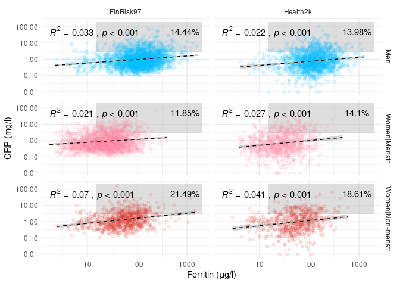
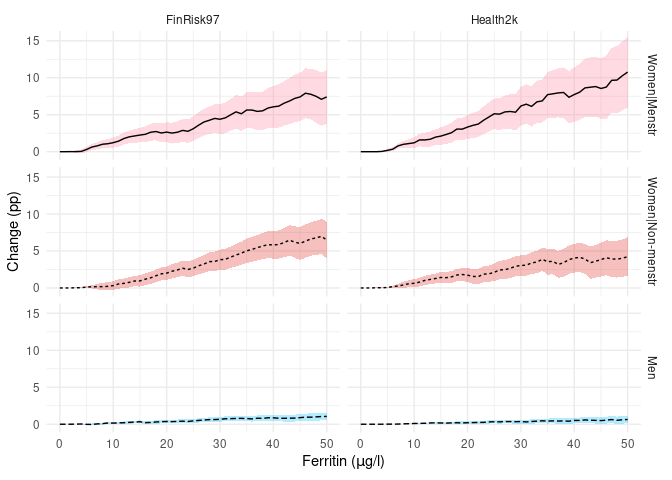
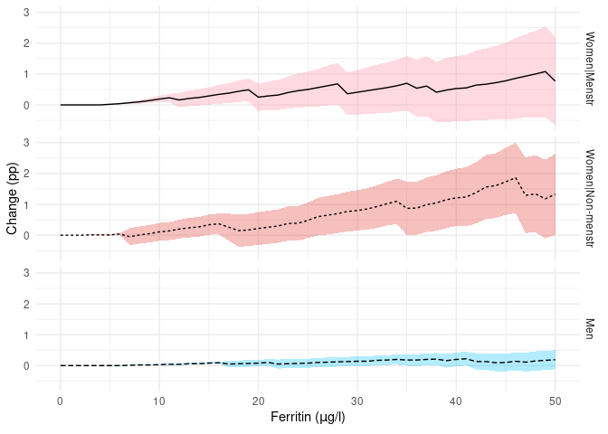
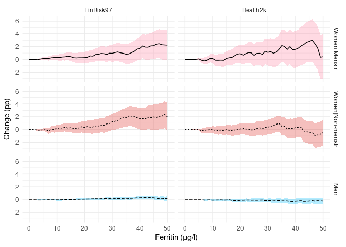

# Create datasets

    # Load data on individual donations
    load("./data/r02.fd.bd.all.rdata") # outputs an object called "output" into the environment
    donations <- output

    # We only want to look at first donation event values from each donor
    donors <- donations %>%
        group_by(donor) %>%
        filter(date == min(date)) %>%
        ungroup()

    # Load FinDonor demographic data
    load("./data/r02ds.donorData.rdata") # outputs an object called "output" into the environment
    findonor <- output

    # Combine the FinDonor datasets
    FinDonor <- left_join(donors, findonor, by = "donor")

    # Load THL data
    # Sofie: thldalta.rdata contains all five THL cohorts, extract FINRISK97 and Health2000 from the others
    load("./data/thldata.rdata")
    FinRisk97 <- thldata$fr1997
    Health2k <- thldata$h2000

    # Remove leftovers
    rm(output)
    rm(thldata)

    ## Rename useful stuff
    # Ferritin, Self-Reported Health
    FinDonor <- rename(FinDonor, SRH = QR17, Menstruation = QR79, Age_float = Age, Age = age)
    FinRisk97 <- rename(FinRisk97, Ferritin = FERRITIN, SRH = Q40, Gender = SUKUP, Menstruation = K129, Age = IKA)
    Health2k <- rename(Health2k, Ferritin = FERRITIINI, SRH = BA01, Gender = SP2, Menstruation = BD03, Age = IKA2, Menopause = MENOP, APOB = NMR_APOB, APOA1 = NMR_APOA1)

    # Make "useful stuff" conform with each other
    FinDonor <- FinDonor %>% 
        mutate(SRH = case_when(SRH == "Excellent" ~ 1,
                               SRH == "Very_good" ~ 2,
                               SRH == "Good" ~ 3,
                               SRH == "Satisfactory" ~ 4,
                               SRH == "Poor" ~ 5),
               Group = case_when(Gender == "Men" ~ "Men",
                                 Gender == "Women" & (Menstruation == "regular_period" | Menstruation == "irregular_period") ~ "Women|Menstr",
                                 Gender == "Women" & Menstruation == "no_period" ~ "Women|Non-menstr",
                                 TRUE ~ "NA")) # Equates to "else"

    FinRisk97 <- FinRisk97 %>%
        mutate(Gender = case_when(Gender == 1 ~ "Men",
                                  Gender == 2 ~ "Women",
                                  TRUE ~ "NA"),
               Group = case_when(Gender == "Men" ~ "Men",
                                 Gender == "Women" & (Menstruation == 1 | Menstruation == 2) ~ "Women|Menstr",
                                 Gender == "Women" & Menstruation == 3 ~ "Women|Non-menstr",
                                 TRUE ~ "NA"))

    Health2k <- Health2k %>%
        mutate(Gender = case_when(Gender == 1 ~ "Men",
                                  Gender == 2 ~ "Women",
                                  TRUE ~ "NA"),
               # It is worth noting here, that menstruation status was not asked from women over 55. So, we treat these as postmenopausal.
               Group = case_when(Gender == "Men" ~ "Men",
                                 Gender == "Women" & (Menstruation == 1 | Menstruation == 2) ~ "Women|Menstr",
                                 Gender == "Women" & (Menstruation == 3 | Age >= 55) ~ "Women|Non-menstr",
                                 TRUE ~ "NA"))

    # Donation eligibility
    # These are both "approximates" in a sense, we don't have all the necessary variables to
    # filter thoroughly, and we'll be able to do more filtering on Health2000 than FinRisk97
    donor_eligible_h2k <- Health2k %>%
        filter(BMII_PAINO.x >= 50 | BMII_PAINO.x <= 200) %>% # Filter away people <50kg and >200kg
        filter(Age >= 18 | Age <= 66) %>% # Filter away too young and too old
        filter((B_Hb >= 125 & Gender == "Women") | (B_Hb >= 135 & Gender == "Men")) %>% # Filter by hemoglobin
        filter(BA08 == 0) %>% # filter out people with heart attacks
        filter(BA09 == 0) %>% # filter out people with angina
        filter(BA10 == 0) %>% # cardiac insufficiency / heart failure
        filter(!(BA26 == 1 & ATC_A10A == 1)) %>% # filter out people who are diabetic AND use insulin
        filter(SRH < 4) %>% # filter out "Bad" or "Very bad" SRH
        rename(GlycA = GP) %>% # rename for ease of use
        mutate(HbA1C = B_GHb_A1C * 10.93 - 23.50)

    donor_eligible_fr <- FinRisk97 %>%
        filter(PAINO >= 50 | PAINO <= 200) %>% # Filter away people <50kg and >200kg
        filter(Age >= 18 | Age <= 66) %>% # Filter away too young and too old
        #filter((HGB >= 125 & Gender == 2) | (HGB >= 135 & Gender == 1)) %>% # DON'T filter by hemoglobin, < 500 values in data
        filter(Q15A != 2) %>% # STEMI, NSTEMI
        filter(Q16A != 2) %>% # Stroke
        # filter(Q38 != 2 & Q38 != 4) %>%  # Insulin treatment (2: just insulin, 4: insulin and a tablet)
        filter(Q17B != 2) %>% # cardiac insufficiency
        filter(Q17C != 2) %>% # angina pectoris
        filter(SRH < 4) %>% # filter out "Bad" or "Very bad" SRH
        rename(GlycA = GP) # rename for ease of use

    # Create useful mastersets
    # fer_srh <- bind_rows(FinRisk97 = donor_eligible_fr[, c("Ferritin", "SRH", "Group")], 
    #                      Health2k = donor_eligible_h2k[, c("Ferritin", "SRH", "Group")], .id = "Cohort") %>% 
    #     mutate(Group = ordered(Group, levels = c("Women|Menstr", "Women|Non-menstr", "Men")),
    #            Cohort = ordered(Cohort, levels = c("FinRisk97", "Health2k")),
    #            SRH = ordered(SRH, levels = 1:5)) %>%
    #     filter(Group != "NA") %>%
    #     drop_na()

    fer_crp <- bind_rows(FinRisk97 = donor_eligible_fr[, c("Ferritin", "Group", "CRP")], 
                             Health2k = donor_eligible_h2k[, c("Ferritin", "Group", "CRP")], .id = "Cohort") %>% 
        mutate(Group = ordered(Group, levels = c("Women|Menstr", "Women|Non-menstr", "Men")),
               Cohort = ordered(Cohort, levels = c("FinRisk97", "Health2k"))) %>%
        filter(Group != "NA") %>%
        filter(CRP >= 0.01) %>%
        drop_na()

# Mock Cohort|Var Tables

    table1 <- as.data.frame(table(fer_crp$Group, fer_crp$Cohort))
    table1$CRP <- c(paste0(round(summary(fer_crp$CRP[fer_crp$Group == "Women|Menstr" & fer_crp$Cohort == "FinRisk97"])[3], 2), " | (", round(summary(fer_crp$CRP[fer_crp$Group == "Women|Menstr" & fer_crp$Cohort == "FinRisk97"])[2], 2), ", ", round(summary(fer_crp$CRP[fer_crp$Group == "Women|Menstr" & fer_crp$Cohort == "FinRisk97"])[5], 2), ")"),
                      paste0(round(summary(fer_crp$CRP[fer_crp$Group == "Women|Non-menstr" & fer_crp$Cohort == "FinRisk97"])[3], 2), " | (", round(summary(fer_crp$CRP[fer_crp$Group == "Women|Non-menstr" & fer_crp$Cohort == "FinRisk97"])[2], 2), ", ", round(summary(fer_crp$CRP[fer_crp$Group == "Women|Non-menstr" & fer_crp$Cohort == "FinRisk97"])[5], 2), ")"),
                      paste0(round(summary(fer_crp$CRP[fer_crp$Group == "Men" & fer_crp$Cohort == "FinRisk97"])[3], 2), " | (", round(summary(fer_crp$CRP[fer_crp$Group == "Men" & fer_crp$Cohort == "FinRisk97"])[2], 2), ", ", round(summary(fer_crp$CRP[fer_crp$Group == "Men" & fer_crp$Cohort == "FinRisk97"])[5], 2), ")"),
                      paste0(round(summary(fer_crp$CRP[fer_crp$Group == "Women|Menstr" & fer_crp$Cohort == "Health2k"])[3], 2), " | (", round(summary(fer_crp$CRP[fer_crp$Group == "Women|Menstr" & fer_crp$Cohort == "Health2k"])[2], 2), ", ", round(summary(fer_crp$CRP[fer_crp$Group == "Women|Menstr" & fer_crp$Cohort == "Health2k"])[5], 2), ")"),
                      paste0(round(summary(fer_crp$CRP[fer_crp$Group == "Women|Non-menstr" & fer_crp$Cohort == "Health2k"])[3], 2), " | (", round(summary(fer_crp$CRP[fer_crp$Group == "Women|Non-menstr" & fer_crp$Cohort == "Health2k"])[2], 2), ", ", round(summary(fer_crp$CRP[fer_crp$Group == "Women|Non-menstr" & fer_crp$Cohort == "Health2k"])[5], 2), ")"),
                      paste0(round(summary(fer_crp$CRP[fer_crp$Group == "Men" & fer_crp$Cohort == "Health2k"])[3], 2), " | (", round(summary(fer_crp$CRP[fer_crp$Group == "Men" & fer_crp$Cohort == "Health2k"])[2], 2), ", ", round(summary(fer_crp$CRP[fer_crp$Group == "Men" & fer_crp$Cohort == "Health2k"])[5], 2), ")"))
    table1$FER <- c(paste0(round(summary(fer_crp$Ferritin[fer_crp$Group == "Women|Menstr" & fer_crp$Cohort == "FinRisk97"])[3], 2), " | (", round(summary(fer_crp$Ferritin[fer_crp$Group == "Women|Menstr" & fer_crp$Cohort == "FinRisk97"])[2], 2), ", ", round(summary(fer_crp$Ferritin[fer_crp$Group == "Women|Menstr" & fer_crp$Cohort == "FinRisk97"])[5], 2), ")"),
                      paste0(round(summary(fer_crp$Ferritin[fer_crp$Group == "Women|Non-menstr" & fer_crp$Cohort == "FinRisk97"])[3], 2), " | (", round(summary(fer_crp$Ferritin[fer_crp$Group == "Women|Non-menstr" & fer_crp$Cohort == "FinRisk97"])[2], 2), ", ", round(summary(fer_crp$Ferritin[fer_crp$Group == "Women|Non-menstr" & fer_crp$Cohort == "FinRisk97"])[5], 2), ")"),
                      paste0(round(summary(fer_crp$Ferritin[fer_crp$Group == "Men" & fer_crp$Cohort == "FinRisk97"])[3], 2), " | (", round(summary(fer_crp$Ferritin[fer_crp$Group == "Men" & fer_crp$Cohort == "FinRisk97"])[2], 2), ", ", round(summary(fer_crp$Ferritin[fer_crp$Group == "Men" & fer_crp$Cohort == "FinRisk97"])[5], 2), ")"),
                      paste0(round(summary(fer_crp$Ferritin[fer_crp$Group == "Women|Menstr" & fer_crp$Cohort == "Health2k"])[3], 2), " | (", round(summary(fer_crp$Ferritin[fer_crp$Group == "Women|Menstr" & fer_crp$Cohort == "Health2k"])[2], 2), ", ", round(summary(fer_crp$Ferritin[fer_crp$Group == "Women|Menstr" & fer_crp$Cohort == "Health2k"])[5], 2), ")"),
                      paste0(round(summary(fer_crp$Ferritin[fer_crp$Group == "Women|Non-menstr" & fer_crp$Cohort == "Health2k"])[3], 2), " | (", round(summary(fer_crp$Ferritin[fer_crp$Group == "Women|Non-menstr" & fer_crp$Cohort == "Health2k"])[2], 2), ", ", round(summary(fer_crp$Ferritin[fer_crp$Group == "Women|Non-menstr" & fer_crp$Cohort == "Health2k"])[5], 2), ")"),
                      paste0(round(summary(fer_crp$Ferritin[fer_crp$Group == "Men" & fer_crp$Cohort == "Health2k"])[3], 2), " | (", round(summary(fer_crp$Ferritin[fer_crp$Group == "Men" & fer_crp$Cohort == "Health2k"])[2], 2), ", ", round(summary(fer_crp$Ferritin[fer_crp$Group == "Men" & fer_crp$Cohort == "Health2k"])[5], 2), ")"))
    table1

    ##               Var1      Var2 Freq                 CRP                     FER
    ## 1     Women|Menstr FinRisk97 1980 0.76 | (0.38, 1.85)  23.97 | (12.35, 42.51)
    ## 2 Women|Non-menstr FinRisk97 1001  1.26 | (0.61, 2.6)   55.8 | (31.42, 94.74)
    ## 3              Men FinRisk97 2801 0.91 | (0.47, 1.92) 110.99 | (65.87, 181.3)
    ## 4     Women|Menstr  Health2k  976 0.61 | (0.26, 1.78)   27.9 | (15.17, 48.54)
    ## 5 Women|Non-menstr  Health2k  785  1.02 | (0.4, 2.35)      55.97 | (32, 95.1)
    ## 6              Men  Health2k 1793 0.79 | (0.35, 1.77)  123.1 | (76.32, 192.7)

# Exclusions: Health2000

    # ExclusionTable method
    excl_h2k_women_mens <- exclusion_table(data = Health2k,
                    inclusion_criteria = c("Group == 'Women|Menstr'"),
                    exclusion_criteria = c("BMII_PAINO.x < 50", "BMII_PAINO.x > 200", "Age < 18", "Age > 66", "SRH >= 4",
                                           "B_Hb < 125", "BA08 == 1", "BA09 == 1", "BA10 == 1", "BA26 == 1 & ATC_A10A == 1"),
                    keep_data = TRUE)
    excl_h2k_women_mens

    ## 
    ## ======================================================
    ## Excluded the following observations:
    ## ======================================================
    ## Exclusions based on INCLUSION criteria
    ## 
    ##                 inclusion n_prior n_post n_excluded
    ## 1 Group == 'Women|Menstr'    6264   1508       4756
    ## 2                   TOTAL    6264   1508       4756
    ## 
    ## Exclusions based on EXCLUSION criteria
    ## 
    ##                    exclusion n_prior n_post n_excluded
    ## 1          BMII_PAINO.x < 50    1508   1459         49
    ## 2         BMII_PAINO.x > 200    1459   1459          0
    ## 3                   Age < 18    1459   1459          0
    ## 4                   Age > 66    1459   1459          0
    ## 5                   SRH >= 4    1459   1409         50
    ## 6                 B_Hb < 125    1409   1115        294
    ## 7                  BA08 == 1    1115   1114          1
    ## 8                  BA09 == 1    1114   1113          1
    ## 9                  BA10 == 1    1113   1111          2
    ## 10 BA26 == 1 & ATC_A10A == 1    1111   1105          6
    ## 11                     TOTAL    1508   1105        403
    ## 
    ## ======================================================

    excl_h2k_women_nonmens <- exclusion_table(data = Health2k,
                    inclusion_criteria = c("Group == 'Women|Non-menstr'"),
                    exclusion_criteria = c("BMII_PAINO.x < 50", "BMII_PAINO.x > 200", "Age < 18", "Age > 66", "SRH >= 4",
                                           "B_Hb < 125", "BA08 == 1", "BA09 == 1", "BA10 == 1", "BA26 == 1 & ATC_A10A == 1"),
                    keep_data = TRUE)
    excl_h2k_women_nonmens

    ## 
    ## ========================================================
    ## Excluded the following observations:
    ## ========================================================
    ## Exclusions based on INCLUSION criteria
    ## 
    ##                     inclusion n_prior n_post n_excluded
    ## 1 Group == 'Women|Non-menstr'    6264   1505       4759
    ## 2                       TOTAL    6264   1505       4759
    ## 
    ## Exclusions based on EXCLUSION criteria
    ## 
    ##                    exclusion n_prior n_post n_excluded
    ## 1          BMII_PAINO.x < 50    1505   1474         31
    ## 2         BMII_PAINO.x > 200    1474   1474          0
    ## 3                   Age < 18    1474   1474          0
    ## 4                   Age > 66    1474   1199        275
    ## 5                   SRH >= 4    1199   1066        133
    ## 6                 B_Hb < 125    1066    772        294
    ## 7                  BA08 == 1     772    764          8
    ## 8                  BA09 == 1     764    739         25
    ## 9                  BA10 == 1     739    729         10
    ## 10 BA26 == 1 & ATC_A10A == 1     729    722          7
    ## 11                     TOTAL    1505    722        783
    ## 
    ## ========================================================

    excl_h2k_men <- exclusion_table(data = Health2k,
                    inclusion_criteria = c("Group == 'Men'"),
                    exclusion_criteria = c("BMII_PAINO.x < 50", "BMII_PAINO.x > 200", "Age < 18", "Age > 66", "SRH >= 4",
                                           "B_Hb < 135", "BA08 == 1", "BA09 == 1", "BA10 == 1", "BA26 == 1 & ATC_A10A == 1"),
                    keep_data = TRUE)
    excl_h2k_men

    ## 
    ## ======================================================
    ## Excluded the following observations:
    ## ======================================================
    ## Exclusions based on INCLUSION criteria
    ## 
    ##        inclusion n_prior n_post n_excluded
    ## 1 Group == 'Men'    6264   2944       3320
    ## 2          TOTAL    6264   2944       3320
    ## 
    ## Exclusions based on EXCLUSION criteria
    ## 
    ##                    exclusion n_prior n_post n_excluded
    ## 1          BMII_PAINO.x < 50    2944   2938          6
    ## 2         BMII_PAINO.x > 200    2938   2938          0
    ## 3                   Age < 18    2938   2938          0
    ## 4                   Age > 66    2938   2711        227
    ## 5                   SRH >= 4    2711   2443        268
    ## 6                 B_Hb < 135    2443   2062        381
    ## 7                  BA08 == 1    2062   2023         39
    ## 8                  BA09 == 1    2023   1999         24
    ## 9                  BA10 == 1    1999   1990          9
    ## 10 BA26 == 1 & ATC_A10A == 1    1990   1970         20
    ## 11                     TOTAL    2944   1970        974
    ## 
    ## ======================================================

# Exclusions: FinRisk1997

    # ExclusionTable method
    excl_fr_women_mens <- exclusion_table(data = FinRisk97,
                    inclusion_criteria = c("Group == 'Women|Menstr'"),
                    exclusion_criteria = c("PAINO < 50", "PAINO > 200", "Age < 18", "Age > 66", "SRH >= 4",
                                           "Q15A == 2", "Q16A == 2", "Q17B == 2", "Q17C == 2"),
                    keep_data = TRUE)
    excl_fr_women_mens

    ## 
    ## ====================================================
    ## Excluded the following observations:
    ## ====================================================
    ## Exclusions based on INCLUSION criteria
    ## 
    ##                 inclusion n_prior n_post n_excluded
    ## 1 Group == 'Women|Menstr'    7943   2469       5474
    ## 2                   TOTAL    7943   2469       5474
    ## 
    ## Exclusions based on EXCLUSION criteria
    ## 
    ##      exclusion n_prior n_post n_excluded
    ## 1   PAINO < 50    2469   2387         82
    ## 2  PAINO > 200    2387   2387          0
    ## 3     Age < 18    2387   2387          0
    ## 4     Age > 66    2387   2379          8
    ## 5     SRH >= 4    2379   2265        114
    ## 6    Q15A == 2    2265   2258          7
    ## 7    Q16A == 2    2258   2249          9
    ## 8    Q17B == 2    2249   2223         26
    ## 9    Q17C == 2    2223   2196         27
    ## 10       TOTAL    2469   2196        273
    ## 
    ## ====================================================

    excl_fr_women_nonmens <- exclusion_table(data = FinRisk97,
                    inclusion_criteria = c("Group == 'Women|Non-menstr'"),
                    exclusion_criteria = c("PAINO < 50", "PAINO > 200", "Age < 18", "Age > 66", "SRH >= 4",
                                           "Q15A == 2", "Q16A == 2", "Q17B == 2", "Q17C == 2"),
                    keep_data = TRUE)
    excl_fr_women_nonmens

    ## 
    ## ========================================================
    ## Excluded the following observations:
    ## ========================================================
    ## Exclusions based on INCLUSION criteria
    ## 
    ##                     inclusion n_prior n_post n_excluded
    ## 1 Group == 'Women|Non-menstr'    7943   1463       6480
    ## 2                       TOTAL    7943   1463       6480
    ## 
    ## Exclusions based on EXCLUSION criteria
    ## 
    ##      exclusion n_prior n_post n_excluded
    ## 1   PAINO < 50    1463   1430         33
    ## 2  PAINO > 200    1430   1430          0
    ## 3     Age < 18    1430   1430          0
    ## 4     Age > 66    1430   1280        150
    ## 5     SRH >= 4    1280   1117        163
    ## 6    Q15A == 2    1117   1100         17
    ## 7    Q16A == 2    1100   1071         29
    ## 8    Q17B == 2    1071   1012         59
    ## 9    Q17C == 2    1012    985         27
    ## 10       TOTAL    1463    985        478
    ## 
    ## ========================================================

    excl_fr_men <- exclusion_table(data = FinRisk97,
                    inclusion_criteria = c("Group == 'Men'"),
                    exclusion_criteria = c("PAINO < 50", "PAINO > 200", "Age < 18", "Age > 66", "SRH >= 4",
                                           "Q15A == 2", "Q16A == 2", "Q17B == 2", "Q17C == 2"),
                    keep_data = TRUE)
    excl_fr_men

    ## 
    ## ===========================================
    ## Excluded the following observations:
    ## ===========================================
    ## Exclusions based on INCLUSION criteria
    ## 
    ##        inclusion n_prior n_post n_excluded
    ## 1 Group == 'Men'    7943   3943       4000
    ## 2          TOTAL    7943   3943       4000
    ## 
    ## Exclusions based on EXCLUSION criteria
    ## 
    ##      exclusion n_prior n_post n_excluded
    ## 1   PAINO < 50    3943   3873         70
    ## 2  PAINO > 200    3873   3873          0
    ## 3     Age < 18    3873   3873          0
    ## 4     Age > 66    3873   3548        325
    ## 5     SRH >= 4    3548   3190        358
    ## 6    Q15A == 2    3190   3124         66
    ## 7    Q16A == 2    3124   3072         52
    ## 8    Q17B == 2    3072   2987         85
    ## 9    Q17C == 2    2987   2935         52
    ## 10       TOTAL    3943   2935       1008
    ## 
    ## ===========================================

# Ferritin X CRP

Subgroups: menstruating women, non-menstruating women, men. Grey box
highlights all individuals that go over 3 mg/l CRP at ferritin &gt;15
ug/l.

    options(scipen = 10000)
    ratio1 <- round(nrow(fer_crp %>% filter(Group == "Women|Menstr" & Cohort == "FinRisk97", CRP >= 3 & Ferritin >= 15)) * 100 / nrow(fer_crp %>% filter(Group == "Women|Menstr" & Cohort == "FinRisk97")), 2)
    ratio2 <- round(nrow(fer_crp %>% filter(Group == "Women|Non-menstr" & Cohort == "FinRisk97", CRP >= 3 & Ferritin >= 15)) * 100 / nrow(fer_crp %>% filter(Group == "Women|Non-menstr" & Cohort == "FinRisk97")), 2)
    ratio3 <- round(nrow(fer_crp %>% filter(Group == "Men" & Cohort == "FinRisk97", CRP >= 3 & Ferritin >= 15)) * 100 / nrow(fer_crp %>% filter(Group == "Men" & Cohort == "FinRisk97")), 2)
    ratio4 <- round(nrow(fer_crp %>% filter(Group == "Women|Menstr" & Cohort == "Health2k", CRP >= 3 & Ferritin >= 15)) * 100 / nrow(fer_crp %>% filter(Group == "Women|Menstr" & Cohort == "Health2k")), 2)
    ratio5 <- round(nrow(fer_crp %>% filter(Group == "Women|Non-menstr" & Cohort == "Health2k", CRP >= 3 & Ferritin >= 15)) * 100 / nrow(fer_crp %>% filter(Group == "Women|Non-menstr" & Cohort == "Health2k")), 2)
    ratio6 <- round(nrow(fer_crp %>% filter(Group == "Men" & Cohort == "Health2k", CRP >= 3 & Ferritin >= 15)) * 100 / nrow(fer_crp %>% filter(Group == "Men" & Cohort == "Health2k")), 2)
    ann_text <- data.frame(Ferritin = rep(900, 6), CRP = rep(50, 6), lab = c(paste0(ratio1, "%"), paste0(ratio2, "%"), paste0(ratio3, "%"), paste0(ratio4, "%"), paste0(ratio5, "%"), paste0(ratio6, "%")), Cohort = c(rep("FinRisk97", 3), rep("Health2k", 3)), Group = rep(c("Women|Menstr", "Women|Non-menstr", "Men"), 2))
    ggplot(data = fer_crp, aes(x = Ferritin, y = CRP)) + 
        annotate("rect", xmin = 15, xmax = 2000, ymin = 3, ymax = 200, alpha = .5, fill = "grey") +
        geom_text(data = ann_text, aes(label = lab)) +
        geom_point(alpha = 0.1) +
        scale_x_log10() +
        scale_y_log10() +
        theme_minimal() + 
        geom_smooth(method = "lm", formula = y ~ x, color = "black", linetype = "dashed", size = 0.5) +
        stat_cor(aes(label = paste(..rr.label.., ..p.label.., sep = "~`,`~")), p.accuracy = 0.001) +
        facet_grid(rows = vars(Group), cols = vars(Cohort))

# Ferritin X CRP | COLORED

    options(scipen = 10000)
    ratio1 <- round(nrow(fer_crp %>% filter(Group == "Women|Menstr" & Cohort == "FinRisk97", CRP >= 3 & Ferritin >= 15)) * 100 / nrow(fer_crp %>% filter(Group == "Women|Menstr" & Cohort == "FinRisk97")), 2)
    ratio2 <- round(nrow(fer_crp %>% filter(Group == "Women|Non-menstr" & Cohort == "FinRisk97", CRP >= 3 & Ferritin >= 15)) * 100 / nrow(fer_crp %>% filter(Group == "Women|Non-menstr" & Cohort == "FinRisk97")), 2)
    ratio3 <- round(nrow(fer_crp %>% filter(Group == "Men" & Cohort == "FinRisk97", CRP >= 3 & Ferritin >= 15)) * 100 / nrow(fer_crp %>% filter(Group == "Men" & Cohort == "FinRisk97")), 2)
    ratio4 <- round(nrow(fer_crp %>% filter(Group == "Women|Menstr" & Cohort == "Health2k", CRP >= 3 & Ferritin >= 15)) * 100 / nrow(fer_crp %>% filter(Group == "Women|Menstr" & Cohort == "Health2k")), 2)
    ratio5 <- round(nrow(fer_crp %>% filter(Group == "Women|Non-menstr" & Cohort == "Health2k", CRP >= 3 & Ferritin >= 15)) * 100 / nrow(fer_crp %>% filter(Group == "Women|Non-menstr" & Cohort == "Health2k")), 2)
    ratio6 <- round(nrow(fer_crp %>% filter(Group == "Men" & Cohort == "Health2k", CRP >= 3 & Ferritin >= 15)) * 100 / nrow(fer_crp %>% filter(Group == "Men" & Cohort == "Health2k")), 2)
    ann_text <- data.frame(Ferritin = rep(900, 6), CRP = rep(50, 6), lab = c(paste0(ratio1, "%"), paste0(ratio2, "%"), paste0(ratio3, "%"), paste0(ratio4, "%"), paste0(ratio5, "%"), paste0(ratio6, "%")), Cohort = c(rep("FinRisk97", 3), rep("Health2k", 3)), Group = rep(c("Women|Menstr", "Women|Non-menstr", "Men"), 2))
    ggplot(data = fer_crp, aes(x = Ferritin, y = CRP)) + 
        annotate("rect", xmin = 15, xmax = 2000, ymin = 3, ymax = 200, alpha = .5, fill = "grey") +
        geom_text(data = ann_text, aes(label = lab)) +
        geom_point(aes(color = Group), alpha = 0.1) +
        scale_x_log10() +
        scale_y_log10() +
        scale_color_manual(values = c( "#00BFFF",  "#de2d26", "#ff85a2" ),
                           limits = c( "Men",  "Women|Non-menstr", "Women|Menstr" )) +
        scale_fill_manual(values = c( "#00BFFF",  "#de2d26", "#ff85a2" ),
                          limits = c( "Men",  "Women|Non-menstr", "Women|Menstr" )) +
        theme_minimal() + 
        geom_smooth(method = "lm", color = "black", linetype = "dashed", size = 0.5) +
        stat_cor(aes(label = paste(..rr.label.., ..p.label.., sep = "~`,`~")), p.accuracy = 0.001) +
        facet_grid(rows = vars(Group), cols = vars(Cohort)) +
        theme(legend.position = "none")

# Ferritin X CRP | GROUPS ONLY BY COLOR

    options(scipen = 10000)
    ratio1 <- round(nrow(fer_crp %>% filter(Cohort == "FinRisk97", CRP >= 3 & Ferritin >= 15)) * 100 / nrow(fer_crp %>% filter(Cohort == "FinRisk97")), 2)
    ratio2 <- round(nrow(fer_crp %>% filter(Cohort == "Health2k", CRP >= 3 & Ferritin >= 15)) * 100 / nrow(fer_crp %>% filter(Cohort == "Health2k")), 2)
    ann_text <- data.frame(Ferritin = rep(900, 2), CRP = rep(50, 2), lab = c(paste0(ratio1, "%"), paste0(ratio2, "%")), Cohort = c("FinRisk97", "Health2k"))
    ggplot(data = fer_crp, aes(x = Ferritin, y = CRP)) + 
        annotate("rect", xmin = 15, xmax = 2000, ymin = 3, ymax = 200, alpha = .5, fill = "grey") +
        geom_text(data = ann_text, aes(label = lab)) +
        geom_point(aes(color = Group), alpha = 0.2) +
        scale_x_log10() +
        scale_y_log10() +
        scale_color_manual(values = c( "#00BFFF",  "#de2d26", "#ff85a2" ),
                           limits = c( "Men",  "Women|Non-menstr", "Women|Menstr" )) +
        scale_fill_manual(values = c( "#00BFFF",  "#de2d26", "#ff85a2" ),
                          limits = c( "Men",  "Women|Non-menstr", "Women|Menstr" )) +
        theme_minimal() + 
        geom_smooth(method = "lm", color = "black", linetype = "dashed", size = 0.5) +
        stat_cor(aes(label = paste(..rr.label.., ..p.label.., sep = "~`,`~")), p.accuracy = 0.001) +
        facet_grid(cols = vars(Cohort)) +
        theme(legend.position = "bottom") + guides(colour = guide_legend(override.aes = list(alpha = 1)))

# Proportion analysis code

The estimate: *How many more people are over 3 mg/l in CRP when we
filter the populations by different ferritin thresholds? Expressed in
percentage point difference.* The intuition: We currently don’t do
ferritin filtering. The population from which we draw donors has a
certain proportion of people in risk of cardiac/chronic inflammation,
often indicated by elevated hs-CRP (&gt;3 mg/l). Does this proportion
increase in a statistically significant manner, if we start requiring
higher ferritin levels from donors?

    if (!file.exists(paste0("./data/PUBL_finrisk_CRP_", boot_n, ".rds"))) { # run bootstrap only if needed
        
        ## Preallocate
        # Men
        means_men <- 1:iterations
        upper_men <- 1:iterations
        lower_men <- 1:iterations
        # Women|Menstr
        means_women_mens <- 1:iterations
        upper_women_mens <- 1:iterations
        lower_women_mens <- 1:iterations
        # Women|Non-menstr
        means_women_nonmens <- 1:iterations
        upper_women_nonmens <- 1:iterations
        lower_women_nonmens <- 1:iterations
        
        bootobs <- setNames(vector("list", length = 3), c("men", "women_mens", "women_nonmens"))
        
        for (i in 1:iterations) {
            
            #############
            #### FinRisk97
            #############
            
            ## Compute
            # Men
            bootobs$men[[i]] <- boot(fer_crp %>% filter(Group == "Men" & Cohort == "FinRisk97"), statistic = get_ratio_boot, R = boot_n, 
                                 var1 = Ferritin, var2 = CRP, var1_trld = ferritin_values[i], var2_trld = CRP_trld, var2_over = T)
            ci_obj_men <- boot.ci(bootobs$men[[i]], type = "norm")
            # Women|Menstr
            bootobs$women_mens[[i]] <- boot(fer_crp %>% filter(Group == "Women|Menstr" & Cohort == "FinRisk97"), statistic = get_ratio_boot, R = boot_n, 
                                       var1 = Ferritin, var2 = CRP, var1_trld = ferritin_values[i], var2_trld = CRP_trld, var2_over = T)
            ci_obj_women_mens <- boot.ci(bootobs$women_mens[[i]], type = "norm")
            # Women|Non-menstr
            bootobs$women_nonmens[[i]] <- boot(fer_crp %>% filter(Group == "Women|Non-menstr" & Cohort == "FinRisk97"), statistic = get_ratio_boot, R = boot_n, 
                                        var1 = Ferritin, var2 = CRP, var1_trld = ferritin_values[i],var2_trld = CRP_trld, var2_over = T)
            ci_obj_women_nonmens <- boot.ci(bootobs$women_nonmens[[i]], type = "norm")
            
            ## Store
            # Men
            means_men[i] <- bootobs$men[[i]]$t0
            upper_men[i] <- ci_obj_men$normal[3]
            lower_men[i] <- ci_obj_men$normal[2]
            # Women|Menstr
            means_women_mens[i] <- bootobs$women_mens[[i]]$t0
            upper_women_mens[i] <- ci_obj_women_mens$normal[3]
            lower_women_mens[i] <- ci_obj_women_mens$normal[2]
            # Women|Non-menstr
            means_women_nonmens[i] <- bootobs$women_nonmens[[i]]$t0
            upper_women_nonmens[i] <- ci_obj_women_nonmens$normal[3]
            lower_women_nonmens[i] <- ci_obj_women_nonmens$normal[2]
            
            # Combine
            means_finrisk <- data.frame(Ferritin = rep(ferritin_values, 3),
                                         means = c(means_men, means_women_mens, means_women_nonmens),
                                         upper = c(upper_men, upper_women_mens, upper_women_nonmens),
                                         lower = c(lower_men, lower_women_mens, lower_women_nonmens),
                                         Gender = c(rep("Men", iterations), rep("Women|Menstr", iterations), rep("Women|Non-menstr", iterations)))
        
        }
        
        # Save
        saveRDS(bootobs, paste0("./data/PUBL_finrisk_CRP_", boot_n, ".rds"))
    } else {
        bootobs <- readRDS(paste0("./data/PUBL_finrisk_CRP_", boot_n, ".rds"))
        
        ## Preallocate
        # Men
        means_men <- 1:iterations
        upper_men <- 1:iterations
        lower_men <- 1:iterations
        # Women|Menstr
        means_women_mens <- 1:iterations
        upper_women_mens <- 1:iterations
        lower_women_mens <- 1:iterations
        # Women|Non-menstr
        means_women_nonmens <- 1:iterations
        upper_women_nonmens <- 1:iterations
        lower_women_nonmens <- 1:iterations
        
        for (i in 1:iterations) {
            ci_obj_men <- boot.ci(bootobs$men[[i]], type = "norm")
            ci_obj_women_mens <- boot.ci(bootobs$women_mens[[i]], type = "norm")
            ci_obj_women_nonmens <- boot.ci(bootobs$women_nonmens[[i]], type = "norm")
            # Store
            means_men[i] <- bootobs$men[[i]]$t0
            upper_men[i] <- ci_obj_men$normal[3]
            lower_men[i] <- ci_obj_men$normal[2]
            means_women_mens[i] <- bootobs$women_mens[[i]]$t0
            upper_women_mens[i] <- ci_obj_women_mens$normal[3]
            lower_women_mens[i] <- ci_obj_women_mens$normal[2]
            means_women_nonmens[i] <- bootobs$women_nonmens[[i]]$t0
            upper_women_nonmens[i] <- ci_obj_women_nonmens$normal[3]
            lower_women_nonmens[i] <- ci_obj_women_nonmens$normal[2]
        }
        
        
        # Combine
        means_finrisk <- data.frame(Ferritin = rep(ferritin_values, 3),
                                     means = c(means_men, means_women_mens, means_women_nonmens),
                                     upper = c(upper_men, upper_women_mens, upper_women_nonmens),
                                     lower = c(lower_men, lower_women_mens, lower_women_nonmens),
                                     Gender = c(rep("Men", iterations), rep("Women|Menstr", iterations), rep("Women|Non-menstr", iterations)))
        }

    if (!file.exists(paste0("./data/PUBL_health2k_CRP_", boot_n, ".rds"))) { # run bootstrap only if needed
        ## Preallocate
        # Men
        means_men <- 1:iterations
        upper_men <- 1:iterations
        lower_men <- 1:iterations
        # Women|Menstr
        means_women_mens <- 1:iterations
        upper_women_mens <- 1:iterations
        lower_women_mens <- 1:iterations
        # Women|Non-menstr
        means_women_nonmens <- 1:iterations
        upper_women_nonmens <- 1:iterations
        lower_women_nonmens <- 1:iterations
        
        bootobs <- setNames(vector("list", length = 3), c("men", "women_mens", "women_nonmens"))

        for (i in 1:iterations) {
        
        #############
        #### Health2000
        #############
        
        ## Compute
        # Men
        bootobs$men[[i]] <- boot(fer_crp %>% filter(Group == "Men" & Cohort == "Health2k"), statistic = get_ratio_boot, R = boot_n, 
                             var1 = Ferritin, var2 = CRP, var1_trld = ferritin_values[i], var2_trld = CRP_trld, var2_over = T)
        ci_obj_men <- boot.ci(bootobs$men[[i]], type = "norm")
        # Women|Menstr
        bootobs$women_mens[[i]] <- boot(fer_crp %>% filter(Group == "Women|Menstr" & Cohort == "Health2k"), statistic = get_ratio_boot, R = boot_n, 
                                   var1 = Ferritin, var2 = CRP, var1_trld = ferritin_values[i], var2_trld = CRP_trld, var2_over = T)
        ci_obj_women_mens <- boot.ci(bootobs$women_mens[[i]], type = "norm")
        # Women|Non-menstr
        bootobs$women_nonmens[[i]] <- boot(fer_crp %>% filter(Group == "Women|Non-menstr" & Cohort == "Health2k"), statistic = get_ratio_boot, R = boot_n, 
                                    var1 = Ferritin, var2 = CRP, var1_trld = ferritin_values[i], var2_trld = CRP_trld, var2_over = T)
        ci_obj_women_nonmens <- boot.ci(bootobs$women_nonmens[[i]], type = "norm")
        
        ## Store
        # Men
        means_men[i] <- bootobs$men[[i]]$t0
        upper_men[i] <- ci_obj_men$normal[3]
        lower_men[i] <- ci_obj_men$normal[2]
        # Women|Menstr
        means_women_mens[i] <- bootobs$women_mens[[i]]$t0
        upper_women_mens[i] <- ci_obj_women_mens$normal[3]
        lower_women_mens[i] <- ci_obj_women_mens$normal[2]
        # Women|Non-menstr
        means_women_nonmens[i] <- bootobs$women_nonmens[[i]]$t0
        upper_women_nonmens[i] <- ci_obj_women_nonmens$normal[3]
        lower_women_nonmens[i] <- ci_obj_women_nonmens$normal[2]
        
        # Combine
        means_health2k <- data.frame(Ferritin = rep(ferritin_values, 3),
                                     means = c(means_men, means_women_mens, means_women_nonmens),
                                     upper = c(upper_men, upper_women_mens, upper_women_nonmens),
                                     lower = c(lower_men, lower_women_mens, lower_women_nonmens),
                                     Gender = c(rep("Men", iterations), rep("Women|Menstr", iterations), rep("Women|Non-menstr", iterations)))    
        
        
        }
        
        # Save
        saveRDS(bootobs, paste0("./data/PUBL_health2k_CRP_", boot_n, ".rds"))
    } else {
        bootobs <- readRDS(paste0("./data/PUBL_health2k_CRP_", boot_n, ".rds"))
        
        ## Preallocate
        # Men
        means_men <- 1:iterations
        upper_men <- 1:iterations
        lower_men <- 1:iterations
        # Women|Menstr
        means_women_mens <- 1:iterations
        upper_women_mens <- 1:iterations
        lower_women_mens <- 1:iterations
        # Women|Non-menstr
        means_women_nonmens <- 1:iterations
        upper_women_nonmens <- 1:iterations
        lower_women_nonmens <- 1:iterations
        
        for (i in 1:iterations) {
            ci_obj_men <- boot.ci(bootobs$men[[i]], type = "norm")
            ci_obj_women_mens <- boot.ci(bootobs$women_mens[[i]], type = "norm")
            ci_obj_women_nonmens <- boot.ci(bootobs$women_nonmens[[i]], type = "norm")
            # Store
            means_men[i] <- bootobs$men[[i]]$t0
            upper_men[i] <- ci_obj_men$normal[3]
            lower_men[i] <- ci_obj_men$normal[2]
            means_women_mens[i] <- bootobs$women_mens[[i]]$t0
            upper_women_mens[i] <- ci_obj_women_mens$normal[3]
            lower_women_mens[i] <- ci_obj_women_mens$normal[2]
            means_women_nonmens[i] <- bootobs$women_nonmens[[i]]$t0
            upper_women_nonmens[i] <- ci_obj_women_nonmens$normal[3]
            lower_women_nonmens[i] <- ci_obj_women_nonmens$normal[2]
        }
        # Combine
        means_health2k <- data.frame(Ferritin = rep(ferritin_values, 3),
                                     means = c(means_men, means_women_mens, means_women_nonmens),
                                     upper = c(upper_men, upper_women_mens, upper_women_nonmens),
                                     lower = c(lower_men, lower_women_mens, lower_women_nonmens),
                                     Gender = c(rep("Men", iterations), rep("Women|Menstr", iterations), rep("Women|Non-menstr", iterations)))
        }

    means_all <- rbind(means_finrisk, means_health2k)
    means_all$Cohort <- c(rep("FinRisk97", 153), rep("Health2k", 153))
    means_all$Group <- factor(means_all$Gender, levels = c("Women|Menstr", "Women|Non-menstr", "Men"))

# Proportion analysis plot

    ggplot(data = means_all, aes(x = Ferritin, y = means)) +
        geom_ribbon(aes(ymin = lower, ymax = upper), alpha = .3) +
        geom_line(aes(linetype = Group)) +
        theme_minimal() +
        facet_grid(rows = vars(Group), cols = vars(Cohort)) +
        labs(y = "%p") + guides(linetype = "none")

# Checking statistical significance at points of interest

IMPORTANT: We are checking for non-overlaps of 95% confidence intervals.
These intervals have been derived from 10000 bootstrap samples using
normal approximation. Normal approximation relies on the assumption,
that our bootstrapped estimates are normally distributed, which we have
confirmed separately using both visual assessment (a histogram) and a
standard Shapiro-Wilk test.

    # FINRISK
    # Menstruating Women
    frwomenpre5 <- means_all %>% filter(Cohort == "FinRisk97" & Group == "Women|Menstr" & Ferritin == 5)
    frwomenpre15 <- means_all %>% filter(Cohort == "FinRisk97" & Group == "Women|Menstr" & Ferritin == 15)
    frwomenpre30 <- means_all %>% filter(Cohort == "FinRisk97" & Group == "Women|Menstr" & Ferritin == 30)
    frwomenpre50 <- means_all %>% filter(Cohort == "FinRisk97" & Group == "Women|Menstr" & Ferritin == 50)

    # Non-menstruating Women
    frwomenpost5 <- means_all %>% filter(Cohort == "FinRisk97" & Group == "Women|Non-menstr" & Ferritin == 5)
    frwomenpost15 <- means_all %>% filter(Cohort == "FinRisk97" & Group == "Women|Non-menstr" & Ferritin == 15)
    frwomenpost30 <- means_all %>% filter(Cohort == "FinRisk97" & Group == "Women|Non-menstr" & Ferritin == 30)
    frwomenpost50 <- means_all %>% filter(Cohort == "FinRisk97" & Group == "Women|Non-menstr" & Ferritin == 50)

    # Men
    frmen5 <- means_all %>% filter(Cohort == "FinRisk97" & Group == "Men" & Ferritin == 5)
    frmen15 <- means_all %>% filter(Cohort == "FinRisk97" & Group == "Men" & Ferritin == 15)
    frmen30 <- means_all %>% filter(Cohort == "FinRisk97" & Group == "Men" & Ferritin == 30)
    frmen50 <- means_all %>% filter(Cohort == "FinRisk97" & Group == "Men" & Ferritin == 50)

    # H2K
    # Menstruating Women
    h2kwomenpre5 <- means_all %>% filter(Cohort == "Health2k" & Group == "Women|Menstr" & Ferritin == 5)
    h2kwomenpre15 <- means_all %>% filter(Cohort == "Health2k" & Group == "Women|Menstr" & Ferritin == 15)
    h2kwomenpre30 <- means_all %>% filter(Cohort == "Health2k" & Group == "Women|Menstr" & Ferritin == 30)
    h2kwomenpre50 <- means_all %>% filter(Cohort == "Health2k" & Group == "Women|Menstr" & Ferritin == 50)

    # Non-menstruating Women
    h2kwomenpost5 <- means_all %>% filter(Cohort == "Health2k" & Group == "Women|Non-menstr" & Ferritin == 5)
    h2kwomenpost15 <- means_all %>% filter(Cohort == "Health2k" & Group == "Women|Non-menstr" & Ferritin == 15)
    h2kwomenpost30 <- means_all %>% filter(Cohort == "Health2k" & Group == "Women|Non-menstr" & Ferritin == 30)
    h2kwomenpost50 <- means_all %>% filter(Cohort == "Health2k" & Group == "Women|Non-menstr" & Ferritin == 50)

    # Men
    h2kmen5 <- means_all %>% filter(Cohort == "Health2k" & Group == "Men" & Ferritin == 5)
    h2kmen15 <- means_all %>% filter(Cohort == "Health2k" & Group == "Men" & Ferritin == 15)
    h2kmen30 <- means_all %>% filter(Cohort == "Health2k" & Group == "Men" & Ferritin == 30)
    h2kmen50 <- means_all %>% filter(Cohort == "Health2k" & Group == "Men" & Ferritin == 50)

Using these objects, we can check the significance of between the points
of interest. For example
“h2kwomenpre5*u**p**p**e**r* &lt; *h*2*k**w**o**m**e**n**p**r**e*15lower”
would evaluate to TRUE, if the proportion of menstruating women over 3
mg/l CRP is significantly higher in the population filtered by ferritin
15 ug/l than 5 ug/l. Indeed, for menstruating women, the proportion is
significantly higher at filter levels of 15, 30, and 50 ug/l when
compared with 5 ug/l. This holds for non-menstruating women also, except
for the FinRisk 1997 cohort, where the difference between levels 5 and
15 was not significant. The differences are all significant also in men,
but the respective increases in proportions are much smaller.

# Proportion analysis plot | COLORED

    ggplot(data = means_all, aes(x = Ferritin, y = means)) +
        geom_ribbon(aes(ymin = lower, ymax = upper, fill = Group), alpha = .3) +
        geom_line(aes(linetype = Group)) +
        #geom_point(aes(color = Group)) +
        scale_color_manual(values = c( "#00BFFF",  "#de2d26", "#ff85a2" ),
                           limits = c( "Men",  "Women|Non-menstr", "Women|Menstr" )) +
        scale_fill_manual(values = c( "#00BFFF",  "#de2d26", "#ff85a2" ),
                          limits = c( "Men",  "Women|Non-menstr", "Women|Menstr" )) +
        theme_minimal() +
        facet_grid(rows = vars(Group), cols = vars(Cohort)) +
        labs(y = "%p") +
        theme(legend.position = "none")

# Proportion analysis plot | COLORED & ALL-IN-1

    ggplot(data = means_all, aes(x = Ferritin, y = means, group = Group)) +
        geom_ribbon(aes(ymin = lower, ymax = upper, fill = Group), alpha = .3) +
        geom_line(aes(linetype = Group)) +
        #geom_point(aes(color = Group, shape = Group)) +
        scale_color_manual(values = c( "#00BFFF",  "#de2d26", "#ff85a2" ),
                           limits = c( "Men",  "Women|Non-menstr", "Women|Menstr" )) +
        scale_fill_manual(values = c( "#00BFFF",  "#de2d26", "#ff85a2" ),
                          limits = c( "Men",  "Women|Non-menstr", "Women|Menstr" )) +
        theme_minimal() +
        facet_grid(cols = vars(Cohort)) +
        labs(y = "%p") + 
        guides(fill = "none") +
        theme(legend.position = "bottom")

# Additional markers (for the supplement)

We’ll also take a look at acetylated glycoprotein measurements, glucated
haemoglobin, and apolipoproteins A1 and B.

    # mastersets for the Supplement
    # GlycA
    fer_glyca <- bind_rows(FinRisk97 = donor_eligible_fr[, c("Ferritin", "Group", "GlycA")], 
                           Health2k = donor_eligible_h2k[, c("Ferritin", "Group", "GlycA")], .id = "Cohort") %>% 
        mutate(Group = ordered(Group, levels = c("Women|Menstr", "Women|Non-menstr", "Men")),
               Cohort = ordered(Cohort, levels = c("FinRisk97", "Health2k"))) %>%
        filter(Group != "NA") %>%
        drop_na()
    # HbA1C
    fer_hba1c <- bind_rows(Health2k = donor_eligible_h2k[, c("Ferritin", "Group", "HbA1C")], .id = "Cohort") %>% 
        mutate(Group = ordered(Group, levels = c("Women|Menstr", "Women|Non-menstr", "Men")),
               Cohort = ordered(Cohort, levels = c("Health2k"))) %>%
        filter(Group != "NA") %>%
        drop_na()

    # APOB
    fer_apob <- bind_rows(FinRisk97 = donor_eligible_fr[, c("Ferritin", "Group", "APOB")], 
                           Health2k = donor_eligible_h2k[, c("Ferritin", "Group", "APOB")], .id = "Cohort") %>% 
        mutate(Group = ordered(Group, levels = c("Women|Menstr", "Women|Non-menstr", "Men")),
               Cohort = ordered(Cohort, levels = c("FinRisk97", "Health2k"))) %>%
        filter(Group != "NA") %>%
        drop_na()
    # APOA1
    fer_apoa1 <- bind_rows(FinRisk97 = donor_eligible_fr[, c("Ferritin", "Group", "APOA1")], 
                           Health2k = donor_eligible_h2k[, c("Ferritin", "Group", "APOA1")], .id = "Cohort") %>% 
        mutate(Group = ordered(Group, levels = c("Women|Menstr", "Women|Non-menstr", "Men")),
               Cohort = ordered(Cohort, levels = c("FinRisk97", "Health2k"))) %>%
        filter(Group != "NA") %>%
        drop_na()

# Mock Cohort|Var Tables (Supplement)

    suptable1 <- as.data.frame(table(fer_glyca$Group, fer_glyca$Cohort))

    suptable1$GlycA <- c(paste0(round(summary(fer_glyca$GlycA[fer_glyca$Group == "Women|Menstr" & fer_glyca$Cohort == "FinRisk97"])[3], 2), " | (", round(summary(fer_glyca$GlycA[fer_glyca$Group == "Women|Menstr" & fer_glyca$Cohort == "FinRisk97"])[2], 2), ", ", round(summary(fer_glyca$GlycA[fer_glyca$Group == "Women|Menstr" & fer_glyca$Cohort == "FinRisk97"])[5], 2), ")"),
                      paste0(round(summary(fer_glyca$GlycA[fer_glyca$Group == "Women|Non-menstr" & fer_glyca$Cohort == "FinRisk97"])[3], 2), " | (", round(summary(fer_glyca$GlycA[fer_glyca$Group == "Women|Non-menstr" & fer_glyca$Cohort == "FinRisk97"])[2], 2), ", ", round(summary(fer_glyca$GlycA[fer_glyca$Group == "Women|Non-menstr" & fer_glyca$Cohort == "FinRisk97"])[5], 2), ")"),
                      paste0(round(summary(fer_glyca$GlycA[fer_glyca$Group == "Men" & fer_glyca$Cohort == "FinRisk97"])[3], 2), " | (", round(summary(fer_glyca$GlycA[fer_glyca$Group == "Men" & fer_glyca$Cohort == "FinRisk97"])[2], 2), ", ", round(summary(fer_glyca$GlycA[fer_glyca$Group == "Men" & fer_glyca$Cohort == "FinRisk97"])[5], 2), ")"),
                      paste0(round(summary(fer_glyca$GlycA[fer_glyca$Group == "Women|Menstr" & fer_glyca$Cohort == "Health2k"])[3], 2), " | (", round(summary(fer_glyca$GlycA[fer_glyca$Group == "Women|Menstr" & fer_glyca$Cohort == "Health2k"])[2], 2), ", ", round(summary(fer_glyca$GlycA[fer_glyca$Group == "Women|Menstr" & fer_glyca$Cohort == "Health2k"])[5], 2), ")"),
                      paste0(round(summary(fer_glyca$GlycA[fer_glyca$Group == "Women|Non-menstr" & fer_glyca$Cohort == "Health2k"])[3], 2), " | (", round(summary(fer_glyca$GlycA[fer_glyca$Group == "Women|Non-menstr" & fer_glyca$Cohort == "Health2k"])[2], 2), ", ", round(summary(fer_glyca$GlycA[fer_glyca$Group == "Women|Non-menstr" & fer_glyca$Cohort == "Health2k"])[5], 2), ")"),
                      paste0(round(summary(fer_glyca$GlycA[fer_glyca$Group == "Men" & fer_glyca$Cohort == "Health2k"])[3], 2), " | (", round(summary(fer_glyca$GlycA[fer_glyca$Group == "Men" & fer_glyca$Cohort == "Health2k"])[2], 2), ", ", round(summary(fer_glyca$GlycA[fer_glyca$Group == "Men" & fer_glyca$Cohort == "Health2k"])[5], 2), ")"))

    suptable1$FER <- c(paste0(round(summary(fer_glyca$Ferritin[fer_glyca$Group == "Women|Menstr" & fer_glyca$Cohort == "FinRisk97"])[3], 2), " | (", round(summary(fer_glyca$Ferritin[fer_glyca$Group == "Women|Menstr" & fer_glyca$Cohort == "FinRisk97"])[2], 2), ", ", round(summary(fer_glyca$Ferritin[fer_glyca$Group == "Women|Menstr" & fer_glyca$Cohort == "FinRisk97"])[5], 2), ")"),
                      paste0(round(summary(fer_glyca$Ferritin[fer_glyca$Group == "Women|Non-menstr" & fer_glyca$Cohort == "FinRisk97"])[3], 2), " | (", round(summary(fer_glyca$Ferritin[fer_glyca$Group == "Women|Non-menstr" & fer_glyca$Cohort == "FinRisk97"])[2], 2), ", ", round(summary(fer_glyca$Ferritin[fer_glyca$Group == "Women|Non-menstr" & fer_glyca$Cohort == "FinRisk97"])[5], 2), ")"),
                      paste0(round(summary(fer_glyca$Ferritin[fer_glyca$Group == "Men" & fer_glyca$Cohort == "FinRisk97"])[3], 2), " | (", round(summary(fer_glyca$Ferritin[fer_glyca$Group == "Men" & fer_glyca$Cohort == "FinRisk97"])[2], 2), ", ", round(summary(fer_glyca$Ferritin[fer_glyca$Group == "Men" & fer_glyca$Cohort == "FinRisk97"])[5], 2), ")"),
                      paste0(round(summary(fer_glyca$Ferritin[fer_glyca$Group == "Women|Menstr" & fer_glyca$Cohort == "Health2k"])[3], 2), " | (", round(summary(fer_glyca$Ferritin[fer_glyca$Group == "Women|Menstr" & fer_glyca$Cohort == "Health2k"])[2], 2), ", ", round(summary(fer_glyca$Ferritin[fer_glyca$Group == "Women|Menstr" & fer_glyca$Cohort == "Health2k"])[5], 2), ")"),
                      paste0(round(summary(fer_glyca$Ferritin[fer_glyca$Group == "Women|Non-menstr" & fer_glyca$Cohort == "Health2k"])[3], 2), " | (", round(summary(fer_glyca$Ferritin[fer_glyca$Group == "Women|Non-menstr" & fer_glyca$Cohort == "Health2k"])[2], 2), ", ", round(summary(fer_glyca$Ferritin[fer_glyca$Group == "Women|Non-menstr" & fer_glyca$Cohort == "Health2k"])[5], 2), ")"),
                      paste0(round(summary(fer_glyca$Ferritin[fer_glyca$Group == "Men" & fer_glyca$Cohort == "Health2k"])[3], 2), " | (", round(summary(fer_glyca$Ferritin[fer_glyca$Group == "Men" & fer_glyca$Cohort == "Health2k"])[2], 2), ", ", round(summary(fer_glyca$Ferritin[fer_glyca$Group == "Men" & fer_glyca$Cohort == "Health2k"])[5], 2), ")"))

    suptable2 <- as.data.frame(table(fer_hba1c$Group))
    suptable2$HbA1C <- c(paste0(round(summary(fer_hba1c$HbA1C[fer_hba1c$Group == "Women|Menstr" & fer_hba1c$Cohort == "Health2k"])[3], 2), " | (", round(summary(fer_hba1c$HbA1C[fer_hba1c$Group == "Women|Menstr" & fer_hba1c$Cohort == "Health2k"])[2], 2), ", ", round(summary(fer_hba1c$HbA1C[fer_hba1c$Group == "Women|Menstr" & fer_hba1c$Cohort == "Health2k"])[5], 2), ")"),
                      paste0(round(summary(fer_hba1c$HbA1C[fer_hba1c$Group == "Women|Non-menstr" & fer_hba1c$Cohort == "Health2k"])[3], 2), " | (", round(summary(fer_hba1c$HbA1C[fer_hba1c$Group == "Women|Non-menstr" & fer_hba1c$Cohort == "Health2k"])[2], 2), ", ", round(summary(fer_hba1c$HbA1C[fer_hba1c$Group == "Women|Non-menstr" & fer_hba1c$Cohort == "Health2k"])[5], 2), ")"),
                      paste0(round(summary(fer_hba1c$HbA1C[fer_hba1c$Group == "Men" & fer_hba1c$Cohort == "Health2k"])[3], 2), " | (", round(summary(fer_hba1c$HbA1C[fer_hba1c$Group == "Men" & fer_hba1c$Cohort == "Health2k"])[2], 2), ", ", round(summary(fer_hba1c$HbA1C[fer_hba1c$Group == "Men" & fer_hba1c$Cohort == "Health2k"])[5], 2), ")"))

    suptable2$FER <-  c(paste0(round(summary(fer_hba1c$Ferritin[fer_hba1c$Group == "Women|Menstr" & fer_hba1c$Cohort == "Health2k"])[3], 2), " | (", round(summary(fer_hba1c$Ferritin[fer_hba1c$Group == "Women|Menstr" & fer_hba1c$Cohort == "Health2k"])[2], 2), ", ", round(summary(fer_hba1c$Ferritin[fer_hba1c$Group == "Women|Menstr" & fer_hba1c$Cohort == "Health2k"])[5], 2), ")"),
                      paste0(round(summary(fer_hba1c$Ferritin[fer_hba1c$Group == "Women|Non-menstr" & fer_hba1c$Cohort == "Health2k"])[3], 2), " | (", round(summary(fer_hba1c$Ferritin[fer_hba1c$Group == "Women|Non-menstr" & fer_hba1c$Cohort == "Health2k"])[2], 2), ", ", round(summary(fer_hba1c$Ferritin[fer_hba1c$Group == "Women|Non-menstr" & fer_hba1c$Cohort == "Health2k"])[5], 2), ")"),
                      paste0(round(summary(fer_hba1c$Ferritin[fer_hba1c$Group == "Men" & fer_hba1c$Cohort == "Health2k"])[3], 2), " | (", round(summary(fer_hba1c$Ferritin[fer_hba1c$Group == "Men" & fer_hba1c$Cohort == "Health2k"])[2], 2), ", ", round(summary(fer_hba1c$Ferritin[fer_hba1c$Group == "Men" & fer_hba1c$Cohort == "Health2k"])[5], 2), ")"))

    suptable1

    ##               Var1      Var2 Freq               GlycA                     FER
    ## 1     Women|Menstr FinRisk97 2045 1.28 | (1.17, 1.42)     23.9 | (12.3, 42.5)
    ## 2 Women|Non-menstr FinRisk97 1002 1.38 | (1.26, 1.53)  55.79 | (31.42, 94.53)
    ## 3              Men FinRisk97 2821 1.39 | (1.26, 1.56) 111.37 | (66.46, 181.9)
    ## 4     Women|Menstr  Health2k 1108 1.09 | (0.95, 1.23)    27.6 | (14.8, 48.23)
    ## 5 Women|Non-menstr  Health2k  834     1.15 | (1, 1.3)   55.8 | (31.42, 94.36)
    ## 6              Men  Health2k 1990 1.19 | (1.05, 1.35) 120.8 | (75.15, 189.15)

    suptable2

    ##               Var1 Freq                  HbA1C                   FER
    ## 1     Women|Menstr 1111 31.15 | (28.96, 33.34)  27.6 | (14.8, 48.17)
    ## 2 Women|Non-menstr  836 33.34 | (31.15, 36.61) 55.8 | (31.48, 94.51)
    ## 3              Men 1997 34.43 | (32.24, 36.61) 120.8 | (75.5, 189.2)

    # TODO: suptable3
    # TODO: suptable4

# Ferritin X GlycA | COLORED

    options(scipen = 10000)
    ratio1 <- round(nrow(fer_glyca %>% filter(Group == "Women|Menstr" & Cohort == "FinRisk97", GlycA >= 1.35 & Ferritin >= 15)) * 100 / nrow(fer_glyca %>% filter(Group == "Women|Menstr" & Cohort == "FinRisk97")), 2)
    ratio2 <- round(nrow(fer_glyca %>% filter(Group == "Women|Non-menstr" & Cohort == "FinRisk97", GlycA >= 1.35 & Ferritin >= 15)) * 100 / nrow(fer_glyca %>% filter(Group == "Women|Non-menstr" & Cohort == "FinRisk97")), 2)
    ratio3 <- round(nrow(fer_glyca %>% filter(Group == "Men" & Cohort == "FinRisk97", GlycA >= 1.35 & Ferritin >= 15)) * 100 / nrow(fer_glyca %>% filter(Group == "Men" & Cohort == "FinRisk97")), 2)
    ratio4 <- round(nrow(fer_glyca %>% filter(Group == "Women|Menstr" & Cohort == "Health2k", GlycA >= 1.35 & Ferritin >= 15)) * 100 / nrow(fer_glyca %>% filter(Group == "Women|Menstr" & Cohort == "Health2k")), 2)
    ratio5 <- round(nrow(fer_glyca %>% filter(Group == "Women|Non-menstr" & Cohort == "Health2k", GlycA >= 1.35 & Ferritin >= 15)) * 100 / nrow(fer_glyca %>% filter(Group == "Women|Non-menstr" & Cohort == "Health2k")), 2)
    ratio6 <- round(nrow(fer_glyca %>% filter(Group == "Men" & Cohort == "Health2k", GlycA >= 1.35 & Ferritin >= 15)) * 100 / nrow(fer_glyca %>% filter(Group == "Men" & Cohort == "Health2k")), 2)
    ann_text <- data.frame(Ferritin = rep(900, 6), GlycA = rep(2.2, 6), lab = c(paste0(ratio1, "%"), paste0(ratio2, "%"), paste0(ratio3, "%"), paste0(ratio4, "%"), paste0(ratio5, "%"), paste0(ratio6, "%")), Cohort = c(rep("FinRisk97", 3), rep("Health2k", 3)), Group = rep(c("Women|Menstr", "Women|Non-menstr", "Men"), 2))
    ggplot(data = fer_glyca, aes(x = Ferritin, y = GlycA)) + 
        annotate("rect", xmin = 15, xmax = 2000, ymin = 1.35, ymax = 3.7, alpha = .5, fill = "grey") +
        geom_text(data = ann_text, aes(label = lab)) +
        geom_point(aes(color = Group), alpha = 0.1) +
        scale_x_log10() +
        scale_y_log10() +
        scale_color_manual(values = c( "#00BFFF",  "#de2d26", "#ff85a2" ),
                           limits = c( "Men",  "Women|Non-menstr", "Women|Menstr" )) +
        scale_fill_manual(values = c( "#00BFFF",  "#de2d26", "#ff85a2" ),
                          limits = c( "Men",  "Women|Non-menstr", "Women|Menstr" )) +
        theme_minimal() + 
        geom_smooth(method = "lm", color = "black", linetype = "dashed", size = 0.5) +
        stat_cor(aes(label = paste(..rr.label.., ..p.label.., sep = "~`,`~")), p.accuracy = 0.001) +
        facet_grid(rows = vars(Group), cols = vars(Cohort)) +
        theme(legend.position = "none")

# Proportion analysis code (GlycA)

For the acetylated glycoprotein we don’t have any well established
thresholds for “healthy” and “unhealthy”. We’ll use the population
median here.

    iterations <- length(ferritin_values)

    if (!file.exists(paste0("./data/PUBL_finrisk_GlycA_", boot_n, ".rds"))) { # run bootstrap only if needed
        
        GlycA_trld <- median(fer_glyca[fer_glyca$Cohort == "FinRisk97", "GlycA"][[1]], na.rm = T)
        
        ## Preallocate
        # Men
        means_men <- 1:iterations
        upper_men <- 1:iterations
        lower_men <- 1:iterations
        # Women|Menstr
        means_women_mens <- 1:iterations
        upper_women_mens <- 1:iterations
        lower_women_mens <- 1:iterations
        # Women|Non-menstr
        means_women_nonmens <- 1:iterations
        upper_women_nonmens <- 1:iterations
        lower_women_nonmens <- 1:iterations
        
        bootobs <- setNames(vector("list", length = 3), c("men", "women_mens", "women_nonmens"))
        
        for (i in 1:iterations) {
            
            #############
            #### FinRisk97
            #############
            
            ## Compute
            # Men
            bootobs$men[[i]] <- boot(fer_glyca %>% filter(Group == "Men" & Cohort == "FinRisk97"), statistic = get_ratio_boot, R = boot_n, 
                                 var1 = Ferritin, var2 = GlycA, var1_trld = ferritin_values[i], var2_trld = GlycA_trld, var2_over = T)
            ci_obj_men <- boot.ci(bootobs$men[[i]], type = "norm")
            # Women|Menstr
            bootobs$women_mens[[i]] <- boot(fer_glyca %>% filter(Group == "Women|Menstr" & Cohort == "FinRisk97"), statistic = get_ratio_boot, R = boot_n, 
                                       var1 = Ferritin, var2 = GlycA, var1_trld = ferritin_values[i], var2_trld = GlycA_trld, var2_over = T)
            ci_obj_women_mens <- boot.ci(bootobs$women_mens[[i]], type = "norm")
            # Women|Non-menstr
            bootobs$women_nonmens[[i]] <- boot(fer_glyca %>% filter(Group == "Women|Non-menstr" & Cohort == "FinRisk97"), statistic = get_ratio_boot, R = boot_n, 
                                        var1 = Ferritin, var2 = GlycA, var1_trld = ferritin_values[i], var2_trld = GlycA_trld, var2_over = T)
            ci_obj_women_nonmens <- boot.ci(bootobs$women_nonmens[[i]], type = "norm")
            
            ## Store
            # Men
            means_men[i] <- bootobs$men[[i]]$t0
            upper_men[i] <- ci_obj_men$normal[3]
            lower_men[i] <- ci_obj_men$normal[2]
            # Women|Menstr
            means_women_mens[i] <- bootobs$women_mens[[i]]$t0
            upper_women_mens[i] <- ci_obj_women_mens$normal[3]
            lower_women_mens[i] <- ci_obj_women_mens$normal[2]
            # Women|Non-menstr
            means_women_nonmens[i] <- bootobs$women_nonmens[[i]]$t0
            upper_women_nonmens[i] <- ci_obj_women_nonmens$normal[3]
            lower_women_nonmens[i] <- ci_obj_women_nonmens$normal[2]
            
            # Combine
            means_finrisk <- data.frame(Ferritin = rep(ferritin_values, 3),
                                         means = c(means_men, means_women_mens, means_women_nonmens),
                                         upper = c(upper_men, upper_women_mens, upper_women_nonmens),
                                         lower = c(lower_men, lower_women_mens, lower_women_nonmens),
                                         Gender = c(rep("Men", iterations), rep("Women|Menstr", iterations), rep("Women|Non-menstr", iterations)))
        
        }
        
        # Save
        saveRDS(bootobs, paste0("./data/PUBL_finrisk_GlycA_", boot_n, ".rds"))
    } else {
        bootobs <- readRDS(paste0("./data/PUBL_finrisk_GlycA_", boot_n, ".rds"))
        
        ## Preallocate
        # Men
        means_men <- 1:iterations
        upper_men <- 1:iterations
        lower_men <- 1:iterations
        # Women|Menstr
        means_women_mens <- 1:iterations
        upper_women_mens <- 1:iterations
        lower_women_mens <- 1:iterations
        # Women|Non-menstr
        means_women_nonmens <- 1:iterations
        upper_women_nonmens <- 1:iterations
        lower_women_nonmens <- 1:iterations
        
        for (i in 1:iterations) {
            ci_obj_men <- boot.ci(bootobs$men[[i]], type = "norm")
            ci_obj_women_mens <- boot.ci(bootobs$women_mens[[i]], type = "norm")
            ci_obj_women_nonmens <- boot.ci(bootobs$women_nonmens[[i]], type = "norm")
            # Store
            means_men[i] <- bootobs$men[[i]]$t0
            upper_men[i] <- ci_obj_men$normal[3]
            lower_men[i] <- ci_obj_men$normal[2]
            means_women_mens[i] <- bootobs$women_mens[[i]]$t0
            upper_women_mens[i] <- ci_obj_women_mens$normal[3]
            lower_women_mens[i] <- ci_obj_women_mens$normal[2]
            means_women_nonmens[i] <- bootobs$women_nonmens[[i]]$t0
            upper_women_nonmens[i] <- ci_obj_women_nonmens$normal[3]
            lower_women_nonmens[i] <- ci_obj_women_nonmens$normal[2]
        }
        
        # Combine
        means_finrisk <- data.frame(Ferritin = rep(ferritin_values, 3),
                                     means = c(means_men, means_women_mens, means_women_nonmens),
                                     upper = c(upper_men, upper_women_mens, upper_women_nonmens),
                                     lower = c(lower_men, lower_women_mens, lower_women_nonmens),
                                     Gender = c(rep("Men", iterations), rep("Women|Menstr", iterations), rep("Women|Non-menstr", iterations)))
        }

    if (!file.exists(paste0("./data/PUBL_health2k_GlycA_", boot_n, ".rds"))) { # run bootstrap only if needed
        
        GlycA_trld <- median(fer_glyca[fer_glyca$Cohort == "Health2k", "GlycA"][[1]], na.rm = T)
        
        ## Preallocate
        # Men
        means_men <- 1:iterations
        upper_men <- 1:iterations
        lower_men <- 1:iterations
        # Women|Menstr
        means_women_mens <- 1:iterations
        upper_women_mens <- 1:iterations
        lower_women_mens <- 1:iterations
        # Women|Non-menstr
        means_women_nonmens <- 1:iterations
        upper_women_nonmens <- 1:iterations
        lower_women_nonmens <- 1:iterations
        
        bootobs <- setNames(vector("list", length = 3), c("men", "women_mens", "women_nonmens"))

        for (i in 1:iterations) {
        
        #############
        #### Health2000
        #############
        
        ## Compute
        # Men
        bootobs$men[[i]] <- boot(fer_glyca %>% filter(Group == "Men" & Cohort == "Health2k"), statistic = get_ratio_boot, R = boot_n, 
                             var1 = Ferritin, var2 = GlycA, var1_trld = ferritin_values[i], var2_trld = GlycA_trld, var2_over = T)
        ci_obj_men <- boot.ci(bootobs$men[[i]], type = "norm")
        # Women|Menstr
        bootobs$women_mens[[i]] <- boot(fer_glyca %>% filter(Group == "Women|Menstr" & Cohort == "Health2k"), statistic = get_ratio_boot, R = boot_n, 
                                   var1 = Ferritin, var2 = GlycA, var1_trld = ferritin_values[i], var2_trld = GlycA_trld, var2_over = T)
        ci_obj_women_mens <- boot.ci(bootobs$women_mens[[i]], type = "norm")
        # Women|Non-menstr
        bootobs$women_nonmens[[i]] <- boot(fer_glyca %>% filter(Group == "Women|Non-menstr" & Cohort == "Health2k"), statistic = get_ratio_boot, R = boot_n, 
                                    var1 = Ferritin, var2 = GlycA, var1_trld = ferritin_values[i], var2_trld = GlycA_trld, var2_over = T)
        ci_obj_women_nonmens <- boot.ci(bootobs$women_nonmens[[i]], type = "norm")
        
        ## Store
        # Men
        means_men[i] <- bootobs$men[[i]]$t0
        upper_men[i] <- ci_obj_men$normal[3]
        lower_men[i] <- ci_obj_men$normal[2]
        # Women|Menstr
        means_women_mens[i] <- bootobs$women_mens[[i]]$t0
        upper_women_mens[i] <- ci_obj_women_mens$normal[3]
        lower_women_mens[i] <- ci_obj_women_mens$normal[2]
        # Women|Non-menstr
        means_women_nonmens[i] <- bootobs$women_nonmens[[i]]$t0
        upper_women_nonmens[i] <- ci_obj_women_nonmens$normal[3]
        lower_women_nonmens[i] <- ci_obj_women_nonmens$normal[2]
        
        # Combine
        means_health2k <- data.frame(Ferritin = rep(ferritin_values, 3),
                                     means = c(means_men, means_women_mens, means_women_nonmens),
                                     upper = c(upper_men, upper_women_mens, upper_women_nonmens),
                                     lower = c(lower_men, lower_women_mens, lower_women_nonmens),
                                     Gender = c(rep("Men", iterations), rep("Women|Menstr", iterations), rep("Women|Non-menstr", iterations)))    
        
        
        }
        
        # Save
        saveRDS(bootobs, paste0("./data/PUBL_health2k_GlycA_", boot_n, ".rds"))
    } else {
        bootobs <- readRDS(paste0("./data/PUBL_health2k_GlycA_", boot_n, ".rds"))
        
        ## Preallocate
        # Men
        means_men <- 1:iterations
        upper_men <- 1:iterations
        lower_men <- 1:iterations
        # Women|Menstr
        means_women_mens <- 1:iterations
        upper_women_mens <- 1:iterations
        lower_women_mens <- 1:iterations
        # Women|Non-menstr
        means_women_nonmens <- 1:iterations
        upper_women_nonmens <- 1:iterations
        lower_women_nonmens <- 1:iterations
        
        for (i in 1:iterations) {
            ci_obj_men <- boot.ci(bootobs$men[[i]], type = "norm")
            ci_obj_women_mens <- boot.ci(bootobs$women_mens[[i]], type = "norm")
            ci_obj_women_nonmens <- boot.ci(bootobs$women_nonmens[[i]], type = "norm")
            # Store
            means_men[i] <- bootobs$men[[i]]$t0
            upper_men[i] <- ci_obj_men$normal[3]
            lower_men[i] <- ci_obj_men$normal[2]
            means_women_mens[i] <- bootobs$women_mens[[i]]$t0
            upper_women_mens[i] <- ci_obj_women_mens$normal[3]
            lower_women_mens[i] <- ci_obj_women_mens$normal[2]
            means_women_nonmens[i] <- bootobs$women_nonmens[[i]]$t0
            upper_women_nonmens[i] <- ci_obj_women_nonmens$normal[3]
            lower_women_nonmens[i] <- ci_obj_women_nonmens$normal[2]
        }
        
        # Combine
        means_health2k <- data.frame(Ferritin = rep(ferritin_values, 3),
                                     means = c(means_men, means_women_mens, means_women_nonmens),
                                     upper = c(upper_men, upper_women_mens, upper_women_nonmens),
                                     lower = c(lower_men, lower_women_mens, lower_women_nonmens),
                                     Gender = c(rep("Men", iterations), rep("Women|Menstr", iterations), rep("Women|Non-menstr", iterations)))
        }

    means_all <- rbind(means_finrisk, means_health2k)
    means_all$Cohort <- c(rep("FinRisk97", 153), rep("Health2k", 153))
    means_all$Group <- factor(means_all$Gender, levels = c("Women|Menstr", "Women|Non-menstr", "Men"))

# Proportion analysis plot (GlycA)

    ggplot(data = means_all, aes(x = Ferritin, y = means)) +
        geom_ribbon(aes(ymin = lower, ymax = upper, fill = Group), alpha = .3) +
        geom_line(aes(linetype = Group)) +
        scale_color_manual(values = c( "#00BFFF",  "#de2d26", "#ff85a2" ),
                           limits = c( "Men",  "Women|Non-menstr", "Women|Menstr" )) +
        scale_fill_manual(values = c( "#00BFFF",  "#de2d26", "#ff85a2" ),
                          limits = c( "Men",  "Women|Non-menstr", "Women|Menstr" )) +
        theme_minimal() +
        facet_grid(rows = vars(Group), cols = vars(Cohort)) +
        labs(y = "%p") + theme(legend.position = "none")

# Ferritin X HbA1C | COLORED

    options(scipen = 10000)
    ratio4 <- round(nrow(fer_hba1c %>% filter(Group == "Women|Menstr" & Cohort == "Health2k", HbA1C >= 42 & Ferritin >= 15)) * 100 / nrow(fer_hba1c %>% filter(Group == "Women|Menstr" & Cohort == "Health2k")), 2)
    ratio5 <- round(nrow(fer_hba1c %>% filter(Group == "Women|Non-menstr" & Cohort == "Health2k", HbA1C >= 42 & Ferritin >= 15)) * 100 / nrow(fer_hba1c %>% filter(Group == "Women|Non-menstr" & Cohort == "Health2k")), 2)
    ratio6 <- round(nrow(fer_hba1c %>% filter(Group == "Men" & Cohort == "Health2k", HbA1C >= 42 & Ferritin >= 15)) * 100 / nrow(fer_hba1c %>% filter(Group == "Men" & Cohort == "Health2k")), 2)
    ann_text <- data.frame(Ferritin = rep(900, 3), HbA1C = rep(60, 3), lab = c(paste0(ratio4, "%"), paste0(ratio5, "%"), paste0(ratio6, "%")), Cohort = rep("Health2k", 3), Group = rep(c("Women|Menstr", "Women|Non-menstr", "Men"), 2))
    ggplot(data = fer_hba1c, aes(x = Ferritin, y = HbA1C)) + 
        annotate("rect", xmin = 15, xmax = 2000, ymin = 42, ymax = 100, alpha = .5, fill = "grey") +
        geom_text(data = ann_text, aes(label = lab)) +
        geom_point(aes(color = Group), alpha = 0.1) +
        scale_x_log10() +
        scale_y_log10() +
        scale_color_manual(values = c( "#00BFFF",  "#de2d26", "#ff85a2" ),
                           limits = c( "Men",  "Women|Non-menstr", "Women|Menstr" )) +
        scale_fill_manual(values = c( "#00BFFF",  "#de2d26", "#ff85a2" ),
                          limits = c( "Men",  "Women|Non-menstr", "Women|Menstr" )) +
        theme_minimal() + 
        geom_smooth(method = "lm", color = "black", linetype = "dashed", size = 0.5) +
        stat_cor(aes(label = paste(..rr.label.., ..p.label.., sep = "~`,`~")), p.accuracy = 0.001) +
        facet_grid(rows = vars(Group)) +
        theme(legend.position = "none") +
        labs(y = expression(HbA[1*C]))

# Proportion analysis code (HbA1C)

The reference values for healthy people are between 20 - 42 mmol/mol
(<https://www.terveyskirjasto.fi/snk03092>). Because the relationship
with ferritin appears to be positive, we’ll use the upper bound.

    iterations <- length(ferritin_values)
    HbA1C_trld <- 42

    if (!file.exists(paste0("./data/PUBL_health2k_HbA1C_", boot_n, ".rds"))) { # run bootstrap only if needed
        
        ## Preallocate
        # Men
        means_men <- 1:iterations
        upper_men <- 1:iterations
        lower_men <- 1:iterations
        # Women|Menstr
        means_women_mens <- 1:iterations
        upper_women_mens <- 1:iterations
        lower_women_mens <- 1:iterations
        # Women|Non-menstr
        means_women_nonmens <- 1:iterations
        upper_women_nonmens <- 1:iterations
        lower_women_nonmens <- 1:iterations
        
        bootobs <- setNames(vector("list", length = 3), c("men", "women_mens", "women_nonmens"))

        for (i in 1:iterations) {
        
        #############
        #### Health2000
        #############
        
        ## Compute
        # Men
        bootobs$men[[i]] <- boot(fer_hba1c %>% filter(Group == "Men" & Cohort == "Health2k"), statistic = get_ratio_boot, R = boot_n, 
                             var1 = Ferritin, var2 = HbA1C, var1_trld = ferritin_values[i], var2_trld = HbA1C_trld, var2_over = T)
        ci_obj_men <- boot.ci(bootobs$men[[i]], type = "norm")
        # Women|Menstr
        bootobs$women_mens[[i]] <- boot(fer_hba1c %>% filter(Group == "Women|Menstr" & Cohort == "Health2k"), statistic = get_ratio_boot, R = boot_n, 
                                   var1 = Ferritin, var2 = HbA1C, var1_trld = ferritin_values[i], var2_trld = HbA1C_trld, var2_over = T)
        ci_obj_women_mens <- boot.ci(bootobs$women_mens[[i]], type = "norm")
        # Women|Non-menstr
        bootobs$women_nonmens[[i]] <- boot(fer_hba1c %>% filter(Group == "Women|Non-menstr" & Cohort == "Health2k"), statistic = get_ratio_boot, R = boot_n, 
                                    var1 = Ferritin, var2 = HbA1C, var1_trld = ferritin_values[i], var2_trld = HbA1C_trld, var2_over = T)
        ci_obj_women_nonmens <- boot.ci(bootobs$women_nonmens[[i]], type = "norm")
        
        ## Store
        # Men
        means_men[i] <- bootobs$men[[i]]$t0
        upper_men[i] <- ci_obj_men$normal[3]
        lower_men[i] <- ci_obj_men$normal[2]
        # Women|Menstr
        means_women_mens[i] <- bootobs$women_mens[[i]]$t0
        upper_women_mens[i] <- ci_obj_women_mens$normal[3]
        lower_women_mens[i] <- ci_obj_women_mens$normal[2]
        # Women|Non-menstr
        means_women_nonmens[i] <- bootobs$women_nonmens[[i]]$t0
        upper_women_nonmens[i] <- ci_obj_women_nonmens$normal[3]
        lower_women_nonmens[i] <- ci_obj_women_nonmens$normal[2]
        
        # Combine
        means_health2k <- data.frame(Ferritin = rep(ferritin_values, 3),
                                     means = c(means_men, means_women_mens, means_women_nonmens),
                                     upper = c(upper_men, upper_women_mens, upper_women_nonmens),
                                     lower = c(lower_men, lower_women_mens, lower_women_nonmens),
                                     Gender = c(rep("Men", iterations), rep("Women|Menstr", iterations), rep("Women|Non-menstr", iterations)))    
        
        
        }
        
        # Save
        saveRDS(bootobs, paste0("./data/PUBL_health2k_HbA1C_", boot_n, ".rds"))
    } else {
        bootobs <- readRDS(paste0("./data/PUBL_health2k_HbA1C_", boot_n, ".rds"))
        
        ## Preallocate
        # Men
        means_men <- 1:iterations
        upper_men <- 1:iterations
        lower_men <- 1:iterations
        # Women|Menstr
        means_women_mens <- 1:iterations
        upper_women_mens <- 1:iterations
        lower_women_mens <- 1:iterations
        # Women|Non-menstr
        means_women_nonmens <- 1:iterations
        upper_women_nonmens <- 1:iterations
        lower_women_nonmens <- 1:iterations
        
        for (i in 1:iterations) {
            ci_obj_men <- boot.ci(bootobs$men[[i]], type = "norm")
            ci_obj_women_mens <- boot.ci(bootobs$women_mens[[i]], type = "norm")
            ci_obj_women_nonmens <- boot.ci(bootobs$women_nonmens[[i]], type = "norm")
            # Store
            means_men[i] <- bootobs$men[[i]]$t0
            upper_men[i] <- ci_obj_men$normal[3]
            lower_men[i] <- ci_obj_men$normal[2]
            means_women_mens[i] <- bootobs$women_mens[[i]]$t0
            upper_women_mens[i] <- ci_obj_women_mens$normal[3]
            lower_women_mens[i] <- ci_obj_women_mens$normal[2]
            means_women_nonmens[i] <- bootobs$women_nonmens[[i]]$t0
            upper_women_nonmens[i] <- ci_obj_women_nonmens$normal[3]
            lower_women_nonmens[i] <- ci_obj_women_nonmens$normal[2]
        }    
        
        # Combine
        means_health2k <- data.frame(Ferritin = rep(ferritin_values, 3),
                                     means = c(means_men, means_women_mens, means_women_nonmens),
                                     upper = c(upper_men, upper_women_mens, upper_women_nonmens),
                                     lower = c(lower_men, lower_women_mens, lower_women_nonmens),
                                     Gender = c(rep("Men", iterations), rep("Women|Menstr", iterations), rep("Women|Non-menstr", iterations)))
        }

    means_all <- means_health2k
    means_all$Cohort <- c(rep("Health2k", 153))
    means_all$Group <- factor(means_all$Gender, levels = c("Women|Menstr", "Women|Non-menstr", "Men"))

# Proportion analysis plot (HbA1C)

    ggplot(data = means_all, aes(x = Ferritin, y = means)) +
        geom_ribbon(aes(ymin = lower, ymax = upper, fill = Group), alpha = .3) +
        geom_line(aes(linetype = Group)) +
        scale_color_manual(values = c( "#00BFFF",  "#de2d26", "#ff85a2" ),
                           limits = c( "Men",  "Women|Non-menstr", "Women|Menstr" )) +
        scale_fill_manual(values = c( "#00BFFF",  "#de2d26", "#ff85a2" ),
                          limits = c( "Men",  "Women|Non-menstr", "Women|Menstr" )) +
        theme_minimal() +
        facet_grid(rows = vars(Group)) +
        labs(y = "%p") + theme(legend.position = "none")

# Ferritin X APOB | COLORED

    options(scipen = 10000)
    ratio1 <- round(nrow(fer_apob %>% filter(Group == "Women|Menstr" & Cohort == "FinRisk97", APOB >= 1.3 & Ferritin >= 15)) * 100 / nrow(fer_apob %>% filter(Group == "Women|Menstr" & Cohort == "FinRisk97")), 2)
    ratio2 <- round(nrow(fer_apob %>% filter(Group == "Women|Non-menstr" & Cohort == "FinRisk97", APOB >= 1.3 & Ferritin >= 15)) * 100 / nrow(fer_apob %>% filter(Group == "Women|Non-menstr" & Cohort == "FinRisk97")), 2)
    ratio3 <- round(nrow(fer_apob %>% filter(Group == "Men" & Cohort == "FinRisk97", APOB >= 1.3 & Ferritin >= 15)) * 100 / nrow(fer_apob %>% filter(Group == "Men" & Cohort == "FinRisk97")), 2)
    ratio4 <- round(nrow(fer_apob %>% filter(Group == "Women|Menstr" & Cohort == "Health2k", APOB >= 1.3 & Ferritin >= 15)) * 100 / nrow(fer_apob %>% filter(Group == "Women|Menstr" & Cohort == "Health2k")), 2)
    ratio5 <- round(nrow(fer_apob %>% filter(Group == "Women|Non-menstr" & Cohort == "Health2k", APOB >= 1.3 & Ferritin >= 15)) * 100 / nrow(fer_apob %>% filter(Group == "Women|Non-menstr" & Cohort == "Health2k")), 2)
    ratio6 <- round(nrow(fer_apob %>% filter(Group == "Men" & Cohort == "Health2k", APOB >= 1.3 & Ferritin >= 15)) * 100 / nrow(fer_apob %>% filter(Group == "Men" & Cohort == "Health2k")), 2)
    ann_text <- data.frame(Ferritin = rep(900, 6), APOB = rep(2.2, 6), lab = c(paste0(ratio1, "%"), paste0(ratio2, "%"), paste0(ratio3, "%"), paste0(ratio4, "%"), paste0(ratio5, "%"), paste0(ratio6, "%")), Cohort = c(rep("FinRisk97", 3), rep("Health2k", 3)), Group = rep(c("Women|Menstr", "Women|Non-menstr", "Men"), 2))
    ggplot(data = fer_apob, aes(x = Ferritin, y = APOB)) + 
        annotate("rect", xmin = 15, xmax = 2000, ymin = 1.3, ymax = 3, alpha = .5, fill = "grey") +
        geom_text(data = ann_text, aes(label = lab)) +
        geom_point(aes(color = Group), alpha = 0.1) +
        scale_x_log10() +
        scale_y_log10() +
        scale_color_manual(values = c( "#00BFFF",  "#de2d26", "#ff85a2" ),
                           limits = c( "Men",  "Women|Non-menstr", "Women|Menstr" )) +
        scale_fill_manual(values = c( "#00BFFF",  "#de2d26", "#ff85a2" ),
                          limits = c( "Men",  "Women|Non-menstr", "Women|Menstr" )) +
        theme_minimal() + 
        geom_smooth(method = "lm", color = "black", linetype = "dashed", size = 0.5) +
        stat_cor(aes(label = paste(..rr.label.., ..p.label.., sep = "~`,`~")), p.accuracy = 0.001) +
        facet_grid(rows = vars(Group), cols = vars(Cohort)) +
        theme(legend.position = "none")

# Ferritin X APOA1 | COLORED

    options(scipen = 10000)
    ratio1 <- round(nrow(fer_apoa1 %>% filter(Group == "Women|Menstr" & Cohort == "FinRisk97", APOA1 <= 1.2 & Ferritin >= 15)) * 100 / nrow(fer_apoa1 %>% filter(Group == "Women|Menstr" & Cohort == "FinRisk97")), 2)
    ratio2 <- round(nrow(fer_apoa1 %>% filter(Group == "Women|Non-menstr" & Cohort == "FinRisk97", APOA1 <= 1.2 & Ferritin >= 15)) * 100 / nrow(fer_apoa1 %>% filter(Group == "Women|Non-menstr" & Cohort == "FinRisk97")), 2)
    ratio3 <- round(nrow(fer_apoa1 %>% filter(Group == "Men" & Cohort == "FinRisk97", APOA1 <= 1.2 & Ferritin >= 15)) * 100 / nrow(fer_apoa1 %>% filter(Group == "Men" & Cohort == "FinRisk97")), 2)
    ratio4 <- round(nrow(fer_apoa1 %>% filter(Group == "Women|Menstr" & Cohort == "Health2k", APOA1 <= 1.2 & Ferritin >= 15)) * 100 / nrow(fer_apoa1 %>% filter(Group == "Women|Menstr" & Cohort == "Health2k")), 2)
    ratio5 <- round(nrow(fer_apoa1 %>% filter(Group == "Women|Non-menstr" & Cohort == "Health2k", APOA1 <= 1.2 & Ferritin >= 15)) * 100 / nrow(fer_apoa1 %>% filter(Group == "Women|Non-menstr" & Cohort == "Health2k")), 2)
    ratio6 <- round(nrow(fer_apoa1 %>% filter(Group == "Men" & Cohort == "Health2k", APOA1 <= 1.2 & Ferritin >= 15)) * 100 / nrow(fer_apoa1 %>% filter(Group == "Men" & Cohort == "Health2k")), 2)
    ann_text <- data.frame(Ferritin = rep(900, 6), APOA1 = rep(0.6, 6), lab = c(paste0(ratio1, "%"), paste0(ratio2, "%"), paste0(ratio3, "%"), paste0(ratio4, "%"), paste0(ratio5, "%"), paste0(ratio6, "%")), Cohort = c(rep("FinRisk97", 3), rep("Health2k", 3)), Group = rep(c("Women|Menstr", "Women|Non-menstr", "Men"), 2))
    ggplot(data = fer_apoa1, aes(x = Ferritin, y = APOA1)) + 
        annotate("rect", xmin = 15, xmax = 2000, ymin = 0.4, ymax = 1.2, alpha = .5, fill = "grey") +
        geom_text(data = ann_text, aes(label = lab)) +
        geom_point(aes(color = Group), alpha = 0.1) +
        scale_x_log10() +
        scale_y_log10() +
        scale_color_manual(values = c( "#00BFFF",  "#de2d26", "#ff85a2" ),
                           limits = c( "Men",  "Women|Non-menstr", "Women|Menstr" )) +
        scale_fill_manual(values = c( "#00BFFF",  "#de2d26", "#ff85a2" ),
                          limits = c( "Men",  "Women|Non-menstr", "Women|Menstr" )) +
        theme_minimal() + 
        geom_smooth(method = "lm", color = "black", linetype = "dashed", size = 0.5) +
        stat_cor(aes(label = paste(..rr.label.., ..p.label.., sep = "~`,`~")), p.accuracy = 0.001) +
        facet_grid(rows = vars(Group), cols = vars(Cohort)) +
        theme(legend.position = "none")

# Proportion analysis code (APOB)

Apolipoprotein B elevates with the risk of cardiovascular diseases and
it correlates positively with ferritin. The reference values for healthy
men are 0.6 - 1.5 (of which we’ll use 1.5) and for healthy women they
are 0.6 - 1.3 (we’ll use 1.3).
(<https://huslab.fi/ohjekirja/20705.html>)

    iterations <- length(ferritin_values)
    APOB_trld_men <- 1.5 # for males [0.6, 1.5]
    APOB_trld_women <- 1.3 # for females [0.6, 1.3]

    if (!file.exists(paste0("./data/PUBL_finrisk_APOB_", boot_n, ".rds"))) { # run bootstrap only if needed
        
        ## Preallocate
        # Men
        means_men <- 1:iterations
        upper_men <- 1:iterations
        lower_men <- 1:iterations
        # Women|Menstr
        means_women_mens <- 1:iterations
        upper_women_mens <- 1:iterations
        lower_women_mens <- 1:iterations
        # Women|Non-menstr
        means_women_nonmens <- 1:iterations
        upper_women_nonmens <- 1:iterations
        lower_women_nonmens <- 1:iterations
        
        bootobs <- setNames(vector("list", length = 3), c("men", "women_mens", "women_nonmens"))
        
        for (i in 1:iterations) {
            
            #############
            #### FinRisk97
            #############
            
            ## Compute
            # Men
            bootobs$men[[i]] <- boot(fer_apob %>% filter(Group == "Men" & Cohort == "FinRisk97"), statistic = get_ratio_boot, R = boot_n, 
                                 var1 = Ferritin, var2 = APOB, var1_trld = ferritin_values[i], var2_trld = APOB_trld_men, var2_over = T)
            ci_obj_men <- boot.ci(bootobs$men[[i]], type = "norm")
            # Women|Menstr
            bootobs$women_mens[[i]] <- boot(fer_apob %>% filter(Group == "Women|Menstr" & Cohort == "FinRisk97"), statistic = get_ratio_boot, R = boot_n, 
                                       var1 = Ferritin, var2 = APOB, var1_trld = ferritin_values[i], var2_trld = APOB_trld_women, var2_over = T)
            ci_obj_women_mens <- boot.ci(bootobs$women_mens[[i]], type = "norm")
            # Women|Non-menstr
            bootobs$women_nonmens[[i]] <- boot(fer_apob %>% filter(Group == "Women|Non-menstr" & Cohort == "FinRisk97"), statistic = get_ratio_boot, R = boot_n, 
                                       var1 = Ferritin, var2 = APOB, var1_trld = ferritin_values[i], var2_trld = APOB_trld_women, var2_over = T)
            ci_obj_women_nonmens <- boot.ci(bootobs$women_nonmens[[i]], type = "norm")
            
            ## Store
            # Men
            means_men[i] <- bootobs$men[[i]]$t0
            upper_men[i] <- ci_obj_men$normal[3]
            lower_men[i] <- ci_obj_men$normal[2]
            # Women|Menstr
            means_women_mens[i] <- bootobs$women_mens[[i]]$t0
            upper_women_mens[i] <- ci_obj_women_mens$normal[3]
            lower_women_mens[i] <- ci_obj_women_mens$normal[2]
            # Women|Non-menstr
            means_women_nonmens[i] <- bootobs$women_nonmens[[i]]$t0
            upper_women_nonmens[i] <- ci_obj_women_nonmens$normal[3]
            lower_women_nonmens[i] <- ci_obj_women_nonmens$normal[2]
            
            # Combine
            means_finrisk <- data.frame(Ferritin = rep(ferritin_values, 3),
                                         means = c(means_men, means_women_mens, means_women_nonmens),
                                         upper = c(upper_men, upper_women_mens, upper_women_nonmens),
                                         lower = c(lower_men, lower_women_mens, lower_women_nonmens),
                                         Gender = c(rep("Men", iterations), rep("Women|Menstr", iterations), rep("Women|Non-menstr", iterations)))
        
        }
        
        # Save
        saveRDS(bootobs, paste0("./data/PUBL_finrisk_APOB_", boot_n, ".rds"))
    } else {
        bootobs <- readRDS(paste0("./data/PUBL_finrisk_APOB_", boot_n, ".rds"))
        
        ## Preallocate
        # Men
        means_men <- 1:iterations
        upper_men <- 1:iterations
        lower_men <- 1:iterations
        # Women|Menstr
        means_women_mens <- 1:iterations
        upper_women_mens <- 1:iterations
        lower_women_mens <- 1:iterations
        # Women|Non-menstr
        means_women_nonmens <- 1:iterations
        upper_women_nonmens <- 1:iterations
        lower_women_nonmens <- 1:iterations
        
        for (i in 1:iterations) {
            ci_obj_men <- boot.ci(bootobs$men[[i]], type = "norm")
            ci_obj_women_mens <- boot.ci(bootobs$women_mens[[i]], type = "norm")
            ci_obj_women_nonmens <- boot.ci(bootobs$women_nonmens[[i]], type = "norm")
            # Store
            means_men[i] <- bootobs$men[[i]]$t0
            upper_men[i] <- ci_obj_men$normal[3]
            lower_men[i] <- ci_obj_men$normal[2]
            means_women_mens[i] <- bootobs$women_mens[[i]]$t0
            upper_women_mens[i] <- ci_obj_women_mens$normal[3]
            lower_women_mens[i] <- ci_obj_women_mens$normal[2]
            means_women_nonmens[i] <- bootobs$women_nonmens[[i]]$t0
            upper_women_nonmens[i] <- ci_obj_women_nonmens$normal[3]
            lower_women_nonmens[i] <- ci_obj_women_nonmens$normal[2]
        }
        
        # Combine
        means_finrisk <- data.frame(Ferritin = rep(ferritin_values, 3),
                                     means = c(means_men, means_women_mens, means_women_nonmens),
                                     upper = c(upper_men, upper_women_mens, upper_women_nonmens),
                                     lower = c(lower_men, lower_women_mens, lower_women_nonmens),
                                     Gender = c(rep("Men", iterations), rep("Women|Menstr", iterations), rep("Women|Non-menstr", iterations)))
        }

    if (!file.exists(paste0("./data/PUBL_health2k_APOB_", boot_n, ".rds"))) { # run bootstrap only if needed
        
        ## Preallocate
        # Men
        means_men <- 1:iterations
        upper_men <- 1:iterations
        lower_men <- 1:iterations
        # Women|Menstr
        means_women_mens <- 1:iterations
        upper_women_mens <- 1:iterations
        lower_women_mens <- 1:iterations
        # Women|Non-menstr
        means_women_nonmens <- 1:iterations
        upper_women_nonmens <- 1:iterations
        lower_women_nonmens <- 1:iterations
        
        bootobs <- setNames(vector("list", length = 3), c("men", "women_mens", "women_nonmens"))

        for (i in 1:iterations) {
        
        #############
        #### Health2000
        #############
        
        ## Compute
        # Men
        bootobs$men[[i]] <- boot(fer_apob %>% filter(Group == "Men" & Cohort == "Health2k"), statistic = get_ratio_boot, R = boot_n, 
                             var1 = Ferritin, var2 = APOB, var1_trld = ferritin_values[i], var2_trld = APOB_trld_men, var2_over = T)
        ci_obj_men <- boot.ci(bootobs$men[[i]], type = "norm")
        # Women|Menstr
        bootobs$women_mens[[i]] <- boot(fer_apob %>% filter(Group == "Women|Menstr" & Cohort == "Health2k"), statistic = get_ratio_boot, R = boot_n, 
                                   var1 = Ferritin, var2 = APOB, var1_trld = ferritin_values[i], var2_trld = APOB_trld_women, var2_over = T)
        ci_obj_women_mens <- boot.ci(bootobs$women_mens[[i]], type = "norm")
        # Women|Non-menstr
        bootobs$women_nonmens[[i]] <- boot(fer_apob %>% filter(Group == "Women|Non-menstr" & Cohort == "Health2k"), statistic = get_ratio_boot, R = boot_n, 
                                   var1 = Ferritin, var2 = APOB, var1_trld = ferritin_values[i], var2_trld = APOB_trld_women, var2_over = T)
        ci_obj_women_nonmens <- boot.ci(bootobs$women_nonmens[[i]], type = "norm")
        
        ## Store
        # Men
        means_men[i] <- bootobs$men[[i]]$t0
        upper_men[i] <- ci_obj_men$normal[3]
        lower_men[i] <- ci_obj_men$normal[2]
        # Women|Menstr
        means_women_mens[i] <- bootobs$women_mens[[i]]$t0
        upper_women_mens[i] <- ci_obj_women_mens$normal[3]
        lower_women_mens[i] <- ci_obj_women_mens$normal[2]
        # Women|Non-menstr
        means_women_nonmens[i] <- bootobs$women_nonmens[[i]]$t0
        upper_women_nonmens[i] <- ci_obj_women_nonmens$normal[3]
        lower_women_nonmens[i] <- ci_obj_women_nonmens$normal[2]
        
        # Combine
        means_health2k <- data.frame(Ferritin = rep(ferritin_values, 3),
                                     means = c(means_men, means_women_mens, means_women_nonmens),
                                     upper = c(upper_men, upper_women_mens, upper_women_nonmens),
                                     lower = c(lower_men, lower_women_mens, lower_women_nonmens),
                                     Gender = c(rep("Men", iterations), rep("Women|Menstr", iterations), rep("Women|Non-menstr", iterations)))    
        
        
        }
        
        # Save
        saveRDS(bootobs, paste0("./data/PUBL_health2k_APOB_", boot_n, ".rds"))
    } else {
        bootobs <- readRDS(paste0("./data/PUBL_health2k_APOB_", boot_n, ".rds"))
        
        ## Preallocate
        # Men
        means_men <- 1:iterations
        upper_men <- 1:iterations
        lower_men <- 1:iterations
        # Women|Menstr
        means_women_mens <- 1:iterations
        upper_women_mens <- 1:iterations
        lower_women_mens <- 1:iterations
        # Women|Non-menstr
        means_women_nonmens <- 1:iterations
        upper_women_nonmens <- 1:iterations
        lower_women_nonmens <- 1:iterations
        
        for (i in 1:iterations) {
            ci_obj_men <- boot.ci(bootobs$men[[i]], type = "norm")
            ci_obj_women_mens <- boot.ci(bootobs$women_mens[[i]], type = "norm")
            ci_obj_women_nonmens <- boot.ci(bootobs$women_nonmens[[i]], type = "norm")
            # Store
            means_men[i] <- bootobs$men[[i]]$t0
            upper_men[i] <- ci_obj_men$normal[3]
            lower_men[i] <- ci_obj_men$normal[2]
            means_women_mens[i] <- bootobs$women_mens[[i]]$t0
            upper_women_mens[i] <- ci_obj_women_mens$normal[3]
            lower_women_mens[i] <- ci_obj_women_mens$normal[2]
            means_women_nonmens[i] <- bootobs$women_nonmens[[i]]$t0
            upper_women_nonmens[i] <- ci_obj_women_nonmens$normal[3]
            lower_women_nonmens[i] <- ci_obj_women_nonmens$normal[2]
        }
        
        # Combine
        means_health2k <- data.frame(Ferritin = rep(ferritin_values, 3),
                                     means = c(means_men, means_women_mens, means_women_nonmens),
                                     upper = c(upper_men, upper_women_mens, upper_women_nonmens),
                                     lower = c(lower_men, lower_women_mens, lower_women_nonmens),
                                     Gender = c(rep("Men", iterations), rep("Women|Menstr", iterations), rep("Women|Non-menstr", iterations)))
        }

    means_all <- rbind(means_finrisk, means_health2k)
    means_all$Cohort <- c(rep("FinRisk97", 153), rep("Health2k", 153))
    means_all$Group <- factor(means_all$Gender, levels = c("Women|Menstr", "Women|Non-menstr", "Men"))

# Proportion analysis plot (APOB)

    ggplot(data = means_all, aes(x = Ferritin, y = means)) +
        geom_ribbon(aes(ymin = lower, ymax = upper, fill = Group), alpha = .3) +
        geom_line(aes(linetype = Group)) +
        scale_color_manual(values = c( "#00BFFF",  "#de2d26", "#ff85a2" ),
                           limits = c( "Men",  "Women|Non-menstr", "Women|Menstr" )) +
        scale_fill_manual(values = c( "#00BFFF",  "#de2d26", "#ff85a2" ),
                          limits = c( "Men",  "Women|Non-menstr", "Women|Menstr" )) +
        theme_minimal() +
        facet_grid(rows = vars(Group), cols = vars(Cohort)) +
        labs(y = "%p") + theme(legend.position = "none")

# Proportion analysis code (APOA1)

Apolipoprotein A1 decreases with the risk of atherosclerosis
(peripheral, coronary, brain) and appears to correlate negatively with
ferritin. Thus, we will use the lower bounds of the reference intervals
for healthy individuals here. These are 1.1 - 2.0 for men and 1.2 - 2.3
for women. (<https://huslab.fi/ohjekirja/20705.html>)

    iterations <- length(ferritin_values)
    APOA1_trld_men <- 1.1 # for males [1.1, 2.0]
    APOA1_trld_women <- 1.2 # for females [1.2, 2.3]

    if (!file.exists(paste0("./data/PUBL_finrisk_APOA1_", boot_n, ".rds"))) { # run bootstrap only if needed
        
        ## Preallocate
        # Men
        means_men <- 1:iterations
        upper_men <- 1:iterations
        lower_men <- 1:iterations
        # Women|Menstr
        means_women_mens <- 1:iterations
        upper_women_mens <- 1:iterations
        lower_women_mens <- 1:iterations
        # Women|Non-menstr
        means_women_nonmens <- 1:iterations
        upper_women_nonmens <- 1:iterations
        lower_women_nonmens <- 1:iterations
        
        bootobs <- setNames(vector("list", length = 3), c("men", "women_mens", "women_nonmens"))
        
        for (i in 1:iterations) {
            
            #############
            #### FinRisk97
            #############
            
            ## Compute
            # Men
            bootobs$men[[i]] <- boot(fer_apoa1 %>% filter(Group == "Men" & Cohort == "FinRisk97"), statistic = get_ratio_boot, R = boot_n, 
                                 var1 = Ferritin, var2 = APOA1, var1_trld = ferritin_values[i], var2_trld = APOA1_trld_men, var2_over = F)
            ci_obj_men <- boot.ci(bootobs$men[[i]], type = "norm")
            # Women|Menstr
            bootobs$women_mens[[i]] <- boot(fer_apoa1 %>% filter(Group == "Women|Menstr" & Cohort == "FinRisk97"), statistic = get_ratio_boot, R = boot_n, 
                                       var1 = Ferritin, var2 = APOA1, var1_trld = ferritin_values[i], var2_trld = APOA1_trld_women, var2_over = F)
            ci_obj_women_mens <- boot.ci(bootobs$women_mens[[i]], type = "norm")
            # Women|Non-menstr
            bootobs$women_nonmens[[i]] <- boot(fer_apoa1 %>% filter(Group == "Women|Non-menstr" & Cohort == "FinRisk97"), statistic = get_ratio_boot, R = boot_n, 
                                       var1 = Ferritin, var2 = APOA1, var1_trld = ferritin_values[i], var2_trld = APOA1_trld_women, var2_over = F)
            ci_obj_women_nonmens <- boot.ci(bootobs$women_nonmens[[i]], type = "norm")
            
            ## Store
            # Men
            means_men[i] <- bootobs$men[[i]]$t0
            upper_men[i] <- ci_obj_men$normal[3]
            lower_men[i] <- ci_obj_men$normal[2]
            # Women|Menstr
            means_women_mens[i] <- bootobs$women_mens[[i]]$t0
            upper_women_mens[i] <- ci_obj_women_mens$normal[3]
            lower_women_mens[i] <- ci_obj_women_mens$normal[2]
            # Women|Non-menstr
            means_women_nonmens[i] <- bootobs$women_nonmens[[i]]$t0
            upper_women_nonmens[i] <- ci_obj_women_nonmens$normal[3]
            lower_women_nonmens[i] <- ci_obj_women_nonmens$normal[2]
            
            # Combine
            means_finrisk <- data.frame(Ferritin = rep(ferritin_values, 3),
                                         means = c(means_men, means_women_mens, means_women_nonmens),
                                         upper = c(upper_men, upper_women_mens, upper_women_nonmens),
                                         lower = c(lower_men, lower_women_mens, lower_women_nonmens),
                                         Gender = c(rep("Men", iterations), rep("Women|Menstr", iterations), rep("Women|Non-menstr", iterations)))
        
        }
        
        # Save
        saveRDS(bootobs, paste0("./data/PUBL_finrisk_APOA1_", boot_n, ".rds"))
    } else {
        bootobs <- readRDS(paste0("./data/PUBL_finrisk_APOA1_", boot_n, ".rds"))
        
        ## Preallocate
        # Men
        means_men <- 1:iterations
        upper_men <- 1:iterations
        lower_men <- 1:iterations
        # Women|Menstr
        means_women_mens <- 1:iterations
        upper_women_mens <- 1:iterations
        lower_women_mens <- 1:iterations
        # Women|Non-menstr
        means_women_nonmens <- 1:iterations
        upper_women_nonmens <- 1:iterations
        lower_women_nonmens <- 1:iterations
        
        for (i in 1:iterations) {
            ci_obj_men <- boot.ci(bootobs$men[[i]], type = "norm")
            ci_obj_women_mens <- boot.ci(bootobs$women_mens[[i]], type = "norm")
            ci_obj_women_nonmens <- boot.ci(bootobs$women_nonmens[[i]], type = "norm")
            # Store
            means_men[i] <- bootobs$men[[i]]$t0
            upper_men[i] <- ci_obj_men$normal[3]
            lower_men[i] <- ci_obj_men$normal[2]
            means_women_mens[i] <- bootobs$women_mens[[i]]$t0
            upper_women_mens[i] <- ci_obj_women_mens$normal[3]
            lower_women_mens[i] <- ci_obj_women_mens$normal[2]
            means_women_nonmens[i] <- bootobs$women_nonmens[[i]]$t0
            upper_women_nonmens[i] <- ci_obj_women_nonmens$normal[3]
            lower_women_nonmens[i] <- ci_obj_women_nonmens$normal[2]
        }
        
        # Combine
        means_health2k <- data.frame(Ferritin = rep(ferritin_values, 3),
                                     means = c(means_men, means_women_mens, means_women_nonmens),
                                     upper = c(upper_men, upper_women_mens, upper_women_nonmens),
                                     lower = c(lower_men, lower_women_mens, lower_women_nonmens),
                                     Gender = c(rep("Men", iterations), rep("Women|Menstr", iterations), rep("Women|Non-menstr", iterations)))
        }

    if (!file.exists(paste0("./data/PUBL_health2k_APOA1_", boot_n, ".rds"))) { # run bootstrap only if needed
        
        ## Preallocate
        # Men
        means_men <- 1:iterations
        upper_men <- 1:iterations
        lower_men <- 1:iterations
        # Women|Menstr
        means_women_mens <- 1:iterations
        upper_women_mens <- 1:iterations
        lower_women_mens <- 1:iterations
        # Women|Non-menstr
        means_women_nonmens <- 1:iterations
        upper_women_nonmens <- 1:iterations
        lower_women_nonmens <- 1:iterations
        
        bootobs <- setNames(vector("list", length = 3), c("men", "women_mens", "women_nonmens"))

        for (i in 1:iterations) {
        
        #############
        #### Health2000
        #############
        
        ## Compute
        # Men
        bootobs$men[[i]] <- boot(fer_apoa1 %>% filter(Group == "Men" & Cohort == "Health2k"), statistic = get_ratio_boot, R = boot_n, 
                             var1 = Ferritin, var2 = APOA1, var1_trld = ferritin_values[i], var2_trld = APOA1_trld_men, var2_over = F)
        ci_obj_men <- boot.ci(bootobs$men[[i]], type = "norm")
        # Women|Menstr
        bootobs$women_mens[[i]] <- boot(fer_apoa1 %>% filter(Group == "Women|Menstr" & Cohort == "Health2k"), statistic = get_ratio_boot, R = boot_n, 
                                   var1 = Ferritin, var2 = APOA1, var1_trld = ferritin_values[i], var2_trld = APOA1_trld_women, var2_over = F)
        ci_obj_women_mens <- boot.ci(bootobs$women_mens[[i]], type = "norm")
        # Women|Non-menstr
        bootobs$women_nonmens[[i]] <- boot(fer_apoa1 %>% filter(Group == "Women|Non-menstr" & Cohort == "Health2k"), statistic = get_ratio_boot, R = boot_n, 
                                   var1 = Ferritin, var2 = APOA1, var1_trld = ferritin_values[i], var2_trld = APOA1_trld_women, var2_over = F)
        ci_obj_women_nonmens <- boot.ci(bootobs$women_nonmens[[i]], type = "norm")
        
        ## Store
        # Men
        means_men[i] <- bootobs$men[[i]]$t0
        upper_men[i] <- ci_obj_men$normal[3]
        lower_men[i] <- ci_obj_men$normal[2]
        # Women|Menstr
        means_women_mens[i] <- bootobs$women_mens[[i]]$t0
        upper_women_mens[i] <- ci_obj_women_mens$normal[3]
        lower_women_mens[i] <- ci_obj_women_mens$normal[2]
        # Women|Non-menstr
        means_women_nonmens[i] <- bootobs$women_nonmens[[i]]$t0
        upper_women_nonmens[i] <- ci_obj_women_nonmens$normal[3]
        lower_women_nonmens[i] <- ci_obj_women_nonmens$normal[2]
        
        # Combine
        means_health2k <- data.frame(Ferritin = rep(ferritin_values, 3),
                                     means = c(means_men, means_women_mens, means_women_nonmens),
                                     upper = c(upper_men, upper_women_mens, upper_women_nonmens),
                                     lower = c(lower_men, lower_women_mens, lower_women_nonmens),
                                     Gender = c(rep("Men", iterations), rep("Women|Menstr", iterations), rep("Women|Non-menstr", iterations)))    
        
        
        }
        
        # Save
        saveRDS(bootobs, paste0("./data/PUBL_health2k_APOA1_", boot_n, ".rds"))
    } else {
        bootobs <- readRDS(paste0("./data/PUBL_health2k_APOA1_", boot_n, ".rds"))
        
        ## Preallocate
        # Men
        means_men <- 1:iterations
        upper_men <- 1:iterations
        lower_men <- 1:iterations
        # Women|Menstr
        means_women_mens <- 1:iterations
        upper_women_mens <- 1:iterations
        lower_women_mens <- 1:iterations
        # Women|Non-menstr
        means_women_nonmens <- 1:iterations
        upper_women_nonmens <- 1:iterations
        lower_women_nonmens <- 1:iterations
        
        for (i in 1:iterations) {
            ci_obj_men <- boot.ci(bootobs$men[[i]], type = "norm")
            ci_obj_women_mens <- boot.ci(bootobs$women_mens[[i]], type = "norm")
            ci_obj_women_nonmens <- boot.ci(bootobs$women_nonmens[[i]], type = "norm")
            # Store
            means_men[i] <- bootobs$men[[i]]$t0
            upper_men[i] <- ci_obj_men$normal[3]
            lower_men[i] <- ci_obj_men$normal[2]
            means_women_mens[i] <- bootobs$women_mens[[i]]$t0
            upper_women_mens[i] <- ci_obj_women_mens$normal[3]
            lower_women_mens[i] <- ci_obj_women_mens$normal[2]
            means_women_nonmens[i] <- bootobs$women_nonmens[[i]]$t0
            upper_women_nonmens[i] <- ci_obj_women_nonmens$normal[3]
            lower_women_nonmens[i] <- ci_obj_women_nonmens$normal[2]
        }    
        
        # Combine
        means_health2k <- data.frame(Ferritin = rep(ferritin_values, 3),
                                     means = c(means_men, means_women_mens, means_women_nonmens),
                                     upper = c(upper_men, upper_women_mens, upper_women_nonmens),
                                     lower = c(lower_men, lower_women_mens, lower_women_nonmens),
                                     Gender = c(rep("Men", iterations), rep("Women|Menstr", iterations), rep("Women|Non-menstr", iterations)))
        }

    means_all <- rbind(means_finrisk, means_health2k)
    means_all$Cohort <- c(rep("FinRisk97", 153), rep("Health2k", 153))
    means_all$Group <- factor(means_all$Gender, levels = c("Women|Menstr", "Women|Non-menstr", "Men"))

# Proportion analysis plot (APOA1)

    ggplot(data = means_all, aes(x = Ferritin, y = means)) +
        geom_ribbon(aes(ymin = lower, ymax = upper, fill = Group), alpha = .3) +
        geom_line(aes(linetype = Group)) +
        scale_color_manual(values = c( "#00BFFF",  "#de2d26", "#ff85a2" ),
                           limits = c( "Men",  "Women|Non-menstr", "Women|Menstr" )) +
        scale_fill_manual(values = c( "#00BFFF",  "#de2d26", "#ff85a2" ),
                          limits = c( "Men",  "Women|Non-menstr", "Women|Menstr" )) +
        theme_minimal() +
        facet_grid(rows = vars(Group), cols = vars(Cohort)) +
        labs(y = "%p") + theme(legend.position = "none")

